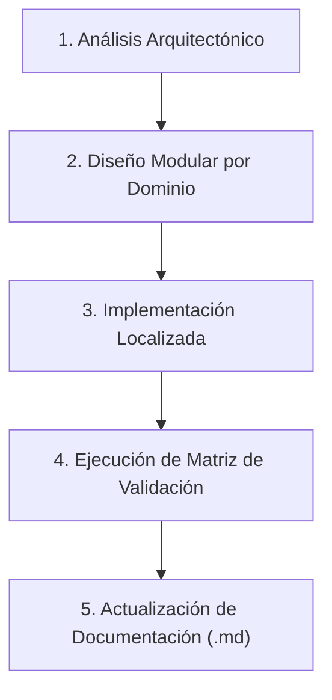

# Guía para Contribuidores de Varn

Gracias por tu interés en contribuir al desarrollo del lenguaje de programación **Varn**.

---

## Tabla de Contenidos

- [Principios de Gobernanza y Arquitectura](#principios-de-gobernanza-y-arquitectura)
- [Gobernanza de Tamaño de Archivos](#gobernanza-de-tamaño-de-archivos)
- [Principios Anti-God Object](#principios-anti-god-object)
- [Flujo de Trabajo para Nuevas Funcionalidades](#flujo-de-trabajo-para-nuevas-funcionalidades)
- [Matriz de Validación Obligatoria](#matriz-de-validación-obligatoria)
- [Reglas Estrictas del Repositorio](#reglas-estrictas-del-repositorio)

---

## Principios de Gobernanza y Arquitectura

1. **Simplicidad sobre Complejidad**: Preferir soluciones pequeñas, locales y cohesionadas. Aplicar DRY y KISS.
2. **Sin Deuda Técnica Ni Compatibilidad Legada Innecesaria**: Si un subsistema tiene defectos fundamentales, no extenderlo; reemplazarlo.
3. **Frontend / Backend Boundary**: Mantener límites estrictos entre frontend (`varn-lexer`, `varn-parser`, `varn-checker`), compilador (`varn-opt`), backend (`varn-backend`), VM (`varn-vm`) y runtime (`varn-runtime`).

---

## Gobernanza de Tamaño de Archivos

Para evitar la creación de *God Files*, el proyecto aplica reglas estrictas sobre la extensión de código fuente en Rust:

| Líneas de Código | Clasificación | Acción Requerida |
|---|---|---|
| `< 300` | **Ideal** | Tamaño óptimo y enfocado. |
| `300 - 500` | **Advertencia** | Monitorear responsabilidad del módulo. |
| `500 - 700` | **Refactor Recomendado** | Evaluar extracción de funciones o estructuras a submódulos. |
| `> 1000` | **Refactor Obligatorio** | **Prohibido** añadir nuevas funciones sin dividir el archivo. |

---

## Principios Anti-God Object

Evitar estrictamente:
- Registros monolíticos globales.
- Enums gigantescos que mezclen múltiples dominios funcionalmente dispares.
- Funciones de `dispatch` centralizadas en constante expansión.
- Módulos `utils.rs` o `helpers.rs` genéricos sin un dominio funcional bien definido.

---

## Flujo de Trabajo para Nuevas Funcionalidades



---

## Matriz de Validación Obligatoria

Ninguna tarea o Pull Request se considera completada sin pasar la matriz de 4 cuadrantes de validación:

```mermaid
matrix
```

| Procedencia Std | Modo JIT / Intérprete | Comando de Validación |
|---|---|---|
| `dev-checkout` | **JIT Activado** | `./target/release/vn.exe run ./tests/main.vn` |
| `dev-checkout` | **Intérprete Pure (`VARN_NO_JIT=1`)** | `VARN_NO_JIT=1 ./target/release/vn.exe run ./tests/main.vn` |
| `@embedded` | **JIT Activado** | `VARN_STD=@embedded ./target/release/vn.exe run ./tests/main.vn` |
| `@embedded` | **Intérprete Pure (`VARN_NO_JIT=1`)** | `VARN_STD=@embedded VARN_NO_JIT=1 ./target/release/vn.exe run ./tests/main.vn` |

> [!IMPORTANT]
> `cargo test` no ejercita la suite de integración completa del compilador. La prueba canónica del sistema es la ejecución de `tests/main.vn`.

---

## Reglas Estrictas del Repositorio

> [!CAUTION]
> **Prohibición de comandos de Git automáticos**: No ejecutar comandos `git` ni alterar el directorio `.git`. El control de versiones es gestionado exclusivamente por el usuario.
