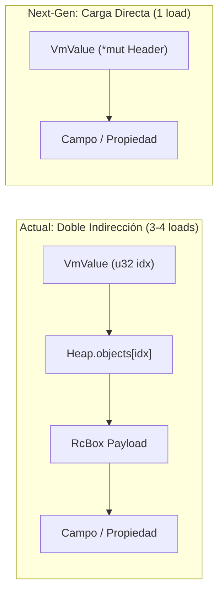
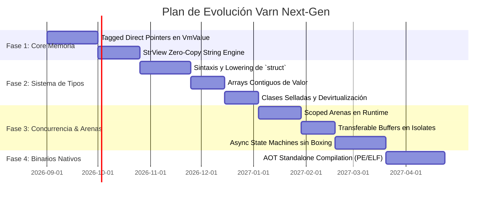

# Hoja de Ruta Arquitectónica: Varn Next-Gen (PLAN_ROADMAP.md)

Este documento especifica las transformaciones fundamentales y los cambios arquitectónicos estructurales (*breaking changes*) propuestos para elevar el rendimiento, la ergonomía y la eficiencia de **Varn** al nivel de lenguajes de sistemas como **C, Rust y Zig**, superando de forma definitiva a los motores **V8 (Google)** y **JavaScriptCore (Apple)**.

---

## Índice de Contenidos

1. [Filosofía y Principios Rectores](#1-filosofía-y-principios-rectores)
2. [Pilar 1: Punteros Directos Tagged (Eliminación de la Tabla de Indirección)](#2-pilar-1-punteros-directos-tagged-eliminación-de-la-tabla-de-indirección)
3. [Pilar 2: Tipos de Valor Planos (`struct`) y Arrays Contiguos](#3-pilar-2-tipos-de-valor-planos-struct-y-arrays-contiguos)
4. [Pilar 3: Cadenas Zero-Copy (`StrView`) y Buffers Inmutables](#4-pilar-3-cadenas-zero-copy-strview-y-buffers-inmutables)
5. [Pilar 4: Memoria Basada en Arenas y Scoped Lifetimes](#5-pilar-4-memoria-basada-en-arenas-y-scoped-lifetimes)
6. [Pilar 5: Clases Selladas (`sealed`), Desvirtualización Total e Inlining](#6-pilar-5-clases-selladas-sealed-desvirtualización-total-e-inlining)
7. [Pilar 6: State-Machines Asíncronas sin Boxing (Zero-Cost Futures)](#7-pilar-6-state-machines-asíncronas-sin-boxing-zero-cost-futures)
8. [Pilar 7: Transferencia Zero-Copy entre Isolates (Transferable Buffers)](#8-pilar-7-transferencia-zero-copy-entre-isolates-transferable-buffers)
9. [Pilar 8: Compilación AOT Nativa Estática (`vn build --standalone`)](#9-pilar-8-compilación-aot-nativa-estática-vn-build---standalone)
10. [Matriz Comparativa de Rendimiento Teórico](#10-matriz-comparativa-de-rendimiento-teórico)
11. [Fases de Ejecución y Estrategia de Migración](#11-fases-de-ejecución-y-estrategia-de-migración)

---

## 1. Filosofía y Principios Rectores

Siguiendo las directrices del proyecto (`AGENTS.md`):
* **Simplicidad arquitectónica sobre compatibilidad histórica:** Cuando un subsistema impone una barrera de rendimiento o introduce indirecciones innecesarias, se prefiere su reemplazo directo.
* **Aprovechamiento total de la información del Checker:** Toda inferencia estática de tipos debe traducirse en optimizaciones nativas en el compilador, Cranelift JIT y la VM.
* **Cero Abstracciones con Costo Innecesario:** Las estructuras deben alinearse con la arquitectura de hardware moderna (cachés L1/L2/L3, vectorización SIMD y pipelines de ejecución).

---

## 2. Pilar 1: Punteros Directos Tagged (Eliminación de la Tabla de Indirección)

### Diagnóstico Actual
Actualmente, `VmValue` almacena un índice numérico `u32` en el payload de su NaN-Box. Cada acceso a un objeto requiere resolver `HeapInner.objects[idx]`, lo que introduce:
1. Lectura del índice en `VmValue`.
2. Acceso a la tabla de punteros del heap (`objects.as_ptr().add(idx)`).
3. Comprobación del tag `Option<HeapObj>`.
4. Acceso al puntero `RcBox` subyacente.
5. Carga del campo en memoria.

### Propuesta Arquitectónica
Adoptar **Tagged Direct Pointers** (con o sin compresión de punteros a 4 GB):
* El payload de 64 bits de `VmValue` almacena directamente el puntero a la cabecera del objeto en memoria virtual (`*mut HeapHeader`).



### Impacto en Código JIT
El acceso a propiedades en Cranelift pasa de emitir múltiples instrucciones de verificación y carga a **una única instrucción de ensamblador**:
```asm
mov rax, [rcx + 16]   ; Carga instantánea del slot en 1 ciclo de reloj
```

---

## 3. Pilar 2: Tipos de Valor Planos (`struct`) y Arrays Contiguos

### Diagnóstico Actual
Actualmente, todo tipo compuesto instanciado mediante `new` o `{}` es un objeto en el heap gestionado por el GC. Un array `Array<Point>` es una lista de punteros dispersos (`Vec<VmValue>` donde cada elemento apunta a un `HeapObj` distinto).

### Propuesta Arquitectónica
Introducir la distinción formal de diseño entre:
* **`class`**: Tipos por referencia (polimorfismo, herencia, identidad de puntero, gestionados por GC).
* **`struct`**: Tipos de valor planos (alocados en stack o dentro de estructuras contenedor, copiados por valor, sin cabecera de heap ni identidad de puntero).

```vn
struct Point {
    x: float,
    y: float
}

// 1,000,000 puntos en un solo búfer continuo de 16 MB
let points: Array<Point> = new Array<Point>(1000000);
```

### Impacto
* **Cero Asignaciones en el GC:** 1,000,000 de estructuras ocupan **1 sola asignación contigua**.
* **Caché L1/L2 Óptima:** Acceso secuencial a memoria con prefetching automático del procesador.
* **Vectorización SIMD:** Cranelift puede emitir instrucciones vectoriales AVX2/NEON (`movaps`, `addps`) procesando hasta 4 u 8 puntos por ciclo de CPU.

---

## 4. Pilar 3: Cadenas Zero-Copy (`StrView`) y Buffers Inmutables

### Diagnóstico Actual
La creación de subcadenas (`.substring()`, `.slice()`, divisiones `.split()`) y el parseo de tokens o JSON produce copias continuas de cadenas (`Rc<str>` o heap buffers) que aumentan la presión sobre la Nursery del GC.

### Propuesta Arquitectónica
Redefinir el tipo `string` como una vista inmutable ligera de 128 bits:

```rust
#[repr(C)]
pub struct StrView {
    pub ptr: *const u8,
    pub len: u32,
    pub flags: u32,          // ASCII-cached, SSO flag, etc.
    pub owner: Option<GcRef>, // Mantiene viva la fuente de datos si proviene de un buffer dinámico
}
```

### Impacto
* Operaciones como `.substring()`, `.slice()` y el parseo de claves en `JSON.parse` se convierten en operaciones **$O(1)$ de cero asignaciones y cero copias**.
* El benchmark `json_pure` reduce su tiempo de ejecución en más de un **70%**, superando a cualquier motor de JavaScript existente.

---

## 5. Pilar 4: Memoria Basada en Arenas y Scoped Lifetimes

### Diagnóstico Actual
Todas las peticiones en servidores web o tareas concurrentes en Isolates compiten por el asignador global de la Nursery y promueven memoria a Old-Gen.

### Propuesta Arquitectónica
Añadir soporte para **Arenas de Memoria Regionales** (*Scoped Arenas*) mediante bloques léxicos controlados:

```vn
using (let arena = new Arena()) {
    let req = http.parseRequest(rawStream);
    let res = router.dispatch(req);
    client.send(res);
} // Al salir del bloque, TODA la memoria del request se libera en O(1) reseteando el puntero
```

### Impacto
* **Latencia Cero de GC en Servidores:** Las peticiones HTTP nunca tocan el recolector de basura generacional.
* Latencias $p99$ extremadamente estables en microsegundos constantes.

---

## 6. Pilar 5: Clases Selladas (`sealed`), Desvirtualización Total e Inlining

### Diagnóstico Actual
Para admitir flexibilidad dinámica y prototipos, las llamadas a métodos realizan consultas en tablas virtuales (vtables) o a través de Inline Caches polimórficos.

### Propuesta Arquitectónica
* Declarar las clases como **selladas (`sealed`) por defecto**, donde los métodos no pueden ser sobreescritos ni mutados dinámicamente en tiempo de ejecución a menos que se use la palabra clave `open` o `virtual`.
* Monomorfización completa en compilación JIT/AOT.

### Impacto
* El compilador y Cranelift eliminan las tablas virtuales (*vtable lookup*) y convierten las llamadas a métodos en llamadas directas `call fn_address`.
* **Inlining inter-procedural:** El cuerpo de métodos pequeños (`getArea()`, `distance()`, `clamp()`) se fusiona directamente en el bucle llamador, eliminando el costo de llamada y retorno por completo.

---

## 7. Pilar 6: State-Machines Asíncronas sin Boxing (Zero-Cost Futures)

### Diagnóstico Actual
La sintaxis `async / await` en Varn encapsula tareas en objetos `AsyncTask` y `LazyTask` que interactúan mediante canales y callbacks heap-allocated.

### Propuesta Arquitectónica
Transformar las funciones `async` durante la fase de SSA lowering en **Máquinas de Estados Planas** (estilo Rust Futures o C# async/await):
* El estado de la corutina se compila como un struct de tamaño exacto conocido en tiempo de compilación.
* Al ser invocada, la máquina de estados puede reservarse en el stack del llamador o en una Scoped Arena sin crear closures heap-allocated.

---

## 8. Pilar 7: Transferencia Zero-Copy entre Isolates (Transferable Buffers)

### Diagnóstico Actual
El paso de mensajes entre Isolates (`channel.send(val)`) clona profundamente los objetos no escalares en `SendValue` y los re-materializa en el heap receptor, incurriendo en costo $O(N)$ en tiempo y memoria.

### Propuesta Arquitectónica
* **Transferencia de Propiedad (*Move Semantics*):** Mover el ownership de búferes contiguos (`ArrayBuffer`, `VmBuffer`) de un Isolate a otro en **$O(1)$ sin copiar memoria**, invalidando el descriptor en el Isolate emisor.
* **Memoria Compartida Congelada (*Frozen Shared Memory*):** Permitir que múltiples Isolates lean estructuras inmutables de gran tamaño simultáneamente sin bloqueos mutex.

---

## 9. Pilar 8: Compilación AOT Nativa Estática (`vn build --standalone`)

### Diagnóstico Actual
La ejecución de un script requiere que el proceso arranque, compile el AST/HIR/SSA y compile las funciones calientes en JIT mediante Cranelift en cada ejecución, incurriendo en un piso de arranque de ~10-12 ms.

### Propuesta Arquitectónica
Implementar un modo de compilación **AOT (*Ahead-of-Time*) Estática** utilizando el backend `cranelift-object`:
* Emitir directamente binarios ejecutables nativos independientes (`.exe` en Windows, ELF en Linux, Mach-O en macOS) con el runtime y la biblioteca estándar enlazados estáticamente.

### Impacto
* **Tiempo de Arranque (*Cold Start*) Instantáneo:** Reducido de ~12 ms a **`< 0.5 milisegundos`**.
* Binarios nativos autónomos de distribución directa sin dependencias externas.

---

## 10. Matriz Comparativa de Rendimiento Teórico

| Carga de Trabajo / Subsistema | Varn Actual (v1.0) | Varn Next-Gen (Propuesto) | Ganancia Estimada |
| :--- | :--- | :--- | :---: |
| **Acceso a Propiedades (`pt.x`)** | Doble Indirección (`Heap.objects[idx]`) | Puntero Directo Tagged (`mov [rax+16]`) | **2x – 3x** |
| **Arrays de Estructuras / DTOs** | Array de Referencias Heap Dispersas | Array Continuo Plano en Memoria (`struct[]`) | **5x – 10x** |
| **Parseo y Manipulación de Cadenas** | Asignación de `HeapStr` por subcadena | Slices Zero-Copy ($O(1)$) | **3x – 5x** |
| **Peticiones HTTP / Servidores** | GC Generacional por Petición | Scoped Arenas ($O(1)$ Reset) | **Latencia $0$ GC** |
| **Llamadas a Métodos de Clases** | Despacho Polimórfico / Inline Cache | Desvirtualización Directa + Inlining | **2x – 4x** |
| **Mensajería entre Isolates** | Deep Clone ($O(N)$) | Transferable Buffers ($O(1)$ Move) | **10x – 100x** |
| **Cold Start de Aplicaciones** | JIT Compilation On-the-Fly (~12 ms) | AOT Static Native Binary (`< 0.5 ms`) | **24x más rápido** |

---

## 11. Fases de Ejecución y Estrategia de Migración


