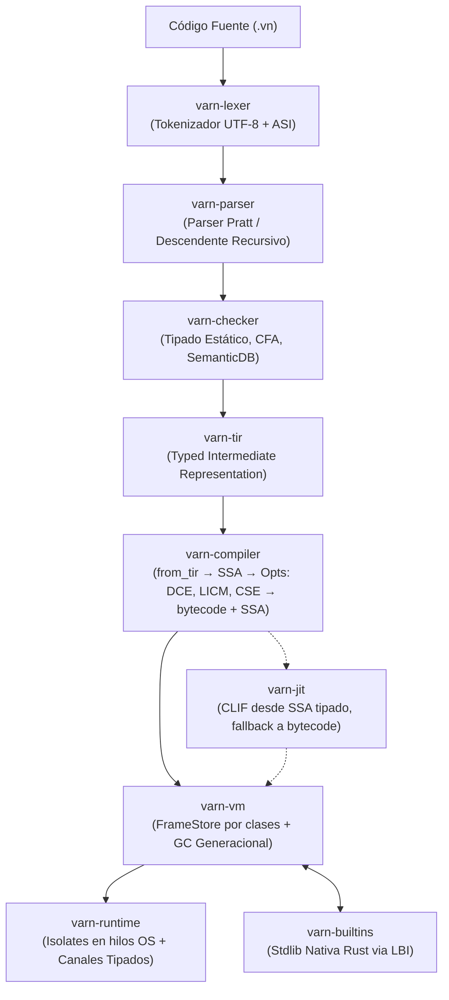

# Varn Programming Language

<div align="center">

[](https://github.com/carlos-burelo/varn/releases/latest)
[](https://github.com/carlos-burelo/varn/actions/workflows/ci.yml)
[](https://github.com/carlos-burelo/varn/releases/latest)
[](https://www.rust-lang.org/)
[](LICENSE)

<p align="center">
  <b>Lenguaje de programación de alto rendimiento, estáticamente tipado, con arquitectura VM basada en registros, motor JIT Cranelift nativo, recolector de basura generacional y runtime asíncrono basado en Isolates.</b>
</p>

[Descargas](#-descargas-y-distribución-binaria) •
[Inicio Rápido](#-inicio-rápido) •
[Tour del Lenguaje](#-tour-del-lenguaje) •
[Arquitectura](#-arquitectura-del-sistema) •
[Benchmarks](#-rendimiento-comparativo) •
[Documentación](#-documentación-técnica)

</div>

---

## ⚡ Aspectos Destacados

* **Tipado Estático Estricto y Bidireccional**: Inferencia de tipos sin sobrecarga en runtime, análisis de flujo de control (CFA), exhaustividad garantizada y cero coerción implícita de tipos.
* **Memoria y Streaming Canónico (`Bytes`, `Stream`)**: Tipo de valor/referencia de primera clase `Bytes` con indexación nativa, slicing zero-copy, transparencia binaria 100% (cero corrupción UTF-8 en sockets) y tuberías asíncronas con contrapresión (`Stream.pipe`).
* **VM de Registros por Clases (`FrameStore`)**: registros particionados en `GPR:i64`, `FPR:f64`, `REF:u32`, `DYN:VmValue` de 128 bits (`tag` + `payload`) — el GC solo recorre lo que es raíz por construcción. Enteros `int` nativos de 64 bits, `float` IEEE 754, `bool`, `char` y *Small String Optimization* (SSO de hasta 5 bytes inline sin tocar el heap).
* **Compilación Nativa JIT desde SSA**: el backend Cranelift baja del mismo SSA tipado que el intérprete (sin re-derivar tipos), con fallback transparente al intérprete para lo aún no cubierto; fast-paths optimizados y hoisting de comprobaciones de límites.
* **Pipeline TIR & SSA Optimizado**: Lowering canónico a *Typed Intermediate Representation* (TIR), construcción SSA, DCE, LICM, CSE, plegado de constantes, escape analysis y TCO.
* **GC Generacional**: nursery generacional junto con Old-Generation mark-and-sweep tricolor con write barriers de bajo coste.
* **Concurrencia Determinista y Paralelismo Real**: Tareas cooperativas síncronas en micro-trampolín, `TaskGroup` con gestión de recursos por ámbito (`using`), e **Isolates** independientes en hilos OS comunicados por canales tipados de paso de mensajes sin memoria compartida.
* **Tooling de Primera Clase**: CLI unificado (`vn run`, `vn check`, `vn build`, `vn bench`, `vn debug -p`, `vn repl`, `vn pkg`, `vn lsp`).

---

## 📦 Descargas y Distribución Binaria

Los binarios precompilados de producción están disponibles para las principales arquitecturas y sistemas operativos en cada lanzamiento oficial:

| Plataforma / Arquitectura | Target Triple | Paquete Oficial (v0.1.0) |
|---|---|---|
| **Linux x86_64** (glibc) | `x86_64-unknown-linux-gnu` | [`vn-v0.1.0-x86_64-unknown-linux-gnu.tar.gz`](https://github.com/carlos-burelo/varn/releases/download/v0.1.0/vn-v0.1.0-x86_64-unknown-linux-gnu.tar.gz) |
| **Linux ARM64** (glibc) | `aarch64-unknown-linux-gnu` | [`vn-v0.1.0-aarch64-unknown-linux-gnu.tar.gz`](https://github.com/carlos-burelo/varn/releases/download/v0.1.0/vn-v0.1.0-aarch64-unknown-linux-gnu.tar.gz) |
| **macOS Apple Silicon** | `aarch64-apple-darwin` | [`vn-v0.1.0-aarch64-apple-darwin.tar.gz`](https://github.com/carlos-burelo/varn/releases/download/v0.1.0/vn-v0.1.0-aarch64-apple-darwin.tar.gz) |
| **macOS Intel** | `x86_64-apple-darwin` | [`vn-v0.1.0-x86_64-apple-darwin.tar.gz`](https://github.com/carlos-burelo/varn/releases/download/v0.1.0/vn-v0.1.0-x86_64-apple-darwin.tar.gz) |
| **Windows x86_64** | `x86_64-pc-windows-msvc` | [`vn-v0.1.0-x86_64-pc-windows-msvc.zip`](https://github.com/carlos-burelo/varn/releases/download/v0.1.0/vn-v0.1.0-x86_64-pc-windows-msvc.zip) |

Para verificar la integridad criptográfica de las descargas:
- **Checksums**: [`SHA256SUMS.txt`](https://github.com/carlos-burelo/varn/releases/download/v0.1.0/SHA256SUMS.txt)

---

## 🚀 Inicio Rápido

### Instalación de Binarios Precompilados

#### Linux & macOS
```bash
# Descargar y extraer (ejemplo para Linux x86_64)
curl -LO https://github.com/carlos-burelo/varn/releases/download/v0.1.0/vn-v0.1.0-x86_64-unknown-linux-gnu.tar.gz
tar -xzf vn-v0.1.0-x86_64-unknown-linux-gnu.tar.gz

# Mover a tu PATH local
sudo mv vn /usr/local/bin/
vn --version
```

#### Windows (PowerShell)
```powershell
Invoke-WebRequest -Uri "https://github.com/carlos-burelo/varn/releases/download/v0.1.0/vn-v0.1.0-x86_64-pc-windows-msvc.zip" -OutFile "vn.zip"
Expand-Archive -Path "vn.zip" -DestinationPath "$HOME\bin"
$env:Path += ";$HOME\bin"
vn --version
```

### Compilación desde el Código Fuente

Requiere **Rust 1.75+** con `cargo`:

```bash
git clone https://github.com/carlos-burelo/varn.git
cd varn-lang
cargo build --release --bin vn
./target/release/vn --version
```

### Primer Programa (`hola.vn`)

```Varn
// hola.vn
function saludar(nombre: str): str {
    return `¡Bienvenido a Varn, ${nombre}!`
}

print(saludar("Mundo"))
```

Ejecuta directamente:
```bash
vn run hola.vn
```

Compila a bytecode optimizado (`.vnc`):
```bash
vn build hola.vn -o hola.vnc
vn run hola.vnc
```

Inspecciona el pipeline completo (AST → TIR → Bytecode → VM):
```bash
vn debug -p hola.vn
```

---

## 🏛️ Arquitectura del Sistema



---

## 💻 Tour del Lenguaje

### Variables y Tipos Primitivos Canónicos

Varn implementa nombres de tipos canónicos únicos: `int`, `float`, `str`, `bool`, `char`.

```Varn
const puerto: int = 8080
let host: str = "127.0.0.1"
const activo: bool = true
const factor: float = 3.14159

// Operaciones y aserciones
assert("potencia", 2 ** 10 === 1024)
assert("bit-shift", 1 << 4 === 16)

// Métodos intrínsecos de strings
const s = "  Varn Language  "
assert("trim", s.trim() === "Varn Language")
assert("slice", s.trim().slice(0, 4) === "Varn")
```

### Pattern Matching Exhaustivo

```Varn
enum Estado { Pendiente, Procesando, Completado, Error }

function describir(estado: Estado): str {
    return match (estado) {
        Estado.Pendiente   => "En cola de espera",
        Estado.Procesando  => "Procesando tarea",
        Estado.Completado  => "Finalizado con éxito",
        Estado.Error       => "Fallo en la ejecución"
    }
}
```

### Manejo Canónico de Errores y Operador `try`

Varn provee el operador prefijo `try <expr>` para desempaquetar y propagar errores anticipadamente sin anidamiento de bloques `match`, soportando `Result<T, E>`, `Option<T>` y tipos anulables (`T?`):

```Varn
enum Result<T, E> { Ok(val: T), Err(err: E) }

function parsear(s: str): Result<int, str> {
    if (s == "") { return Result.Err("cadena vacía") }
    return Result.Ok(42)
}

function calcularTotal(a: str, b: str): Result<int, str> {
    const x: int = try parsear(a)
    const y: int = try parsear(b)
    return Result.Ok(x + y)
}

const res = calcularTotal("10", "20")
assert("try Result", match res { Ok(v) => v, Err(_) => 0 } === 84)
```

### Funciones, Closures y Argumentos Nombrados

```Varn
function crearSumador(base: int): (n: int) => int {
    return (x: int) => base + x
}

const sumar10 = crearSumador(10)
assert("closure", sumar10(5) === 15)

// Argumentos nombrados fuera de orden
function configurarServidor(host: str, puerto: int, ssl: bool = false): str {
    const proto = ssl ? "https" : "http"
    return `${proto}://${host}:${puerto}`
}

assert("named args", configurarServidor(puerto: 443, host: "varn.dev", ssl: true) === "https://varn.dev:443")
```

### Clases, Interfaces y Polimorfismo

```Varn
interface Dibujable {
    area(): float
}

abstract class Figura implements Dibujable {
    abstract area(): float
    etiqueta(): str {
        return `Área calculada: ${this.area()}`
    }
}

class Circulo extends Figura {
    radio: float
    constructor(radio: float) {
        this.radio = radio
    }
    override area(): float {
        return 3.1415926535 * this.radio * this.radio
    }
}
```

### Extensiones y Operador Pipeline

```Varn
extension EnteroUtil on int {
    esPar(): bool { return this % 2 === 0 }
    alCuadrado(): int { return this * this }
}

assert("extension", (4).esPar() === true)

// Pipeline chaining con placeholder (_)
function duplicar(n: int): int { return n * 2 }
function restar(a: int, b: int): int { return a - b }

const resultado = 5 |> duplicar(_) |> restar(_, 3)
assert("pipeline", resultado === 7)
```

### Concurrencia con `TaskGroup` e `Isolates`

```Varn
import { sleep, TaskGroup, spawnIsolate } from "std:task"

// Tareas cooperativas asíncronas
async function calcular(): void {
    using grupo = TaskGroup<int>()
    grupo.spawn(async () => 20)
    grupo.spawn(async () => 22)
    const partes = await grupo.join()
    assert("concurrencia", partes[0] + partes[1] === 42)
}

// Paralelismo multinúcleo real (Isolate con heap aislado)
function tareaPesada(): void {
    const worker = spawnIsolate("./worker.vn")
    worker.send("procesar_lote")
}
```

### Biblioteca Estándar Consolidada

La stdlib de Varn está estructurada en dominios cohesivos de alto nivel:

* **`std:encoding`**: Serialización de datos unificada (`JSON`, `CSV`, `TOML`, `Base64`, `Hex`).
* **`std:cli`**: Terminal toolkit (`CLI.parse`, `Color` ANSI, `Table`, `Prompt` interactivo).
* **`std:task`**: Concurrencia estructurada y sincronización cooperativa (`Mutex`, `Semaphore`, `WaitGroup`, `Channel`).
* **`std:log`**: Observabilidad y logging estructurado dual (texto coloreado y JSON).
* **`std:collections`**: Estructuras de datos eficientes (`PriorityQueue`, `LRUCache`, `List`, `Stack`, `Queue`).
* **`std:net`**: Redes y transporte TCP (`TcpStream`, `TcpListener`, validación IP).
* **`std:http`**: Servidor `HttpServer` con CORS, cliente de alto nivel `http` (`get`, `post`, `put`, `patch`, `del`) y `fetch`.
* **`std:ws`**: WebSockets bidireccionales basados en eventos con `WebSocketReadyState`.

---

## 📊 Rendimiento Comparativo

Última medición completa en `release` (2026-09-20, Windows; ver
`docs/plans/2026-09-20-PLAN-PENDIENTE.md` §16–19 para el detalle por sesión).
Metodología: `cargo xtask compare`, tiempo de pared de proceso completo
(arranque + compilación JIT + ejecución). Los números se mueven entre sesiones:
**re-mide antes de citar**.

### 🚀 Latencia de Arranque (Cold Start)
- **Varn: ~3x más rápido que Bun** en arranque en frío.

### 📈 Matriz de Cargas de Trabajo (Varn vs Bun, menor es mejor para Varn)

| Carga de Trabajo | Ratio | Estado |
|---|---|---|
| `fib` (Recursión hot) | ~tied | JIT leaf con llamada directa |
| `csv_etl` (Extracción y parseo) | ~tied | |
| `dto` (Instanciación tipada) | ~1.3x | Campos compactos inline |
| `matrix` (Álgebra matricial) | ~2.0x | |
| `csv_pipeline` (Transformación) | ~1.25x | |
| `json_pure` (Parseo puro) | ~1.18x | |
| `json_native` (Parseo/Stringify) | ~1.39x | |
| `json_api_payloads` | ~2.4x | Mapas dinámicos + strings |
| `gc_alloc` (GC Trashing) | ~2.9x | Allocator/GC |
| `str_ops` (Strings) | ~3.6x | `slice`/`substring` sin hoist |
| `collection_pipeline` | ~7x | Allocator/GC |
| `http_routing` | ~25x | Mapas dinámicos + strings |

Cuellos conocidos (medidos, no adivinados): **allocator/GC** (`gc_alloc`,
`collection_pipeline`) y **mapas dinámicos + strings** (`http_routing`,
`str_ops`). La convención de llamada se descartó como causa por medición.

> [!NOTE]
> **Integridad Verificada (Zero Mismatches)**: Todos los benchmarks validan formalmente la equivalencia semántica de las salidas numéricas y estructuras de datos generadas frente a los demás motores.

---

## 🛠️ Ecosistema de Crates

El compilador y runtime de Varn están diseñados de forma modular siguiendo dominios estrictos:

| Crate | Descripción |
|---|---|
| [`varn-core`](docs/ARCHITECTURE.md) | Definiciones canónicas de AST, OpCodes, Spans, diagnósticos y constantes centrales. |
| [`varn-types`](docs/ARCHITECTURE.md) | Representación de `VmValue` (128-bit), `Chunk`, `FunctionProto`, `Shape` y memoria. |
| [`varn-lexer`](docs/ARCHITECTURE.md) | Tokenizador UTF-8 determinista con soporte de ASI (*Automatic Semicolon Insertion*). |
| [`varn-parser`](docs/ARCHITECTURE.md) | Analizador sintáctico Pratt y descendente recursivo. |
| [`varn-checker`](docs/ARCHITECTURE.md) | Verificador estático, inferencia bidireccional, CFA y generación de TIR. |
| [`varn-tir`](docs/ARCHITECTURE.md) | Representación Intermedia Tipada (*Typed Intermediate Representation*). |
| [`varn-compiler`](docs/COMPILER_ARCHITECTURE.md) | Generador SSA, inlining de hojas, pasadas de optimización, regalloc y emisión de bytecode. |
| [`varn-vm`](docs/VM_ARCHITECTURE.md) | Máquina virtual basada en registros por clases, recolector de basura generacional e inline caches. |
| [`varn-jit`](docs/VM_ARCHITECTURE.md) | Motor JIT nativo multi-arquitectura basado en Cranelift. |
| [`varn-runtime`](docs/RUNTIME_ARCHITECTURE.md) | Gestión de hilos de SO, runtime asíncrono y canales entre Isolates. |
| [`varn-builtins`](docs/LBI_ARCHITECTURE.md) | Biblioteca estándar nativa Rust vinculada mediante Linker-Bound Interface (LBI). |
| [`varn-modules`](docs/STDLIB_ARCHITECTURE.md) | Cargador de módulos, resolución de dependencias y bundles `.vnb`. |
| [`varn-op-macros`](docs/LBI_ARCHITECTURE.md) | Proc-macro `varn_contract!` para contratos de la stdlib nativa. |
| [`varn-pm`](docs/CLI_REFERENCE.md) | Gestor de paquetes. |
| [`varn-rt`](docs/NATIVE_ABI_SPEC.md) | Runtime estático mínimo para binarios AOT. |
| [`varn-pipeline`](docs/ARCHITECTURE.md) | Orquestador de fases de compilación y almacenamiento en caché. |
| [`varn-cli`](docs/CLI_REFERENCE.md) | Interfaz de línea de comandos unificada `vn`. |
| [`varn-lsp`](docs/ARCHITECTURE.md) | Implementación del Language Server Protocol para soporte en IDEs y editores. |
| [`varn-debug`](docs/CLI_INSPECT.md) | Pipeline inspector para diagnóstico integral (`vn debug -p`). |

---

## 📚 Documentación Técnica

* 🏛️ [**Arquitectura General del Sistema**](docs/ARCHITECTURE.md)
* ⚙️ [**Compilador, TIR y Optimizaciones SSA**](docs/COMPILER_ARCHITECTURE.md)
* 🧠 [**Arquitectura de la VM, VmValue y GC**](docs/VM_ARCHITECTURE.md)
* ⚡ [**Runtime Asíncrono e Isolates**](docs/RUNTIME_ARCHITECTURE.md)
* 📚 [**Biblioteca Estándar y Bundles (.vnb)**](docs/STDLIB_ARCHITECTURE.md)
* 🔗 [**Linker-Bound Interface (LBI)**](docs/LBI_ARCHITECTURE.md)
* 💻 [**Manual de Referencia CLI**](docs/CLI_REFERENCE.md)
* 🔍 [**Inspección del Pipeline con `vn debug`**](docs/CLI_INSPECT.md)
* 📦 [**Guía de Instalación Detallada**](docs/INSTALL.md)
* 📖 [**Especificación del Lenguaje**](docs/lang/) — sintaxis, tipos y semántica.
* 🗺️ [**Plan Único del Proyecto**](docs/plans/2026-09-20-PLAN-PENDIENTE.md) — estado, historial y pendiente.
* 🔬 [**Respuesta de Auditoría**](docs/AUDIT_RESPONSE.md) — arquitectura y decisiones con evidencia.
* 🤝 [**Guía para Contribuidores**](CONTRIBUTING.md)

---

## 📄 Licencia

Distribuido bajo la Licencia **Apache 2.0**. Consulta el archivo [LICENSE](LICENSE) para más información.
