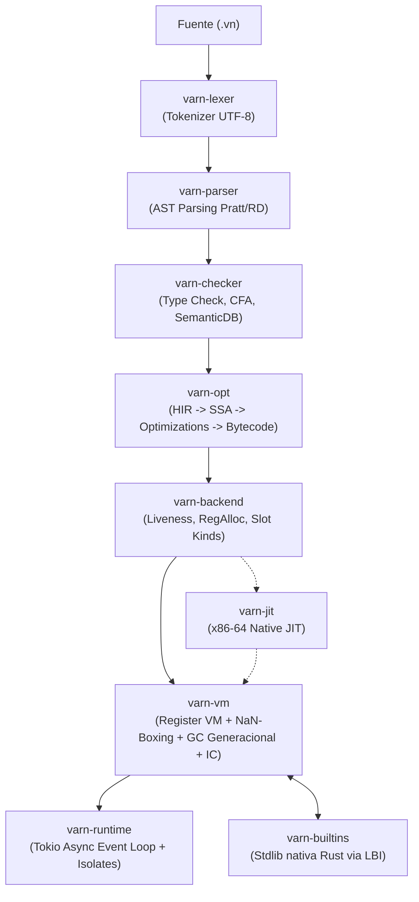

# Varn Programming Language

[](LICENSE)
[](https://www.rust-lang.org/)
[]()

**Varn** es un lenguaje de programación compilado de alto rendimiento, estáticamente tipado, con VM basada en registros, recolector de basura generacional y runtime asíncrono nativo escrito íntegramente en Rust. Extensión de archivos fuente: `.vn`.

---

## Tabla de Contenidos

- [Características Principales](#características-principales)
- [Arquitectura de Alto Nivel](#arquitectura-de-alto-nivel)
- [Tour del Lenguaje](#tour-del-lenguaje)
  - [Variables, Tipos y Operadores](#variables-tipos-y-operadores)
  - [Control de Flujo y Pattern Matching](#control-de-flujo-y-pattern-matching)
  - [Funciones, Closures y Argumentos Nombrados](#funciones-closures-y-argumentos-nombrados)
  - [Programación Orientada a Objetos](#programación-orientada-a-objetos)
  - [Interfaces y Tipado Estructural](#interfaces-y-tipado-estructural)
  - [Genéricos y Tipos Unión](#genéricos-y-tipos-unión)
  - [Extensiones y Operador Pipeline](#extensiones-y-operador-pipeline)
  - [Async/Await, Generadores e Isolates](#asyncawait-generadores-e-isolates)
  - [Decoradores y Metadatos](#decoradores-y-metadatos)
- [Rendimiento (Varn vs Bun vs Node)](#rendimiento-varn-vs-bun-vs-node)
- [Instalación y Uso Rápido](#instalación-y-uso-rápido)
- [Estructura del Proyecto](#estructura-del-proyecto)
- [Ecosistema de Crates](#ecosistema-de-crates)
- [Documentación Técnica Detallada](#documentación-técnica-detallada)
- [Licencia](#licencia)

---

## Características Principales

- **VM Register-Based con NaN-Boxing**: Todos los valores (enteros de 48 bits, flotantes IEEE 754, booleans, null y punteros de heap) caben en 64 bits sin boxing en el hot path.
- **Compilador propio en SSA**: Pipeline multi-fase (`varn-opt`) que transforma AST en HIR y SSA, aplicando pases de inlining, eliminación de código muerto (DCE) y plegado de constantes.
- **JIT x86-64 (Cranelift/Eager)**: Compilación nativa para funciones en el hot-path con fallback automático e indoloro al intérprete.
- **GC Generacional**: Nursery de rápida asignación con promoción a Old-Gen mark-and-sweep tricolor y write barrier.
- **Runtime Asíncrono e Isolates**: Integración nativa con Tokio, concurrencia determinista mediante `TaskGroup` y paralelismo multinúcleo real mediante Isolates aislados con canales tipados.
- **Gestión de Paquetes y Tooling Integrado**: Comandos unificados (`vn run`, `vn check`, `vn build`, `vn bench`, `vn debug`, `vn repl`, `vn pkg`, `vn lsp`).

---

## Arquitectura de Alto Nivel



---

## Tour del Lenguaje

### Variables, Tipos y Operadores

```Varn
const x: int = 42
let name: str = "Varn"
const flag: bool = true

// Operadores aritméticos y bitwise
assert("power",    2 ** 10 === 1024)
assert("mod",      17 % 5 === 2)
assert("bitwise",  (12 & 10) === 8)
assert("shift",    1 << 4 === 16)

// Métodos nativos de cadenas
const s = "  Hello, World!  "
assert("trim",        s.trim() === "Hello, World!")
assert("slice",       "hello world".slice(6, 11) === "world")
assert("replaceAll",  "foo bar foo".replaceAll("foo", "baz") === "baz bar baz")
assert("split",       "a,b,c".split(",")[1] === "b")
assert("padStart",    "5".padStart(3, "0") === "005")
```

### Control de Flujo y Pattern Matching

```Varn
// Bucles for-of, while, break, continue
for (const n of [10, 20, 30]) {
    print(n)
}

let i = 0
while (i < 5) {
    if (i % 2 === 0) { i = i + 1; continue }
    print(i)
    i = i + 1
}

// Pattern matching exhaustivo
enum Direction { North, South, East, West }

function describeDir(d: Direction): str {
    return match (d) {
        Direction.North => "going north",
        Direction.South => "going south",
        Direction.East  => "going east",
        Direction.West  => "going west"
    }
}
```

### Funciones, Closures y Argumentos Nombrados

```Varn
function makeAdder(n: int): (a: int) => int {
    return (x: int) => x + n
}
const add5 = makeAdder(5)
assert("closure", add5(3) === 8)

// Argumentos nombrados fuera de orden
function describe(name: str, age: int, city: str | null = null): str {
    if (city == null) { city = "Unknown" }
    return `${name} is ${age} years old and lives in ${city}`
}

assert("named args", describe(age: 30, name: "Alice", city: "London") === "Alice is 30 years old and lives in London")
```

### Programación Orientada a Objetos

```Varn
abstract class Shape {
    abstract area(): float
    describe(): str { return `shape with area ${this.area()}` }
}

class Circle extends Shape {
    r: float
    constructor(r: float) { this.r = r }
    override area(): float { return 3.14159 * this.r * this.r }
}

class Temperature {
    private _celsius: float
    constructor(c: float) { this._celsius = c }
    get celsius(): float { return this._celsius }
    set celsius(v: float) { this._celsius = v }
    get fahrenheit(): float { return this._celsius * 1.8 + 32.0 }
}
```

### Interfaces y Tipado Estructural

```Varn
interface Printable { toString(): str }
interface Serializable { serialize(): str }

class Config implements Printable, Serializable {
    key: str
    value: int
    constructor(k: str, v: int) { this.key = k; this.value = v }
    toString(): str { return `${this.key}=${this.value}` }
    serialize(): str { return `{"${this.key}":${this.value}}` }
}
```

### Genéricos y Tipos Unión

```Varn
class Box<T> {
    value: T
    constructor(v: T) { this.value = v }
    get(): T { return this.value }
    map<U>(f: (T) => U): Box<U> { return new Box<U>(f(this.value)) }
}

type StringOrInt = str | int

function processValue(v: StringOrInt): str {
    if (v instanceof str) { return "string: " + v }
    else { return "number: " + v }
}
```

### Extensiones y Operador Pipeline

```Varn
extension StringUtils on str {
    shout(): str { return this + "!" }
}

extension IntUtils on int {
    isEven(): bool { return this % 2 === 0 }
}

assert("shout", "hello".shout() === "hello!")
assert("isEven", (4).isEven() === true)

// Operador pipeline con placeholders (_)
function double(n: int): int { return n * 2 }
function addN(n: int, x: int): int { return n + x }

assert("pipe placeholder", 7 |> addN(_, 3) === 10)
```

### Async/Await, Generadores e Isolates

```Varn
import { sleep, TaskGroup, spawn, spawnIsolate } from "std:task"

async function runTasks(): void {
    using group = TaskGroup<int>()
    group.spawn(async () => 21)
    group.spawn(async () => 21)
    const results = await group.join()
    assert("taskgroup", results[0] + results[1] === 42)
}

// Generadores
function* range(start: int, end: int) {
    let i = start
    while (i < end) { yield i; i = i + 1 }
}
```

---

## Rendimiento (Varn vs Bun vs Node)

Resultados de benchmark ejecutados con `benchmarks/compare.ps1` en build `release` sobre la suite pareada comparando el tiempo mínimo de ejecución en pared (wall-clock time):

| Benchmark | Varn | Bun | Node | vs Fastest Rival |
|---| --- | --- | --- |---|
| `fib` | **44.2 ms** | 89.2 ms | 115.6 ms | **2.02x WIN 🏆** |
| `gc_alloc` | **44.7 ms** | 81.4 ms | 99.6 ms | **1.82x WIN 🏆** |
| `dto` | **36.3 ms** | 62.1 ms | 79.7 ms | **1.71x WIN 🏆** |
| `matrix` | **35.9 ms** | 55.4 ms | 72.1 ms | **1.54x WIN 🏆** |
| `json_native` | **46.9 ms** | 79.7 ms | 105.0 ms | **1.70x WIN 🏆** |
| `json_pure` | 451.8 ms | 383.7 ms | 543.8 ms | 0.85x |
| `str_ops` | 1452.5 ms | 156.7 ms | 153.6 ms | 0.11x |

> [!NOTE]
> En microbenchmarks computacionales y de asignación (`fib`, `gc_alloc`, `dto`, `matrix`, `json_native`), la VM en registro con NaN-boxing y compilación JIT eager supera consistentemente a JavaScriptCore (Bun) y V8 (Node).

---

## Instalación y Uso Rápido

### Requisitos
- **Rust stable** (1.75+) con `cargo`.

### Compilación desde el código fuente

```bash
git clone https://github.com/carlos-burelo/varn.git
cd varn-lang
cargo build --bin vn --release
```

### Ejecutar el primer programa

```bash
# Ejecutar un script
./target/release/vn run program.vn

# Compilar a paquete binario portable (.vnc)
./target/release/vn build program.vn -o program.vnc

# Ejecutar el binario compilado
./target/release/vn run program.vnc
```

---

## Estructura del Proyecto

```
varn-lang/
├── main.vn             ← Suite principal de integración
├── Cargo.toml          ← Configuración del workspace Rust
├── crates/             ← Módulos del núcleo del compilador y VM
├── std/                ← Código fuente de la biblioteca estándar (.vn)
├── benchmarks/         ← Suite de rendimiento y compare.ps1
└── docs/               ← Especificaciones de arquitectura y referencia
```

---

## Ecosistema de Crates

| Crate | Responsabilidad Principal |
|---|---|
| [`varn-core`](docs/ARCHITECTURE.md#2-crates-y-responsabilidades) | Definición de AST, OpCodes, Spans y reglas numéricas. |
| [`varn-types`](docs/ARCHITECTURE.md#2-crates-y-responsabilidades) | Estructura de `VmValue`, `Chunk`, `FunctionProto`, `Shape` y memoria. |
| [`varn-lexer`](docs/ARCHITECTURE.md#2-crates-y-responsabilidades) | Tokenizador UTF-8 con ASI (Automatic Semicolon Insertion). |
| [`varn-parser`](docs/ARCHITECTURE.md#2-crates-y-responsabilidades) | Parser Pratt / Recursive Descent. |
| [`varn-checker`](docs/ARCHITECTURE.md#2-crates-y-responsabilidades) | Inferidor de tipos, CFA, narrowing y SemanticDB. |
| [`varn-opt`](docs/COMPILER_ARCHITECTURE.md) | **El Compilador**: HIR → SSA → Optimización → Bytecode. |
| [`varn-backend`](docs/COMPILER_ARCHITECTURE.md) | Post-passes de bytecode: Liveness analysis y Register Allocation. |
| [`varn-vm`](docs/VM_ARCHITECTURE.md) | VM de registros con NaN-Boxing, GC generacional e Inline Cache. |
| [`varn-jit`](docs/VM_ARCHITECTURE.md) | Backend JIT nativo para x86-64. |
| [`varn-runtime`](docs/RUNTIME_ARCHITECTURE.md) | Scheduler async sobre Tokio e Isolates multi-hilo. |
| [`varn-builtins`](docs/LBI_ARCHITECTURE.md) | Bindings nativos Rust expuestos vía Linker-Bound Interface (LBI). |
| [`varn-cli`](docs/CLI_REFERENCE.md) | Binario unificado CLI `vn`. |

---

## Documentación Técnica Detallada

Para una inmersión completa en la arquitectura e implementación del sistema, consulta los siguientes documentos:

- 🏛️ [**Arquitectura General del Sistema**](docs/ARCHITECTURE.md)
- ⚙️ [**Especificación del Compilador y SSA**](docs/COMPILER_ARCHITECTURE.md)
- 🧠 [**Arquitectura de la VM, NaN-Boxing y GC**](docs/VM_ARCHITECTURE.md)
- ⚡ [**Runtime Asíncrono e Isolates**](docs/RUNTIME_ARCHITECTURE.md)
- 📚 [**Biblioteca Estándar y Bundles (.vnb)**](docs/STDLIB_ARCHITECTURE.md)
- 🔗 [**Linker-Bound Interface (LBI)**](docs/LBI_ARCHITECTURE.md)
- 🔌 [**Host Boundary Spec**](docs/HOST_BOUNDARY_SPEC.md) & [**Native ABI Spec**](docs/NATIVE_ABI_SPEC.md)
- 💻 [**Manual de Referencia CLI**](docs/CLI_REFERENCE.md) & [**Inspección de Fases**](docs/CLI_INSPECT.md)
- 📖 [**Especificación Formal del Lenguaje (WARP-SPEC)**](docs/WARP-SPEC.md)
- 🚀 [**Guía de Primeros Pasos**](docs/GETTING_STARTED.md) & [**Instalación**](docs/INSTALL.md)
- 📈 [**Hoja de Ruta de Rendimiento Extremo**](docs/PERFORMANCE_ROADMAP.md)
- 🛠️ [**Guía para Contribuidores**](CONTRIBUTING.md)

---

## Licencia

Este proyecto está distribuido bajo la licencia Apache 2.0. Consulta el archivo [LICENSE](LICENSE) para más detalles.
