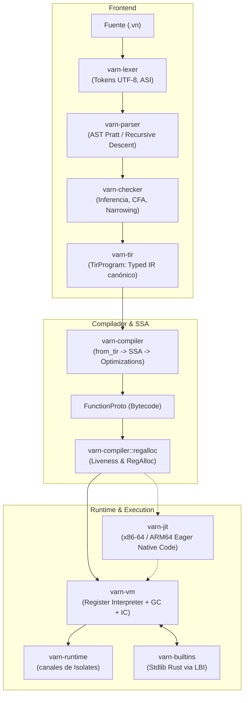
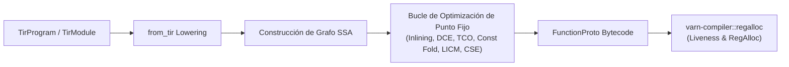
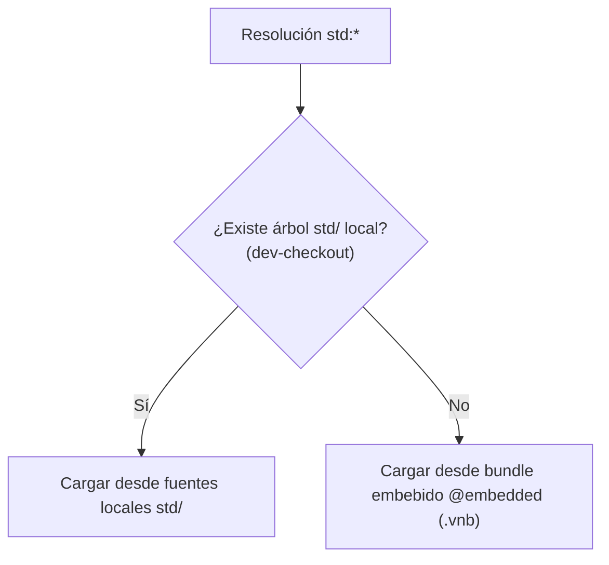

# Arquitectura Interna del Lenguaje Varn

Este documento ofrece una descripción técnica detallada e integral de la arquitectura del compilador, la máquina virtual (VM), el runtime asíncrono y el sistema de bibliotecas del lenguaje **Varn**, implementado enteramente en Rust.

---

## Tabla de Contenidos

- [1. Visión General del Pipeline de Compilación](#1-visión-general-del-pipeline-de-compilación)
- [2. Arquitectura de Crates y Modularidad](#2-arquitectura-de-crates-y-modularidad)
- [3. Frontend y Type Checker (`varn-checker`)](#3-frontend-y-type-checker-varn-checker)
- [4. Compilador en SSA y Optimización (`varn-compiler`)](#4-compilador-en-ssa-y-optimización-varn-compiler)
- [5. Máquina Virtual Basada en Registros y Representación `VmValue` (`varn-vm`)](#5-máquina-virtual-basada-en-registros-y-representación-vmvalue-varn-vm)
- [6. Backend JIT x86-64 (`varn-jit`)](#6-backend-jit-x86-64-varn-jit)
- [7. Concurrencia: `await` e Isolates](#7-concurrencia-await-e-isolates)
- [8. Interfaz Nativa LBI (`varn-builtins`)](#8-interfaz-nativa-lbi-varn-builtins)
- [9. Sistema de Módulos y Bundles `.vnb`](#9-sistema-de-módulos-y-bundles-vnb)
- [10. Artefactos Serializados](#10-artefactos-serializados)

---

## 1. Visión General del Pipeline de Compilación

El crate `varn-pipeline` orquesta las 7 fases secuenciales del pipeline de ejecución:



> **Antes de perseguir un cuello de botella o un bug de GC/JIT, lee
> [HIPOTESIS_DESCARTADAS.md](HIPOTESIS_DESCARTADAS.md).** Recoge las hipótesis
> que ya se probaron y murieron por medición —el acceso a campos, el arena de
> objetos, el GC como causa del coste de alocar, varias raíces del colector— con
> el dato que cerró cada una. Reabrir una exige un dato nuevo que contradiga al
> que la mató.
>
> El frente abierto de rendimiento es el coste de alocar un objeto (60 ns
> contra los 24 de Bun), que decide todos los benchmarks que perdemos. La
> dirección tomada (tras medir que los tramos no son aditivos) fue el layout
> compacto de instancia + constructores triviales inline, no la arena bump del
> plan descartado; ver el plan único `plans/2026-09-20-PLAN-PENDIENTE.md` y
> [HIPOTESIS_DESCARTADAS.md](HIPOTESIS_DESCARTADAS.md).
>
> Para las decisiones de fondo —por qué las referencias de heap son índices y
> no punteros, y qué cuesta eso— ver
> [AUDIT_RESPONSE.md](AUDIT_RESPONSE.md).

## 2. Arquitectura de Crates y Modularidad

El workspace son 20 crates consolidados. El inventario completo con tamaños y el grafo de aristas reales está en [CRATES_STATE.md](CRATES_STATE.md); aquí van los que definen la arquitectura:

| Crate | Categoría | Responsabilidad Principal |
|---|---|---|
| [`varn-core`](#) | Base | AST, `OpCode` (137 opcodes sin prefijos), `ModuleId`, `Span`, evaluador numérico canónico (`numeric.rs`), diagnósticos (`diagnostics/`), estilo de terminal (`term/`) y `TypeTag`. Sin dependencias internas. |
| [`varn-types`](#) | Base | Tipos compartidos por VM y compilador: `VmValue` (128-bit two-word + SSO), `Chunk`, `FunctionProto`, `ClassObj`, `Closure`, `ObjData`/`ObjRef`, `Shape`. |
| [`varn-lexer`](#) | Frontend | Tokenizador streaming UTF-8 con inserción automática de puntos y comas (ASI). |
| [`varn-parser`](#) | Frontend | Parser en descenso recursivo + operador de precedencia Pratt (`|>`, ternarios, named args). |
| [`varn-checker`](#) | Frontend | Type-checker multi-fase. Produce `TypedAST`, `SemanticDB` y genera el `TirProgram`. |
| [`varn-tir`](#) | Frontend / IR | Representación intermedia tipada canónica (`TirProgram`, `TirExpr`, `TirStmt`, `TirType`). Desacopla la semántica del checker de la generación de código. |
| [`varn-compiler`](COMPILER_ARCHITECTURE.md) | Compilador | Transformación `TirProgram` (vía `from_tir`) → `SSA`. Passes de inlining, DCE, TCO, const-folding y análisis de registros (`regalloc/`). |
| [`varn-vm`](VM_ARCHITECTURE.md) | Ejecución | VM basada en registros de 128 bits (`VmValue` con tag + payload de 64 bits, nativo `i64`/`f64` y SSO hasta 5 bytes), GC generacional (nursery + old-gen mark-sweep) e Inline Cache polimórfico. |
| [`varn-jit`](VM_ARCHITECTURE.md) | Ejecución | Backend JIT nativo para x86-64 y ARM64 (Cranelift) que compila eager funciones en hot path. |
| [`varn-rt`](#) | Runtime Base | Runtime estático mínimo para ejecutables AOT y soporte compartido. |
| [`varn-runtime`](RUNTIME_ARCHITECTURE.md) | Ejecución | Canales tipados entre Isolates (hilos independientes) y vtable de asignación del heap. La suspensión de `async`/`await` la implementa `varn-vm`, no este crate. |
| [`varn-op-macros`](LBI_ARCHITECTURE.md) | Stdlib Host | Proc-macro `varn_contract!`: cruza el contrato `.vn` con la implementación Rust y emite las entradas de la tabla de ops nativa. |
| [`varn-lsp`](#) | Herramienta | Servidor LSP (hover, completion, semantic tokens, inlay hints). |
| [`varn-pm`](#) | Herramienta | Gestor de paquetes (`vn add`, `install`, `update`). |
| [`varn-builtins`](LBI_ARCHITECTURE.md) | Stdlib Host | Implementaciones nativas en Rust de `core:` y `runtime:`. Registradas mediante Linker-Bound Interface (LBI). |
| [`varn-modules`](STDLIB_ARCHITECTURE.md) | Módulos | Registro de espacio de nombres, resolución topológica y despaquetado del bundle `.vnb`. |
| [`varn-pipeline`](#) | Orquestación | Orquesta el flujo de ejecución completo y gestiona la caché de bytecode en disco. |
| [`varn-cli`](CLI_REFERENCE.md) | Herramienta | Punto de entrada del ejecutable CLI `vn`. |
| [`varn-debug`](CLI_INSPECT.md) | Herramienta | Inspección profunda de fases AST, HIR, SSA, bytecode y métricas de VM. |
| [`xtask`](#) | Herramienta | Runner de tareas y benchmarking comparativo automatizado (`cargo xtask compare`). |

---

## 3. Frontend y Type Checker (`varn-checker`)

`varn-checker` valida la semántica del programa a través de 4 fases secuenciales:

1. **Hoisting y Binding Global**: Registra las firmas de clases, interfaces, tipos y funciones top-level antes de validar los cuerpos, permitiendo referencias circulares y llamadas recursivas sin forward declarations.
2. **Normalización de Tipos**: Simplifica uniones e intersecciones (ej. `(A | B) | (A | C)` → `A | B | C`).
3. **Control Flow Analysis (CFA) y Narrowing**: Estrecha el tipo de las variables según el flujo de control (ej. tras un `if (x instanceof str)`).
4. **Construcción de SemanticDB**: Genera una base de datos relacional immutable que asigna a cada nodo AST su tipo derivado, ID de símbolo y Span exacto.

---

## 4. Compilador en SSA y Optimización (`varn-compiler`)

El compilador transforma la representación intermedia tipada canónica (`TirProgram`) en bytecode para la VM a través del módulo `from_tir`:



> [!NOTE]
> `varn-compiler` integra directamente el submódulo `regalloc`: `varn_compiler::compile_module` corre los post-passes de liveness y asignación compacta de registros sobre el `FunctionProto` ya emitido, recursivamente por cada función anidada del pool de constantes.

Entre las optimizaciones destacadas del compilador figuran:
- **Inlining de funciones hoja**: Las funciones simples sin llamadas anidadas (`is_leaf`) se inlinean directamente en el sitio de llamada (`try_inline_direct_call`), eliminando el frame overhead.
- **Lowering limpio de bucles `for`**: Desazucarado canónico con variable de control nativa en lugar de flags booleanos sintéticos, permitiendo que LICM y Cranelift reconozcan las variables de inducción.
- **Eliminación de phis triviales**: Simplificación de nodos $\phi$ redundantes antes del paso de DCE.

---

## 5. Máquina Virtual Basada en Registros y Representación `VmValue` (`varn-vm`)

### Representación `VmValue` de 128 bits (Two-Word Layout) y SSO

Varn utiliza una representación de dos palabras de 64 bits (16 bytes en total, `tag: u64`, `payload: u64`) en lugar de NaN-boxing. Al ser un lenguaje con tipos conocidos estáticamente antes de la emisión, un empaquetado forzado en 64 bits solo añadía costes de máscaras y limitaba los enteros a 48 bits.

```
Word 0 (Tag, 64-bit):     [Reserved: 48 bits] [SSO Len: 8 bits] [Kind: 8 bits]
Word 1 (Payload, 64-bit): [64-bit Native Value / Direct Pointer / SSO bytes (<= 5)]
```

| Tipo de Dato | Kind (Byte 0 de Tag) | Tag Metadata (Bits 8-15) | Estructura del Payload (Word 1) |
|---|---|---|---|
| `null` | `0x00` (`KIND_NULL`) | `0` | `0` |
| `bool` | `0x01` (`KIND_BOOL`) | `0` | `0` para `false`, `1` para `true` |
| `int` | `0x02` (`KIND_INT`) | `0` | Entero con signo nativo de 64 bits (`i64` completo) |
| `float` | `0x03` (`KIND_FLOAT`) | `0` | Flotante IEEE 754 de 64 bits (`f64` estándar) |
| Heap Ref | `0x04` (`KIND_HEAP`) | `0` | Índice de 32 bits a la tabla de objetos (o puntero directo) |
| SSO String | `0x05` (`KIND_SSO`) | Longitud (0 a 5 bytes) | Hasta 5 bytes UTF-8 inline empaquetados en little-endian |
| Symbol | `0x06` (`KIND_SYMBOL`) | `0` | Identificador numérico de símbolo |

### Ventajas del Two-Word Layout frente al NaN-Boxing de 64 bits:
1. **`int` es `i64` completo**: No hay restricciones de rango a 48 bits ni chequeos de desbordamiento artificiales para empaquetado.
2. **Cero máscaras costosas**: Comparar un tipo es un único `cmp` contra una constante pequeña inmediata (0..6), que baja a una tabla de salto o dispatch directo.
3. **Small String Optimization (SSO)**: Cadenas cortas de hasta 5 bytes (claves de mapas, identificadores comunes, códigos de estado) se almacenan inline en el payload de 64 bits sin alocar memoria en el heap.
4. **Paridad de registros en arquitecturas modernas**: En x86-64 y AArch64, operar con dos palabras de 64 bits en registros no genera penalización frente a una palabra enmascarada con constantes de 64 bits cargadas desde memoria.

### Recolector de Basura Generacional y Optimizaciones de Memoria

- **Nursery**: Asignación ultrarrápida bump-pointer para objetos jóvenes (`NURSERY_CAPACITY = 65 536`).
- **Promotion**: El GC menor promueve a Old-Gen los objetos que sobreviven.
- **Old-Gen**: Mark-and-sweep tricolor sobre memoria no móvil con free-list.
- **Write Barrier**: Remembered set que registra referencias de Old-Gen a Nursery.
- **COW para Mapas Vacíos (`alloc_empty_map_vm`)**: Los mapas creados vacíos `{}` comparten una instancia estática inmutable hasta la primera mutación, eliminando cientos de miles de alocaciones efímeras en frameworks web y deserialización.
- **Construcción de Records por Slices (`alloc_record_with_shape_slice`)**: Creación optimizada de tuplas y records inmutables a partir de slices contiguos.

---

## 6. Backend JIT Nativo y Abstracción de Arquitectura (`varn-jit` & `varn-vm::arch`)

`varn-jit` proporciona compilación eager a código de máquina nativo utilizando el backend **Cranelift** multi-arquitectura:

- **Generación Multi-Target**: A través de `cranelift_native::builder()` y el Target ISA correspondiente, compila funciones directamente a instrucciones nativas para la arquitectura del host (**x86-64**, **AArch64 / ARM64**, **RISC-V 64**, etc.) respetando las convenciones de llamadas (`CallConv`) de cada plataforma.
- **Capa de Abstracción de Arquitectura (`varn-vm::arch`)**: Las operaciones de bajo nivel dependientes de la arquitectura del CPU y del sistema operativo (búferes de salto `JmpBuf`, `vm_setjmp`, `vm_longjmp` para la recuperación de pánicos del JIT y suspensión asíncrona) están aisladas en submódulos dedicados:
  - `x86_64_windows.rs`: Windows x86_64 ABI (`rcx`, `rdx`, registros callee-saved).
  - `x86_64_sysv.rs`: System V AMD64 ABI para Linux y macOS x86_64 (`rdi`, `rsi`).
  - `aarch64.rs`: ARM64 AAPCS ABI para macOS Apple Silicon, Linux AArch64 y Windows on ARM (`x19-x30`, `sp`, `d8-d15`).
  - `fallback.rs`: Fallback portable en C estándar para RISC-V u otras arquitecturas.
- **Bailouts Transparentes**: Si una función contiene opcodes no soportados o entra en un camino no compenable, la VM conmuta de forma transparente al intérprete sin interrumpir la ejecución.

---

## 7. Concurrencia: `await` e Isolates

- **`await`**: lo implementa la VM, no `varn-runtime`. `ExecCtx::wait_task_handle` registra un callback con `AsyncTask::on_settle` y espera el resultado por un canal `std::sync::mpsc` — espera bloqueante, cooperativa dentro del hilo, sin event loop.
- **Timers**: `suspend_timer` duerme el hilo (`thread::sleep`) salvo que exista un contexto Tokio con `LocalSet`, caso que hoy no se da en ninguna ruta del CLI.
- **Isolates**: hilos independientes con su propia VM y heap. La comunicación es paso de mensajes serializados (`SendValue` / `SendEnvelope`) por los canales tipados de `varn-runtime::channel`.

Detalle y estado en [RUNTIME_ARCHITECTURE.md](RUNTIME_ARCHITECTURE.md).

---

## 8. Interfaz Nativa LBI (`varn-builtins`)

El sistema Linker-Bound Interface (LBI) elimina las tablas de registro manuales utilizando secciones del binario del sistema:

```mermaid
flowchart TD
    A["varn_contract! { contract: \"x.vn\", impl X { .. } }"] --> B["El macro emite un NativeOpEntry por símbolo\nen la sección .varn_ops"]
    A --> M["...y un array __VARN_LINK_MARKER_*\napuntando a los mismos statics"]
    B --> C["iter_native_ops(): recorrido de sección"]
    M --> R["force_link_builtins(): registro de respaldo"]
    C --> U["all_native_ops(): unión deduplicada por ptr::eq"]
    R --> U
    U --> D["Tabla de dispatch por op-id en la VM"]
```

El registro de respaldo no es redundancia decorativa: apunta a los mismos statics que la sección, así que la tabla queda completa aunque el agrupamiento de secciones del linker no cubra todas las unidades de codegen. Medido: 313 entradas idénticas con `codegen-units = 1` y con `16`.

---

## 9. Sistema de Módulos y Bundles `.vnb`

Varn organiza sus fuentes en 3 espacios de nombres:
- `builtin:*`: Símbolos globales del sistema.
- `std:*`: Biblioteca estándar compilada en el bundle `.vnb`.
- `pkg:*` / Rutas Relativas: Paquetes externos y fuentes del usuario.

### Jerarquía de Resolución del Bundle Std



---

## 10. Artefactos Serializados

Todo artefacto de Varn —caché de compilación, interfaz del checker, bundle de stdlib, salida de `vn build`— comparte **una sola envolvente**:

```
[0..4)    magic "VARN"
[4..6)    versión de cabecera   u16 LE
[6..8)    kind                  u16 LE    grafo | interfaz | bundle
[8..9)    class                 u8        caché | distribuible
[9..13)   BUILD_FINGERPRINT     u32 LE    forma del payload
[13..17)  productor             u32 LE    0 en los distribuibles
[17..21)  checksum              u32 LE    FNV-1a del payload
[21..)    payload (postcard)
```

Antes eran cuatro magics (`WRC`, `VNC`, `VNM`, `VNB`) para **dos payloads reales**: `WRC` y `VNC` envolvían el mismo `ModuleGraphArtifact` y sólo se diferenciaban en la política de versión. Esa política la elegía *el sitio de llamada*, no el artefacto: nada dentro de un archivo decía de qué clase era, así que sellar un distribuible con la clave de una caché compilaba, pasaba los tests y sólo fallaba al llevar el `.vnc` a otra máquina. Ahora la clase viaja dentro y la validación se deriva de ella, así que esa clase de error no se puede escribir.

El `kind` también paga: pedir un grafo y encontrar una interfaz de checker se diagnostica como *«se esperaba grafo de módulos, el archivo lleva interfaz de checker»* en vez de «magic incorrecto».

### Integridad

postcard no lleva descripción del esquema: detecta la corrupción sólo cuando produce una longitud imposible. Alterar bytes **dentro** de un `Vec<u16>` de bytecode deserializa sin quejarse y se ejecutaría sin que nada lo notase. El checksum es lo que convierte eso en un error.

Y las entradas de caché se escriben a un temporal y se renombran. `fs::write` trunca y va llenando, así que un `vn` concurrente —el LSP y una terminal a la vez es lo normal— o un Ctrl-C dejaban una entrada parcial en su sitio definitivo.

El checksum no es criptográfico ni pretende serlo: cubre escrituras a medias y discos con bits podridos, no manipulación deliberada. Quien puede reescribir el archivo puede recalcular el checksum — y ejecutar un artefacto ya es ejecutar código, igual que un `.exe`.

### Dos Clases de Artefacto

| Clase | Quién | Validez | Si no casa |
|---|---|---|---|
| Caché (`~/.varn/cache`) | compilación (`.vncache`), interfaces (`.vnm`) | esquema **⊕ productor** | recompila en silencio |
| Distribuible | `vn build` (`.vnc`), standalone, bundle de std | **sólo esquema** | error a quien lo ejecuta |

Un distribuible viaja a otra máquina y lo ejecuta otro binario, así que atarlo a la identidad del productor lo vuelve ilegible en destino. Una entrada de caché es un detalle invisible y regenerable, así que puede —y debe— depender del binario que la emitió.

Las extensiones ya no colisionan: `.vnc` es **sólo** el artefacto que produce `vn build` y que el usuario ejecuta; las entradas de caché usan `.vncache`. Compartir sufijo hacía que el mismo nombre designara dos cosas con reglas de validez opuestas.

### Clave de un Artefacto Cacheado

Una entrada de caché se identifica por dos cosas distintas, y ambas van en el **nombre** del archivo además de en la envolvente:

* **Forma del esquema** (`BUILD_FINGERPRINT`, hash de `varn-types` y `varn-modules`): si cambia, el artefacto no se puede ni deserializar. Su lista de crates es corta a propósito — observar desde el build script un crate del que todos dependen recompilaría el grafo entero en cada edición.
* **Identidad del productor** (`producer_fingerprint`, ruta + tamaño + mtime del ejecutable): el bytecode cacheado es la SALIDA del compilador, así que el compilador forma parte de su clave. Se resuelve en tiempo de ejecución, lo que además captura cambios de toolchain que un hash de fuentes no ve.

Sin la segunda, un `vn` actualizado ejecutaba bytecode emitido por su predecesor hasta que alguien corría `vn cache clean`: un fallo de corrección, no de rendimiento, porque ese bytecode es anterior a cada arreglo del compilador.

Va en el nombre y no sólo dentro de la envolvente porque, compartiendo ruta, dos binarios se sobreescriben la entrada mutuamente y ninguno reutiliza nada. Con la clave en el nombre cada uno tiene la suya; se conservan las `ARTIFACT_GENERATIONS` más recientes por archivo fuente para que el directorio no crezca sin límite.

### Revalidación de Dependencias

Un artefacto sólo vale si TODAS sus fuentes siguen iguales, así que guarda un hash por módulo del grafo. La procedencia de cada uno la decide el *provider*, nunca la forma del texto: la regla anterior —«contiene `:` y no contiene `/`»— clasificaba `std:time` como id virtual pero `std:time/duration` como ruta de disco, y ese `fs::read` de una ruta inexistente invalidaba el grafo entero en cada arranque. Un solo import con submódulo bastaba para que un programa no volviera a acertar la caché nunca.

Un *miss* silencioso se comporta igual que una caché fría, así que una validación rota se manifiesta como lentitud difusa y puede sobrevivir sin que nadie la note. Por eso `vn run -v` imprime el MOTIVO del fallo, no sólo el hecho.
