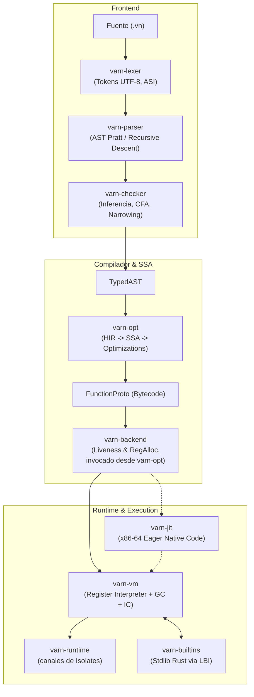
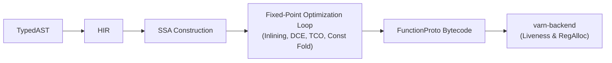
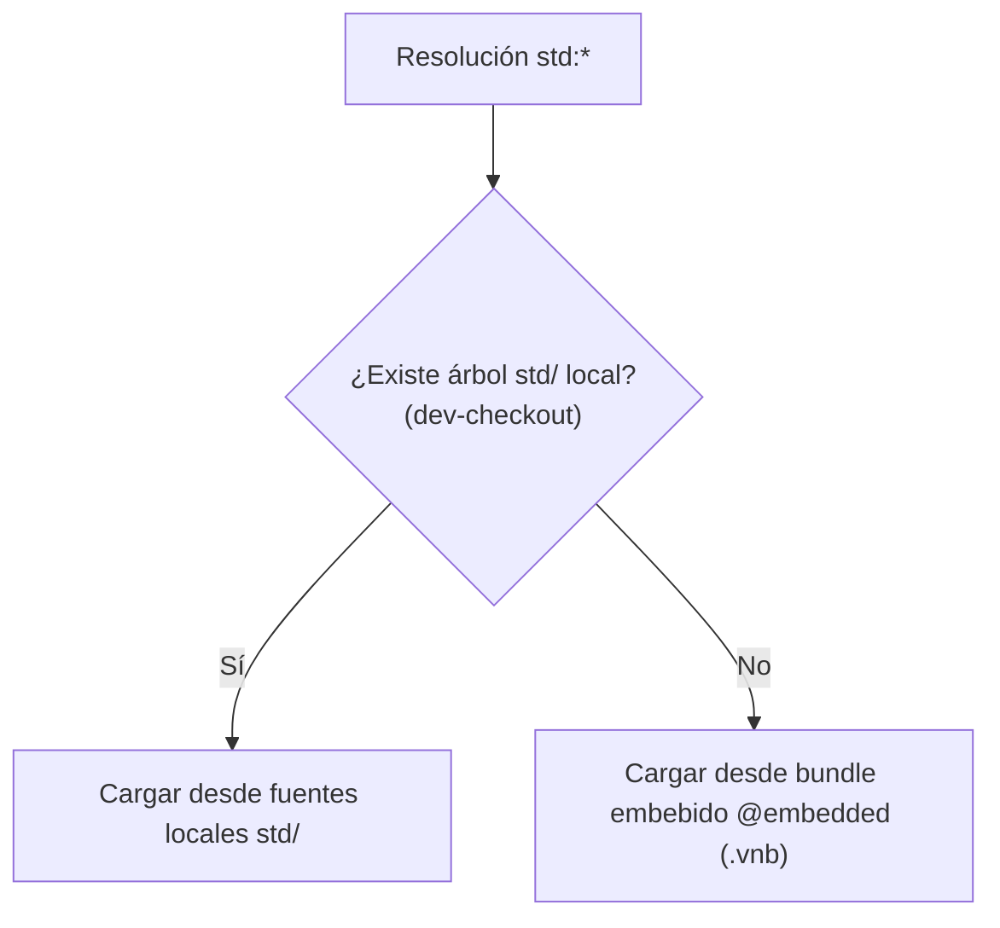

# Arquitectura Interna del Lenguaje Varn

Este documento ofrece una descripción técnica detallada e integral de la arquitectura del compilador, la máquina virtual (VM), el runtime asíncrono y el sistema de bibliotecas del lenguaje **Varn**, implementado enteramente en Rust.

---

## Tabla de Contenidos

- [1. Visión General del Pipeline de Compilación](#1-visión-general-del-pipeline-de-compilación)
- [2. Arquitectura de Crates y Modularidad](#2-arquitectura-de-crates-y-modularidad)
- [3. Frontend y Type Checker (`varn-checker`)](#3-frontend-y-type-checker-varn-checker)
- [4. Compilador en SSA y Optimización (`varn-opt` & `varn-backend`)](#4-compilador-en-ssa-y-optimización-varn-opt--varn-backend)
- [5. Machine Virtual Register-Based y NaN-Boxing (`varn-vm`)](#5-machine-virtual-register-based-y-nan-boxing-varn-vm)
- [6. Backend JIT x86-64 (`varn-jit`)](#6-backend-jit-x86-64-varn-jit)
- [7. Runtime Asíncrono e Isolates (`varn-runtime`)](#7-runtime-asíncrono-e-isolates-varn-runtime)
- [8. Interfaz Nativa LBI (`varn-builtins`)](#8-interfaz-nativa-lbi-varn-builtins)
- [9. Sistema de Módulos y Bundles `.vnb`](#9-sistema-de-módulos-y-bundles-vnb)
- [10. Formato de Artefacto `.vnc`](#10-formato-de-artefacto-vnc)

---

## 1. Visión General del Pipeline de Compilación

El crate `varn-pipeline` orquesta las 7 fases secuenciales del pipeline de ejecución:



> [!NOTE]
> No existe ningún crate `varn-compiler` ni `varn-ir`. La generación de bytecode e IR intermedio vive en `varn-opt`; los post-passes sobre registros residen en `varn-backend`.

---

## 2. Arquitectura de Crates y Modularidad

El workspace son 21 crates. El inventario completo con tamaños y el grafo de aristas reales está en [CRATES_STATE.md](CRATES_STATE.md); aquí van los que definen la arquitectura:

| Crate | Categoría | Responsabilidad Principal |
|---|---|---|
| [`varn-core`](#) | Base | AST, `OpCode` (137 opcodes sin prefijos), `ModuleId`, `Span`, evaluador numérico canónico (`numeric.rs`). Depende solo de `varn-diagnostics` y `varn-base`. |
| [`varn-types`](#) | Base | Tipos compartidos por VM y compilador: `VmValue`, `Chunk`, `FunctionProto`, `ClassObj`, `Closure`, `ObjData`/`ObjRef`, `Shape`. |
| [`varn-diagnostics`](#) | Base | Formateo estandarizado de errores sintácticos y semánticos con underlines para CLI y LSP. |
| [`varn-lexer`](#) | Frontend | Tokenizador streaming UTF-8 con inserción automática de puntos y comas (ASI). |
| [`varn-parser`](#) | Frontend | Parser en descenso recursivo + operador de precedencia Pratt (`|>`, ternarios, named args). |
| [`varn-checker`](#) | Frontend | Type-checker multi-fase. Produce `TypedAST` y `SemanticDB`. |
| [`varn-opt`](COMPILER_ARCHITECTURE.md) | Compilador | Transformación `TypedAST` → `HIR` → `SSA`. Passes de inlining, DCE, TCO y const-folding. |
| [`varn-backend`](COMPILER_ARCHITECTURE.md) | Compilador | Post-passes de análisis de vida de registros (`liveness`), asignación de registros y metapropiedades de slots. |
| [`varn-vm`](VM_ARCHITECTURE.md) | Ejecución | VM basada en registros en 64 bits con NaN-Boxing, GC generacional (nursery + old-gen mark-sweep) e Inline Cache polimórfico. |
| [`varn-jit`](VM_ARCHITECTURE.md) | Ejecución | Backend JIT nativo para x86-64 que compila eager funciones en hot path. |
| [`varn-runtime`](RUNTIME_ARCHITECTURE.md) | Ejecución | Canales tipados entre Isolates (hilos independientes) y vtable de asignación del heap. La suspensión de `async`/`await` la implementa `varn-vm`, no este crate. |
| [`varn-base`](#) | Base | `TypeTag` y `TypeFlags`, compartidos por `varn-core`, `varn-types` y `varn-vm`. |
| [`varn-utilities`](#) | Herramienta | Estilo de terminal (chalk, colores ANSI, salida etiquetada). |
| [`varn-op-macros`](LBI_ARCHITECTURE.md) | Stdlib Host | Proc-macro `varn_contract!`: cruza el contrato `.vn` con la implementación Rust y emite las entradas de la tabla de ops nativa. |
| [`varn-lsp`](#) | Herramienta | Servidor LSP (hover, completion, semantic tokens, inlay hints). |
| [`varn-pm`](#) | Herramienta | Gestor de paquetes (`vn add`, `install`, `update`). |
| [`varn-builtins`](LBI_ARCHITECTURE.md) | Stdlib Host | Implementaciones nativas en Rust de `core:` y `runtime:`. Registradas mediante Linker-Bound Interface (LBI). |
| [`varn-modules`](STDLIB_ARCHITECTURE.md) | Módulos | Registro de espacio de nombres, resolución topológica y despaquetado del bundle `.vnb`. |
| [`varn-pipeline`](#) | Orquestación | Orquesta el flujo de ejecución completo y gestiona la caché de bytecode en disco. |
| [`varn-cli`](CLI_REFERENCE.md) | Herramienta | Punto de entrada del ejecutable CLI `vn`. |
| [`varn-debug`](CLI_INSPECT.md) | Herramienta | Inspección profunda de fases AST, HIR, SSA, bytecode y métricas de VM. |

---

## 3. Frontend y Type Checker (`varn-checker`)

`varn-checker` valida la semántica del programa a través de 4 fases secuenciales:

1. **Hoisting y Binding Global**: Registra las firmas de clases, interfaces, tipos y funciones top-level antes de validar los cuerpos, permitiendo referencias circulares y llamadas recursivas sin forward declarations.
2. **Normalización de Tipos**: Simplifica uniones e intersecciones (ej. `(A | B) | (A | C)` → `A | B | C`).
3. **Control Flow Analysis (CFA) y Narrowing**: Estrecha el tipo de las variables según el flujo de control (ej. tras un `if (x instanceof str)`).
4. **Construcción de SemanticDB**: Genera una base de datos relacional immutable que asigna a cada nodo AST su tipo derivado, ID de símbolo y Span exacto.

---

## 4. Compilador en SSA y Optimización (`varn-opt` & `varn-backend`)

El compilador transforma la representación de alto nivel en bytecode para la VM:



> [!NOTE]
> `varn-backend` no es una fase que corra después de `varn-opt`: es una **dependencia** suya. `varn_opt::compile_module` llama a `varn_backend::run_post_passes` sobre el `FunctionProto` ya emitido, recursivamente por cada función anidada del pool de constantes.

---

## 5. Machine Virtual Register-Based y NaN-Boxing (`varn-vm`)

###NaN-Boxing de 64 bits

Todos los valores en la VM caben en una palabra de 64 bits utilizando el espacio de Quiet NaN del estándar IEEE 754:

```
Double Precision Float:  [S EEEEEEEEEEE MMMMMMMMMMMMMMMMMMMMMMMMMMMMMMMMMMMMMMMMMMMMMMMMMM]
QNAN Marker:            [1 11111111111 11..........................................]
Value Encoding:         [1 11111111111 11] [TAG 4-bit] [Payload 48-bit                 ]
```

| Tipo de Dato | Tag de Codificación | Estructura del Payload |
|---|---|---|
| `float` | Non-QNAN | Valor flotante IEEE 754 estándar de 64 bits |
| `null` | `0x01` | Cero |
| `bool` | `0x02` / `0x03` | `0` para `false`, `1` para `true` |
| `int` | `0x04` | Entero con signo de 48 bits (-140,737,488,355,328 a +140,737,488,355,327) |
| Heap Pointer | `0x05` | Índice de 32 bits a la tabla de objetos del Heap |

### Recolector de Basura Generacional

- **Nursery**: Asignación ultrarrápida bump-pointer para objetos jóvenes.
- **Promotion**: El GC menor promueve a Old-Gen los objetos que sobreviven.
- **Old-Gen**: Mark-and-sweep tricolor sobre memoria no móvil con free-list.
- **Write Barrier**: Remembered set que registra referencias de Old-Gen a Nursery.

---

## 6. Backend JIT x86-64 (`varn-jit`)

`varn-jit` proporciona compilación eager a código máquina x86-64 utilizando el backend Cranelift:

- Compila funciones en el hot-path directamente a instrucciones de máquina nativas.
- Si una función contiene opcodes no soportados (bailouts), la VM conmuta de forma transparente al intérprete sin interrumpir la ejecución.

---

## 7. Concurrencia: `await` e Isolates

- **`await`**: lo implementa la VM, no `varn-runtime`. `ExecCtx::wait_task_handle` registra un callback con `AsyncTask::on_settle` y espera el resultado por un canal `std::sync::mpsc` — espera bloqueante, cooperativa dentro del hilo, sin event loop.
- **Timers**: `suspend_timer` duerme el hilo (`thread::sleep`) salvo que exista un contexto Tokio con `LocalSet`, caso que hoy no se da en ninguna ruta del CLI.
- **Isolates**: hilos independientes con su propia VM y heap. La comunicación es paso de mensajes serializados (`SendValue` / `SendEnvelope`) por los canales tipados de `varn-runtime::channel`.

Detalle y estado en [RUNTIME_ARCHITECTURE.md](RUNTIME_ARCHITECTURE.md).

---

## 8. Interfaz Nativa LBI (`varn-builtins`)

El sistema Linker-Bound Interface (LBI) elimina las tablas de registro manuales utilizando secciones del binario del sistema:

```mermaid
flowchart TD
    A["varn_contract! { contract: \"x.vn\", impl X { .. } }"] --> B["El macro emite un NativeOpEntry por símbolo\nen la sección .varn_ops"]
    A --> M["...y un array __VARN_LINK_MARKER_*\napuntando a los mismos statics"]
    B --> C["iter_native_ops(): recorrido de sección"]
    M --> R["force_link_builtins(): registro de respaldo"]
    C --> U["all_native_ops(): unión deduplicada por ptr::eq"]
    R --> U
    U --> D["Tabla de dispatch por op-id en la VM"]
```

El registro de respaldo no es redundancia decorativa: apunta a los mismos statics que la sección, así que la tabla queda completa aunque el agrupamiento de secciones del linker no cubra todas las unidades de codegen. Medido: 313 entradas idénticas con `codegen-units = 1` y con `16`.

---

## 9. Sistema de Módulos y Bundles `.vnb`

Varn organiza sus fuentes en 3 espacios de nombres:
- `builtin:*`: Símbolos globales del sistema.
- `std:*`: Biblioteca estándar compilada en el bundle `.vnb`.
- `pkg:*` / Rutas Relativas: Paquetes externos y fuentes del usuario.

### Jerarquía de Resolución del Bundle Std



---

## 10. Formato de Artefacto `.vnc`

Los binarios compilados `.vnc` utilizan la siguiente estructura física:

```
[ Magic Header: "WRC\0" (4 bytes) ]
[ Version: u32 LE (4 bytes)       ]
[ Serialized Module Graph Postcard Payload ]
```

Permite la ejecución instantánea (`vn run app.vnc`) omitiendo el parsing y type checking.
