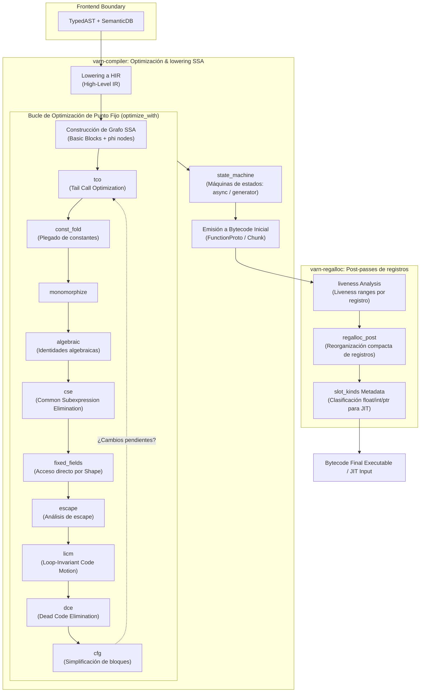

# Arquitectura del Compilador y SSA (`varn-compiler` & `varn-regalloc`)

Este documento detalla el diseño interno del compilador de **Varn**, comprendiendo la transformación del Árbol de Sintaxis Abstracta Tipado (`TypedAST`), la representación intermedia de alto nivel (`HIR`), la construcción en Forma de Asignación Única Estática (`SSA`), el bucle de optimizaciones de punto fijo y la emisión de bytecode optimizado.

---

## Tabla de Contenidos

- [1. Visión General del Pipeline del Compilador](#1-visión-general-del-pipeline-del-compilador)
- [2. Del AST Tipado al HIR (`varn-compiler`)](#2-del-ast-tipado-al-hir-varn-compiler)
- [3. Representación Formas SSA (Static Single Assignment)](#3-representación-formas-ssa-static-single-assignment)
- [4. Bucle de Optimizaciones de Punto Fijo](#4-bucle-de-optimizaciones-de-punto-fijo)
  - [Propagación y Plegado de Constantes (`const_fold`)](#propagación-y-plegado-de-constantes-const_fold)
  - [Eliminación de Código Muerto (`dce`)](#eliminación-de-código-muerto-dce)
  - [Optimización de Recursión Final (`tco`)](#optimización-de-recursión-final-tco)
  - [Acceso Directo a Campos por Shape (`fixed_fields`)](#acceso-directo-a-campos-por-shape-fixed_fields)
  - [Simplificación del Grafo de Flujo de Control (`cfg`)](#simplificación-del-grafo-de-flujo-de-control-cfg)
  - [Movimiento de Código Invariante de Bucle (`licm`)](#movimiento-de-código-invariante-de-bucle-licm)
  - [Eliminación de Subexpresiones Comunes (`cse`)](#eliminación-de-subexpresiones-comunes-cse)
  - [Análisis de Escape (`escape`)](#análisis-de-escape-escape)
  - [Monomorfización (`monomorphize`)](#monomorfización-monomorphize)
  - [Identidades Algebraicas (`algebraic`)](#identidades-algebraicas-algebraic)
  - [Pase Post-Bucle: Máquinas de Estados (`state_machine`)](#pase-post-bucle-máquinas-de-estados-state_machine)
- [5. Emisión de Bytecode y Estructura de `FunctionProto`](#5-emisión-de-bytecode-y-estructura-de-functionproto)
- [6. Post-Passes del Backend (`varn-regalloc`)](#6-post-passes-del-backend-varn-regalloc)
  - [Análisis de Vida de Registros (`liveness`)](#análisis-de-vida-de-registros-liveness)
  - [Asignación de Registros Nativos (`regalloc_post`)](#asignación-de-registros-nativos-regalloc_post)
  - [Inferidor de Tipos de Slot (`slot_kinds`)](#inferidor-de-tipos-de-slot-slot_kinds)

---

## 1. Visión General del Pipeline del Compilador

El pipeline de compilación se divide estrictamente entre la fase de optimización semántica SSA (`varn-compiler`) y la fase de post-procesamiento de registros (`varn-regalloc`):



---

## 2. Del AST Tipado al HIR (`varn-compiler`)

El lowering convierte el árbol sintáctico del checker en un Grafo de Flujo de Control (CFG) estructurado en HIR:
- Se desazucaran constructos complejos: el operador pipeline (`|>`) se expande a llamadas de función estándar; las clases e interfaces se traducen a vtables e índices de campos.
- Cada expresión produce una instrucción explícita con un registro destino asignado.

---

## 3. Representación Formas SSA (Static Single Assignment)

En la representación SSA:
1. Cada variable se asigna **exactamente una vez**.
2. Las bifurcaciones de flujo de control conectan bloques básicos mediante nodos $\phi$ (*phi nodes*).
3. Permite un análisis estático de datos de complejidad lineal $O(N)$ en lugar de cuadrática.

```text
[Bloque B0]
  v0 = 10
  v1 = 20
  cond = v0 < v1
  br_if cond, Bloque B1, Bloque B2

[Bloque B1]
  v2 = v0 + 5
  jump Bloque B3

[Bloque B2]
  v3 = v1 * 2
  jump Bloque B3

[Bloque B3]
  v4 = phi(B1: v2, B2: v3)
  ret v4
```

---

## 4. Bucle de Optimizaciones de Punto Fijo

`varn-compiler` ejecuta un conjunto de pases iterativos hasta que el bytecode alcance un estado estable (*fixed-point*):

### Propagación y Plegado de Constantes (`const_fold`)
Evalúa expresiones aritméticas y lógicas conocidas en tiempo de compilación utilizando la fuente canónica `numeric.rs`:
```Varn
// Antes:
const x = 2 + 3 * 4
// Después:
const x = 14
```

### Eliminación de Código Muerto (`dce`)
Identifica y elimina bloques básicos e instrucciones cuyos resultados no tengan efectos secundarios ni alimenten retornos de función.

### Optimización de Recursión Final (`tco`)
Transforma llamadas recursivas finales en saltos directos (`Jump`), convirtiendo algoritmos recursivos en bucles de rendimiento $O(1)$ en pila.

### Acceso Directo a Campos por Shape (`fixed_fields`)
Sustituye búsquedas dinámicas de propiedades en objetos por accesos directos por offset numérico cuando el checker conoce la `Shape` exacta del objeto.

### Simplificación del Grafo de Flujo de Control (`cfg`)
Fusiona bloques básicos contiguos que carecen de bifurcaciones intermedias.

### Movimiento de Código Invariante de Bucle (`licm`)
Saca fuera del cuerpo de un bucle las instrucciones cuyo resultado no cambia entre iteraciones, siempre que el sacado sea puro y libre de alocación (aritmética/comparaciones sobre `Int`/`Float` probados, sin excepciones posibles): así se ejecutan una vez en vez de en cada vuelta.

### Eliminación de Subexpresiones Comunes (`cse`)
Deduplica, bloque a bloque, cómputos ya vistos (relecturas de un mismo campo, literales rematerializados) mediante una tabla local — sin necesidad de teoría de aliasing porque el ámbito es un único bloque básico.

### Análisis de Escape (`escape`)
Hermano de `fixed_fields` un nivel más difícil: reemplaza por sus campos en SSA una instancia de clase construida por un `constructor call` que nunca escapa de la función, usando el resumen entre funciones de `hir::ctor_summary`.

### Monomorfización (`monomorphize`)
Especializa indexado genérico (`GetIndex`/`SetIndex`) a operaciones monomórficas de array (`ArrayGetIndex`/`ArraySetIndex`) cuando los metadatos de tipo estático o el origen de la asignación SSA confirman el layout de array.

### Identidades Algebraicas (`algebraic`)
Simplifica aritmética cuyo resultado ya es uno de sus operandos o una constante conociendo sólo uno de los dos lados (`i + 0`, `x * 1`, `n - n`) — el complemento de `const_fold`, que sólo actúa cuando **ambos** operandos son conocidos.

### Pase Post-Bucle: Máquinas de Estados (`state_machine`)
Corre **fuera** del bucle de punto fijo, una sola vez, después de él y antes de la asignación de registros — no dentro, porque transforma una función en otra de forma distinta y volver a pasarle `licm`/`cse`/`cfg` por encima sería reoptimizar una máquina de estados como si fuera código normal. Convierte una función suspendible (`async`/`function*`) en una máquina de estados según la convención `Poll` (discriminante en `state[0]`, ver `varn_types::chunk::proto`) y publica `FunctionProto::state_size`, el tamaño en palabras del objeto de estado. Hoy sólo reconoce el caso trivial —una `async` que nunca suspende— sin partir ningún CFG; los cortes llegan en un plan posterior. Ver spec `docs/superpowers/specs/2026-08-16-modelo-asincrono-design.md` §3.1 y §3.8.

---

## 5. Emisión de Bytecode y Estructura de `FunctionProto`

El compilador emite un `FunctionProto` reutilizable que contiene:

- **`code`**: Vector de opcodes de 32/64 bits.
- **`constants`**: Tabla de constantes (strings, BigInts, objetos complejos).
- **`register_count`**: Cantidad total de registros del frame requeridos.
- **`upvalue_count`**: Variables capturadas por closure.

### Captura de Closures

El nodo SSA `MakeClosure` describe sus capturas **sólo por origen** (`upvalues_src`: slot local del padre, parámetro, o upvalue heredada). No lista los `Value` capturados, porque el descriptor emitido nombra el slot canónico del frame padre (`var_reg`) o un índice de upvalue: el valor SSA nunca se lee.

Listarlos convertía cada captura en un operando fantasma: el constructor emitía un `LoadCaptured`/`LoadUpvalue` por captura, el backend lo materializaba en un `Move` a un registro que nadie leía, y esas escrituras muertas inflaban el frame. En `makeStateMachine` (`tests/37-complex-closures.vn`) eliminarlas bajó la función de 44 a 30 palabras y de 14 a 8 registros.

El valor capturado sigue vivo sin ese operando: lo escribe `StoreCaptured` (un efecto, no eliminable) en el slot canónico, que es *home slot* del frame en todo safepoint y raíz del GC.

---

## 6. Post-Passes del Backend (`varn-regalloc`)

Una vez emitido el bytecode inicial, `varn-regalloc` procesa el resultado:

### Análisis de Vida de Registros (`liveness`)
Calcula los intervalos de vida (*live ranges*) de cada registro virtual para determinar la interferencia de variables.

El intervalo de un registro es `[primera escritura, max(último uso, última escritura)]`. Incluir la **última escritura** es de corrección, no una holgura: un registro reescrito después de su último uso sigue ocupando el slot en ese punto. Si el rango terminase en el último uso, un registro con escrituras múltiples y muertas parecería libre y el coloreado podría entregar su slot a un valor todavía vivo, pisándolo.

Los slots capturados por `MakeClosure` con `is_local=1` se fijan aparte: la VM crea una *open upvalue* que apunta al slot del frame padre y lo lee hasta que el frame cierra, así que el escaneo extiende su rango hasta el final de la función.

### Asignación de Registros Nativos (`regalloc_post`)
Reasigna los registros para minimizar el tamaño del frame de la VM, reutilizando slots de registros que ya no estén activos.

El coloreado está sujeto a dos restricciones **duras**, ambas de corrección:

- **interferencia** — dos registros cuyos rangos de vida se solapan nunca comparten color;
- **frame del llamado** — un registro vivo a través de una llamada se colorea por debajo de la ventana de argumentos de esa llamada, para que el frame del callee no lo pise.

Pueden ser conjuntamente infactibles para un orden de asignación dado: todos los colores bajo el techo pueden pertenecer ya a un vecino. El pase **no puede** mover una ventana de argumentos, así que en ese caso abandona la función entera y conserva la asignación que emitió el SSA. Elegir un color ilegal es un miscompile silencioso, no una degradación.

Cuatro verificadores revisan el mapeo final antes de escribirlo: interferencia, ventanas de llamada, frames de callee y sitios de construcción (`BuildArray` / `BuildObjectWithShape`).

### Inferidor de Tipos de Slot (`slot_kinds`)
Inspecciona los tipos asignados a cada registro (`Float`, `Int`, `ObjectRef`, `Any`) y construye el mapa de metadatos `register_meta` necesario para que el JIT compila instrucciones nativas x86-64 sin comprobaciones redundantes.

---

## 7. Frontend y Lowering Semántico

### 7.1 Sintaxis Moderna de Literales de Objetos
- **Property Shorthand**: La sintaxis `{ a, b }` se desazucara automáticamente a `{ a: a, b: b }` tanto en el parser (`varn-parser`) como en el lowering (`varn-compiler`).
- **Nombres de Propiedades Contextuales**: Identificadores coincidentes con palabras clave contextuales (como `get`, `post`, `set`, `delete`, `type`) se aceptan como claves de propiedades válidas en literales de objetos sin requerir comillas obligatorias `{ get: fn, post: fn }`.

### 7.2 Orden Determinista de Inicialización de Constructores
En `varn-compiler` (`hir/lower/decl/functions.rs`), la inicialización de campos de clases por defecto (`field_inits`) se compila e inyecta **estrictamente antes** del cuerpo del constructor. Esto garantiza que todos los campos declarados con valores iniciales (`field: Type = default_val`) existan y no sean `null` si el código del constructor invoca métodos de la propia instancia (`this.method()`).

