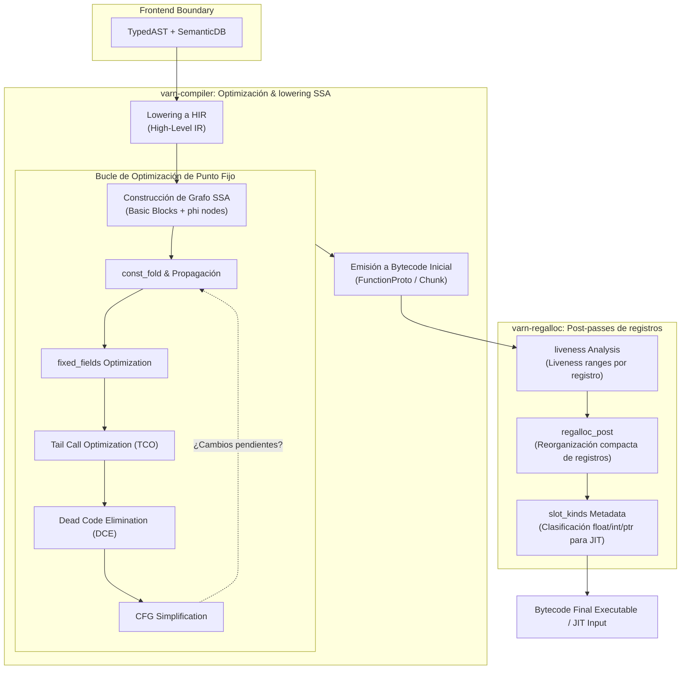

# Arquitectura del Compilador y SSA (`varn-compiler` & `varn-regalloc`)

Este documento detalla el diseño interno del compilador de **Varn**, comprendiendo la transformación del Árbol de Sintaxis Abstracta Tipado (`TypedAST`), la representación intermedia de alto nivel (`HIR`), la construcción en Forma de Asignación Única Estática (`SSA`), el bucle de optimizaciones de punto fijo y la emisión de bytecode optimizado.

---

## Tabla de Contenidos

- [1. Visión General del Pipeline del Compilador](#1-visión-general-del-pipeline-del-compilador)
- [2. Del AST Tipado al HIR (`varn-compiler`)](#2-del-ast-tipado-al-hir-varn-compiler)
- [3. Representación Formas SSA (Static Single Assignment)](#3-representación-formas-ssa-static-single-assignment)
- [4. Bucle de Optimizaciones de Punto Fijo](#4-bucle-de-optimizaciones-de-punto-fijo)
  - [Propagación y Plegado de Constantes (`const_fold`)](#propagación-y-plegado-de-constantes-const_fold)
  - [Eliminación de Código Muerto (`dce`)](#eliminación-de-código-muerto-dce)
  - [Optimización de Recursión Final (`tco`)](#optimización-de-recursión-final-tco)
  - [Acceso Directo a Campos por Shape (`fixed_fields`)](#acceso-directo-a-campos-por-shape-fixed_fields)
  - [Simplificación del Grafo de Flujo de Control (`cfg`)](#simplificación-del-grafo-de-flujo-de-control-cfg)
- [5. Emisión de Bytecode y Estructura de `FunctionProto`](#5-emisión-de-bytecode-y-estructura-de-functionproto)
- [6. Post-Passes del Backend (`varn-regalloc`)](#6-post-passes-del-backend-varn-regalloc)
  - [Análisis de Vida de Registros (`liveness`)](#análisis-de-vida-de-registros-liveness)
  - [Asignación de Registros Nativos (`regalloc_post`)](#asignación-de-registros-nativos-regalloc_post)
  - [Inferidor de Tipos de Slot (`slot_kinds`)](#inferidor-de-tipos-de-slot-slot_kinds)

---

## 1. Visión General del Pipeline del Compilador

El pipeline de compilación se divide estrictamente entre la fase de optimización semántica SSA (`varn-compiler`) y la fase de post-procesamiento de registros (`varn-regalloc`):



---

## 2. Del AST Tipado al HIR (`varn-compiler`)

El lowering convierte el árbol sintáctico del checker en un Grafo de Flujo de Control (CFG) estructurado en HIR:
- Se desazucaran constructos complejos: el operador pipeline (`|>`) se expande a llamadas de función estándar; las clases e interfaces se traducen a vtables e índices de campos.
- Cada expresión produce una instrucción explícita con un registro destino asignado.

---

## 3. Representación Formas SSA (Static Single Assignment)

En la representación SSA:
1. Cada variable se asigna **exactamente una vez**.
2. Las bifurcaciones de flujo de control conectan bloques básicos mediante nodos $\phi$ (*phi nodes*).
3. Permite un análisis estático de datos de complejidad lineal $O(N)$ en lugar de cuadrática.

```text
[Bloque B0]
  v0 = 10
  v1 = 20
  cond = v0 < v1
  br_if cond, Bloque B1, Bloque B2

[Bloque B1]
  v2 = v0 + 5
  jump Bloque B3

[Bloque B2]
  v3 = v1 * 2
  jump Bloque B3

[Bloque B3]
  v4 = phi(B1: v2, B2: v3)
  ret v4
```

---

## 4. Bucle de Optimizaciones de Punto Fijo

`varn-compiler` ejecuta un conjunto de pases iterativos hasta que el bytecode alcance un estado estable (*fixed-point*):

### Propagación y Plegado de Constantes (`const_fold`)
Evalúa expresiones aritméticas y lógicas conocidas en tiempo de compilación utilizando la fuente canónica `numeric.rs`:
```Varn
// Antes:
const x = 2 + 3 * 4
// Después:
const x = 14
```

### Eliminación de Código Muerto (`dce`)
Identifica y elimina bloques básicos e instrucciones cuyos resultados no tengan efectos secundarios ni alimenten retornos de función.

### Optimización de Recursión Final (`tco`)
Transforma llamadas recursivas finales en saltos directos (`Jump`), convirtiendo algoritmos recursivos en bucles de rendimiento $O(1)$ en pila.

### Acceso Directo a Campos por Shape (`fixed_fields`)
Sustituye búsquedas dinámicas de propiedades en objetos por accesos directos por offset numérico cuando el checker conoce la `Shape` exacta del objeto.

### Simplificación del Grafo de Flujo de Control (`cfg`)
Fusiona bloques básicos contiguos que carecen de bifurcaciones intermedias.

---

## 5. Emisión de Bytecode y Estructura de `FunctionProto`

El compilador emite un `FunctionProto` reutilizable que contiene:

- **`code`**: Vector de opcodes de 32/64 bits.
- **`constants`**: Tabla de constantes (strings, BigInts, objetos complejos).
- **`register_count`**: Cantidad total de registros del frame requeridos.
- **`upvalue_count`**: Variables capturadas por closure.

---

## 6. Post-Passes del Backend (`varn-regalloc`)

Una vez emitido el bytecode inicial, `varn-regalloc` procesa el resultado:

### Análisis de Vida de Registros (`liveness`)
Calcula los intervalos de vida (*live ranges*) de cada registro virtual para determinar la interferencia de variables.

### Asignación de Registros Nativos (`regalloc_post`)
Reasigna los registros para minimizar el tamaño del frame de la VM, reutilizando slots de registros que ya no estén activos.

### Inferidor de Tipos de Slot (`slot_kinds`)
Inspecciona los tipos asignados a cada registro (`Float`, `Int`, `ObjectRef`, `Any`) y construye el mapa de metadatos `register_meta` necesario para que el JIT compila instrucciones nativas x86-64 sin comprobaciones redundantes.
