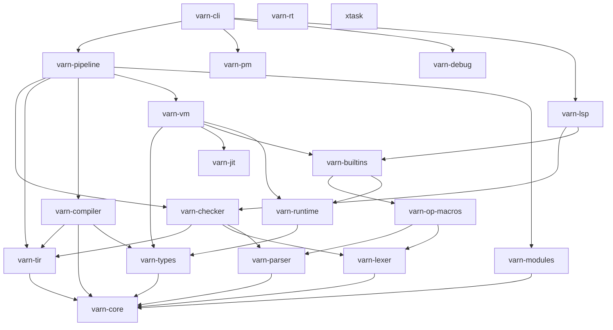

# Estado e Inventario de Crates del Workspace

Matriz de estado, jerarquía de dependencias y tamaños de los **20 crates** consolidados del workspace de **Varn**.

Los tamaños son líneas de Rust medidas sobre el árbol actual. Este documento no publica porcentajes de cobertura: la suite de Rust son 85 tests, y la prueba real de integridad es `tests/main.vn` (1139 aserciones en 83 test suites) bajo las cuatro combinaciones de procedencia de std y JIT descritas en [CONTRIBUTING.md](../CONTRIBUTING.md).

---

## Tabla de Contenidos

- [1. Grafo de Dependencias entre Crates](#1-grafo-de-dependencias-entre-crates)
- [2. Inventario y Tamaño](#2-inventario-y-tamaño)
- [3. Descripción por Dominio Funcional](#3-descripción-por-dominio-funcional)
- [4. Métricas de Gobierno de Código](#4-métricas-de-gobierno-de-código)

---

## 1. Grafo de Dependencias entre Crates

Aristas reales declaradas en los manifiestos (no el flujo de datos del pipeline):

Queda una arista de deuda conocida, no diseño (ver [../AUDIT.md](../AUDIT.md) §4):

- `varn-vm → varn-builtins → varn-op-macros → varn-parser`: `varn_contract!` parsea sus contratos `.vn` en tiempo de expansión, así que compilar el motor de ejecución exige compilar el frontend.

Las vistas de inspección que necesitan el análisis del LSP (`-p types`, `-p lsp`) viven en `varn-cli/src/inspect_lsp/`, no en el pipeline: solo requieren ruta y fuente, así que no justifican que el orquestador dependa del servidor de editor.

---

## 2. Inventario y Tamaño

| Crate | Dominio | Líneas | Estabilidad |
|---|---|---|---|
| `varn-vm` | Ejecución | 19 027 | Estable |
| `varn-compiler` | Compilador (TIR→SSA→bytecode + RegAlloc) | 17 222 | Estable |
| `varn-checker` | Frontend | 16 576 | Estable |
| `varn-jit` | JIT x86-64 / ARM64 (Cranelift) | 8 625 | En evolución |
| `varn-lsp` | Servidor LSP | 7 437 | En evolución |
| `varn-types` | Modelo de datos de runtime y bytecode (VmValue 128-bit) | 6 311 | Estable |
| `varn-core` | AST, opcodes, tokens, diagnósticos, term, `TypeTag` | 5 180 | Estable |
| `varn-cli` | CLI (`vn`) | 5 085 | Estable |
| `varn-parser` | Frontend | 4 943 | Estable |
| `varn-builtins` | Stdlib nativa (LBI) | 4 312 | Estable |
| `varn-debug` | Inspección de fases | 3 294 | Herramienta |
| `varn-tir` | Representación intermedia tipada canónica | 2 236 | Estable |
| `varn-pipeline` | Orquestación de fases y caché | 1 908 | Estable |
| `varn-lexer` | Frontend | 1 557 | Estable |
| `varn-modules` | Resolución de módulos y bundle `.vnb` | 1 292 | Estable |
| `xtask` | Benchmarks comparativos (`cargo xtask compare`) | 1 196 | Herramienta |
| `varn-op-macros` | Proc-macro `varn_contract!` | 918 | Estable |
| `varn-pm` | Gestor de paquetes | 802 | En evolución |
| `varn-runtime` | Canales de isolates + vtable de heap | 381 | Estable |
| `varn-rt` | Runtime estático para binarios AOT | 92 | Estable |

---

## 3. Descripción por Dominio Funcional

### Frontend e IR Intermedio (`varn-lexer`, `varn-parser`, `varn-checker`, `varn-tir`)
Tokenización con ASI, parser descendente con precedencia Pratt, y type-checker multi-fase que emite un `TirProgram` (`varn-tir`) con tipos y resoluciones canónicas en cada nodo.

### Compilador (`varn-compiler`)
Baja `TirProgram` vía `from_tir` → SSA → bytecode, ejecuta pases de inlining de leaf functions, DCE, phis triviales, desazucarado canónico de bucles, LICM, CSE, e integra el análisis y reasignación de registros (`regalloc`).

### Ejecución (`varn-vm`, `varn-jit`)
VM de registros de 128 bits (`VmValue` con tag + payload de 64 bits, nativo `i64`/`f64` y SSO hasta 5 bytes), GC generacional (nursery + mark-sweep), optimizaciones COW para mapas vacíos e inline caches. El JIT compila eager con Cranelift (x86-64 y ARM64) y comparte la tabla de helpers con la ruta de inspección `vn debug -p clif`.

### Runtime (`varn-runtime`, `varn-rt`)
`varn-runtime` expone canales tipados entre isolates (`channel`) y la vtable de asignación del heap (`init_heap`). `varn-rt` proporciona el runtime nativo mínimo para compilación AOT estática.

---

## 4. Métricas de Gobierno de Código

Umbral de refactor obligatorio: 1000 líneas por archivo. **Ningún archivo lo cruza** (ver [../AUDIT.md](../AUDIT.md) §8: los seis que lo hacían se dividieron por dominio).

Los mayores hoy, todos en la banda de "refactor recomendado" (700-1000):

| Archivo | Líneas |
|---|---|
| `varn-debug/src/ast.rs` | 934 |
| `varn-op-macros/src/varn_contract.rs` | 910 |
| `varn-lsp/src/features/compiler_inspect.rs` | 847 |
| `varn-vm/src/exec/ctx_json.rs` | 842 |
| `varn-jit/src/clif/emit.rs` | 818 |

El subárbol `varn-vm/src/exec/` son 12 795 líneas (67 % del crate) repartidas en archivos que sí respetan el umbral; su división es una tarea de dominio, no de gobierno de tamaño.
