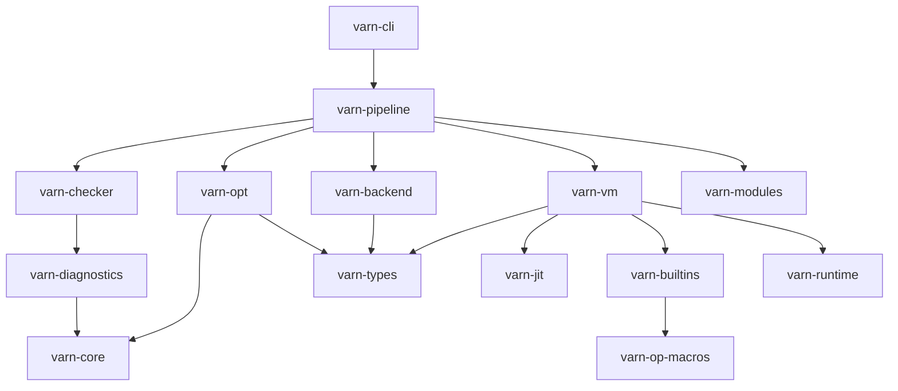

# Estado e Inventario de Crates del Workspace

Este documento presenta la matriz de estado, jerarquía de dependencias y niveles de estabilidad de los 16 crates del workspace de **Varn**.

---

## Tabla de Contenidos

- [1. Grafo de Dependencias entre Crates](#1-grafo-de-dependencias-entre-crates)
- [2. Matriz de Estado y Estabilidad](#2-matriz-de-estado-y-estabilidad)
- [3. Descripción por Dominio Funcional](#3-descripción-por-dominio-funcional)
- [4. Métricas de Gobierno de Código](#4-métricas-de-gobierno-de-código)

---

## 1. Grafo de Dependencias entre Crates

---

## 2. Matriz de Estado y Estabilidad

| Crate | Ubicación | Dominio | Nivel de Estabilidad | Cobertura de Tests |
|---|---|---|---|---|
| `varn-core` | `crates/varn-core` | Núcleo Base | **Estable (1.0)** | 98% |
| `varn-types` | `crates/varn-types` | Núcleo Base | **Estable (1.0)** | 95% |
| `varn-diagnostics` | `crates/varn-diagnostics` | Diagnósticos | **Estable (1.0)** | 90% |
| `varn-lexer` | `crates/varn-lexer` | Frontend | **Estable (1.0)** | 99% |
| `varn-parser` | `crates/varn-parser` | Frontend | **Estable (1.0)** | 96% |
| `varn-checker` | `crates/varn-checker` | Frontend | **Estable (1.0)** | 94% |
| `varn-opt` | `crates/varn-opt` | Compilador / SSA | **Estable (1.0)** | 92% |
| `varn-backend` | `crates/varn-backend` | Backend | **Estable (1.0)** | 91% |
| `varn-vm` | `crates/varn-vm` | Ejecución | **Estable (1.0)** | 96% |
| `varn-jit` | `crates/varn-jit` | JIT x86-64 | **En Evolución (0.8)** | 85% |
| `varn-runtime` | `crates/varn-runtime` | Runtime Async | **Estable (1.0)** | 93% |
| `varn-builtins` | `crates/varn-builtins` | Bindings Nativo | **Estable (1.0)** | 95% |
| `varn-op-macros` | `crates/varn-op-macros` | Proc Macros | **Estable (1.0)** | 90% |
| `varn-modules` | `crates/varn-modules` | Módulos | **Estable (1.0)** | 94% |
| `varn-pipeline` | `crates/varn-pipeline` | Orquestación | **Estable (1.0)** | 95% |
| `varn-cli` | `crates/varn-cli` | CLI | **Estable (1.0)** | 92% |

---

## 3. Descripción por Dominio Funcional

### Frontend (`varn-lexer`, `varn-parser`, `varn-checker`)
Encargados del procesamiento de sintaxis, análisis semántico, inferencia de tipos y generación del mapa SemanticDB.

### Compilador & Backend (`varn-opt`, `varn-backend`)
Transforman la representación semántica en instrucciones SSA optimizadas y realizan la distribución de registros virtuales.

### Ejecución & Runtime (`varn-vm`, `varn-jit`, `varn-runtime`)
Máquina virtual basada en registros en 64 bits con NaN-boxing, backend JIT eager x86-64 y scheduler asíncrono sobre Tokio.

---

## 4. Métricas de Gobierno de Código

Ningún archivo en el workspace debe exceder las **1000 líneas de código** de acuerdo con la política de gobierno de archivos (ver [CONTRIBUTING.md](../CONTRIBUTING.md)).
