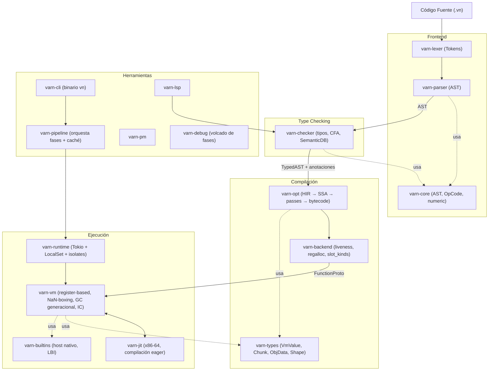

# Estado del Workspace de Crates

Cada fase del pipeline vive en su propio crate. La jerarquía de dependencias es estricta — `varn-core` no depende de ningún crate interno.

## Diagrama del Pipeline

## Responsabilidades

### `varn-core`
AST nodes, OpCode, ModuleId, Span. Sin lógica de ejecución. Compartido por todos los crates.

### `varn-lexer`
Tokenizer. UTF-8, escape sequences, ASI. Solo gramática.

### `varn-parser`
Recursive-Descent + Pratt parsing. Produce AST de `varn-core`. No sabe de tipos ni módulos.

### `varn-checker`
Type checker multi-fase: hoisting, inferencia, CFA, narrowing. Produce TypedAST + SemanticDB. No emite bytecode.

### `varn-types`
Tipos compartidos por VM y builtins: `VmValue`, `Chunk`, `FunctionProto`, `ClassObj`, `Closure`, `ResourceStore`, `NativeCtx`.

### `varn-opt`
**El compilador.** TypedAST + anotaciones → HIR → inlining → SSA → passes en bucle de
punto fijo (`tco`, `const_fold`, `fixed_fields`, `dce`, `cfg`) → bytecode
(`FunctionProto`). Slots estáticos, upvalues, constant pool, back-patching.
Traza: `VN_OPT_TRACE=1`. Ver [COMPILER_ARCHITECTURE.md](COMPILER_ARCHITECTURE.md).

> No existe ningún crate `varn-compiler` ni `varn-ir`. Este documento los listó hasta
> 2026-07-13.

### `varn-backend`
Post-passes sobre el bytecode ya emitido: `liveness`, `regalloc_post` (asignación de
registros) y `slot_kinds` (infiere el tipo de cada slot). `slot_kinds` alimenta el
`register_meta` del que depende el JIT para saber qué registros puede mantener sin
flush — desincronizarlos corrompe el código generado en silencio.

### `varn-vm`
VM register-based con NaN-boxing (`int` = 48 bits, SSO ≤ 5 bytes). Heap con **GC
generacional** (nursery de 4096 slots + promoción) y mark-and-sweep tricolor en old-gen.
Inline caches **polimórficos de 8 entradas** por shape id, compartidos con el JIT.
Upvalues open/closed. Objetos en **una sola allocation** (cola DST). `ExecSettings` se
pasa por constructor — nada de defaults silenciosos. Ver
[VM_ARCHITECTURE.md](VM_ARCHITECTURE.md).

### `varn-jit`
JIT x86-64: ensamblador propio, register allocation, hoisting de loops, safepoints.
Compila **eager** al construir el closure (no hay umbral de calor); si declina una
función, esa función se interpreta — el intérprete es el tier base, no legacy.
Los offsets de memoria que emite se **prueban al arrancar** (`jit_object_layout`,
`jit_array_layout`), no se hardcodean. `VARN_NO_JIT=1` lo apaga por completo (ni compila).

### `varn-pipeline`
Orquesta las fases que reporta `vn bench` (read, lex, parse, check, compile, optimize,
execute), la caché de bytecode y la carga de la stdlib.

### `varn-utilities`
Formato de terminal, colores, helpers de salida del CLI.

### `varn-runtime`
Scheduler async sobre runtime Tokio multi-thread. Las tareas Varn `!Send` viven en un `LocalSet`; `spawnIsolate` levanta un worker en otro hilo, con su propia VM y su propio heap. La comunicación es por **canales tipados** (`channel<T>`, `Sender`/`Receiver`), y los valores cruzan como `SendValue` / `SendEnvelope`.

### `varn-builtins`
Implementaciones nativas de `core:`/`runtime:`/globals (host boundary). LBI: `#[varn_module]` + `#[varn_fn]`/`#[varn_class]` inyectan `NativeOpEntry` en secciones del linker. `build_module()` ensambla el objeto Varn en startup. Ya **no** embebe fuentes `std:*` — esas viven en el árbol top-level `std/` (ver [STDLIB_ARCHITECTURE.md](STDLIB_ARCHITECTURE.md)); `build.rs` rechaza cualquier `module.json` con `"kind": "stdlib"`.

### `varn-op-macros`
Proc macros: `#[varn_module]`, `#[varn_fn]`, `#[varn_class]`, `#[varn_constructor]`, `#[varn_method]`, `#[varn_getter]`, `#[varn_static]`, `#[varn_extends]`, `#[varn_namespace]`.

### `varn-modules`
Registro canónico de módulos (`MODULE_REGISTRY`). Resolución topológica. Especificadores `std:*`, `builtin:*`. `bundle` (formato `.vnb`) y `std_root` (resolución de la std activa: `varn.json` override → `VARN_STD` → `<exe>/std.vnb`) — ver [STDLIB_ARCHITECTURE.md](STDLIB_ARCHITECTURE.md).

### `xtask`
Crate de tooling del repo (no se publica, no es dependencia de `vn`). `cargo xtask build-std` compila `std/` a `std.vnb` versionado para release/CI.

### `varn-cli`
Binario `vn`. Pipeline completo: `run`, `check`, `eval`, `repl`, `bench`, `debug`, `build`, `pkg`, `init`, `doctor`, `cache`, `lsp`, `completions`.

### `varn-lsp`
LSP con tower-lsp + tokio. Consulta SemanticDB. Hover, completions, go-to-definition, semantic tokens.

### `varn-pm`
Package manager. Resolución semver sobre GitHub/Gitea tags API. Caché global `~/.vn/cache/`. SHA256 integrity. Lockfile `varn.lock`.

### `varn-debug`
Profiling, bytecode, inspección de estructuras internas.

### `varn-diagnostics`
Reporte de errores con spans y subrayados. Formato CLI y LSP.

### `varn-base`
Utilidades comunes compartidas.

## Especificaciones relacionadas

- `NATIVE_ABI_SPEC.md` — ABI de dispatch nativo: op-id, `NativeOpEntry`, wire de intrinsics, las dos capas de dispatch (op-id vs intrinsic), convención de llamada JIT, marshalling y garantías semánticas por op.
