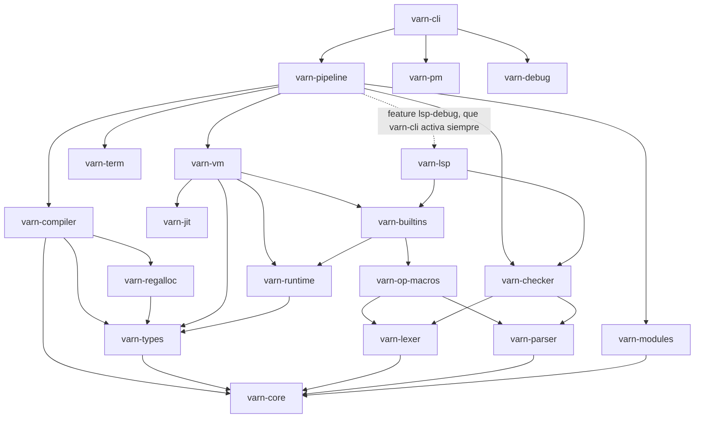

# Estado e Inventario de Crates del Workspace

Matriz de estado, jerarquía de dependencias y tamaños de los **19 crates** del workspace de **Varn**.

Los tamaños son líneas de Rust medidas sobre el árbol actual (105 060 líneas en 553 archivos). Este documento no publica porcentajes de cobertura: la suite de Rust son 85 tests, y la prueba real de integridad es `tests/main.vn` (991 aserciones) bajo las cuatro combinaciones de procedencia de std y JIT descritas en [CONTRIBUTING.md](../CONTRIBUTING.md).

---

## Tabla de Contenidos

- [1. Grafo de Dependencias entre Crates](#1-grafo-de-dependencias-entre-crates)
- [2. Inventario y Tamaño](#2-inventario-y-tamaño)
- [3. Descripción por Dominio Funcional](#3-descripción-por-dominio-funcional)
- [4. Métricas de Gobierno de Código](#4-métricas-de-gobierno-de-código)

---

## 1. Grafo de Dependencias entre Crates

Aristas reales declaradas en los manifiestos (no el flujo de datos del pipeline):

Dos aristas del grafo son deuda conocida, no diseño (ver [../AUDIT.md](../AUDIT.md) §4):

- `varn-vm → varn-builtins → varn-op-macros → varn-parser`: `varn_contract!` parsea sus contratos `.vn` en tiempo de expansión, así que compilar el motor de ejecución exige compilar el frontend.
- `varn-pipeline → varn-lsp` tras la feature `lsp-debug`, que `varn-cli` activa incondicionalmente: el orquestador consume el servidor de editor.

---

## 2. Inventario y Tamaño

| Crate | Dominio | Líneas | Estabilidad |
|---|---|---|---|
| `varn-vm` | Ejecución | 19 038 | Estable |
| `varn-checker` | Frontend | 16 594 | Estable |
| `varn-compiler` | Compilador (AST→HIR→SSA→bytecode) | 15 694 | Estable |
| `varn-jit` | JIT x86-64 (Cranelift) | 8 625 | En evolución |
| `varn-lsp` | Servidor LSP | 7 437 | En evolución |
| `varn-types` | Modelo de datos de runtime y bytecode | 6 263 | Estable |
| `varn-parser` | Frontend | 4 943 | Estable |
| `varn-core` | AST, opcodes, tokens, diagnósticos, `TypeTag` | 4 820 | Estable |
| `varn-cli` | CLI (`vn`) | 4 590 | Estable |
| `varn-builtins` | Stdlib nativa (LBI) | 4 307 | Estable |
| `varn-debug` | Inspección de fases | 3 302 | Herramienta |
| `varn-pipeline` | Orquestación de fases y caché | 3 034 | Estable |
| `varn-lexer` | Frontend | 1 557 | Estable |
| `varn-modules` | Resolución de módulos y bundle `.vnb` | 1 292 | Estable |
| `varn-regalloc` | Liveness + regalloc post-pass | 1 103 | Estable |
| `varn-op-macros` | Proc-macro `varn_contract!` | 918 | Estable |
| `varn-pm` | Gestor de paquetes | 802 | En evolución |
| `varn-runtime` | Canales de isolates + vtable de heap | 381 | Estable |
| `varn-term` | Estilo de terminal (chalk, colores) | 360 | Estable |

---

## 3. Descripción por Dominio Funcional

### Frontend (`varn-lexer`, `varn-parser`, `varn-checker`)
Tokenización con ASI, parser descendente con precedencia Pratt, y type-checker multi-fase que produce `TypedAST` + `SemanticDB`.

### Compilador (`varn-compiler`, `varn-regalloc`)
`varn-compiler` baja AST → HIR → SSA → bytecode y corre los passes de optimización. `varn-regalloc` no es una fase posterior: `varn-compiler` lo **invoca por dentro** (`run_post_passes`) para el liveness y la reasignación de registros sobre el bytecode ya emitido.

### Ejecución (`varn-vm`, `varn-jit`)
VM de registros de 64 bits con NaN-boxing, GC generacional (nursery + mark-sweep) e inline caches. El JIT compila con Cranelift y comparte la tabla de helpers con la ruta de inspección `vn debug -p clif`.

### Runtime (`varn-runtime`)
Hoy expone exactamente dos cosas: los canales tipados entre isolates (`channel`) y la instalación de la vtable de asignación del heap (`init_heap`). La ejecución de `async`/`await` **no** vive aquí — ver [RUNTIME_ARCHITECTURE.md](RUNTIME_ARCHITECTURE.md).

---

## 4. Métricas de Gobierno de Código

Umbral de refactor obligatorio: 1000 líneas por archivo. Archivos que hoy lo cruzan:

| Archivo | Líneas |
|---|---|
| `varn-compiler/src/ssa/emit.rs` | 1635 |
| `varn-compiler/src/ssa/build/expr.rs` | 1513 |
| `varn-compiler/src/hir/lower/expr.rs` | 1260 |
| `varn-compiler/src/hir/lower/decl.rs` | 1196 |
| `varn-compiler/src/ssa/build/stmt.rs` | 1089 |
| `varn-types/src/chunk.rs` | 1007 |

El subárbol `varn-vm/src/exec/` son 12 806 líneas (67 % del crate) y es el siguiente candidato a división por dominio.
