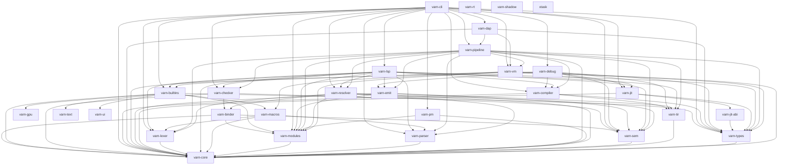

# Estado e Inventario de Crates del Workspace

Matriz de estado y jerarquía de dependencias de los **29 members** declarados en `Cargo.toml` (raíz, `members`): `varn-core`, `varn-lexer`, `varn-parser`, `varn-checker`, `varn-emit`, `varn-types`, `varn-tir`, `varn-sem`, `varn-binder`, `varn-resolver`, `varn-macros`, `varn-modules`, `varn-builtins`, `varn-cli`, `varn-lsp`, `varn-vm`, `varn-debug`, `varn-pm`, `varn-jit`, `varn-jit-abi`, `varn-pipeline`, `varn-compiler`, `varn-gpu`, `varn-ui`, `varn-text`, `varn-rt`, `varn-shadow`, `varn-dap` y `xtask`. `default-members` excluye `varn-rt`, `varn-shadow` y `xtask`.

Los conteos (líneas, tests, asserts) viven en el código y no se copian aquí: se desincronizan. La prueba canónica de integridad es `tests/main.vn` (200+ imports) bajo las cuatro combinaciones de procedencia de std y JIT (más el cuadrante 5 de caché JIT en `verify.ps1`) descritas en [CONTRIBUTING.md](../CONTRIBUTING.md).

---

## Tabla de Contenidos

- [1. Grafo de Dependencias entre Crates](#1-grafo-de-dependencias-entre-crates)
- [2. Inventario por Dominio](#2-inventario-por-dominio)
- [3. Descripción por Dominio Funcional](#3-descripción-por-dominio-funcional)
- [4. Métricas de Gobierno de Código](#4-métricas-de-gobierno-de-código)

---

## 1. Grafo de Dependencias entre Crates

Aristas reales declaradas en los manifiestos (no el flujo de datos del pipeline):

```mermaid
graph TD
    varn_binder["varn-binder"] --> varn_core["varn-core"]
    varn_binder["varn-binder"] --> varn_modules["varn-modules"]
    varn_binder["varn-binder"] --> varn_sem["varn-sem"]
    varn_builtins["varn-builtins"] --> varn_core["varn-core"]
    varn_builtins["varn-builtins"] --> varn_gpu["varn-gpu"]
    varn_builtins["varn-builtins"] --> varn_macros["varn-macros"]
    varn_builtins["varn-builtins"] --> varn_modules["varn-modules"]
    varn_builtins["varn-builtins"] --> varn_text["varn-text"]
    varn_builtins["varn-builtins"] --> varn_types["varn-types"]
    varn_builtins["varn-builtins"] --> varn_ui["varn-ui"]
    varn_checker["varn-checker"] --> varn_binder["varn-binder"]
    varn_checker["varn-checker"] --> varn_core["varn-core"]
    varn_checker["varn-checker"] --> varn_sem["varn-sem"]
    varn_cli["varn-cli"] --> varn_builtins["varn-builtins"]
    varn_cli["varn-cli"] --> varn_checker["varn-checker"]
    varn_cli["varn-cli"] --> varn_compiler["varn-compiler"]
    varn_cli["varn-cli"] --> varn_core["varn-core"]
    varn_cli["varn-cli"] --> varn_dap["varn-dap"]
    varn_cli["varn-cli"] --> varn_debug["varn-debug"]
    varn_cli["varn-cli"] --> varn_jit["varn-jit"]
    varn_cli["varn-cli"] --> varn_lexer["varn-lexer"]
    varn_cli["varn-cli"] --> varn_lsp["varn-lsp"]
    varn_cli["varn-cli"] --> varn_modules["varn-modules"]
    varn_cli["varn-cli"] --> varn_parser["varn-parser"]
    varn_cli["varn-cli"] --> varn_pipeline["varn-pipeline"]
    varn_cli["varn-cli"] --> varn_pm["varn-pm"]
    varn_cli["varn-cli"] --> varn_resolver["varn-resolver"]
    varn_cli["varn-cli"] --> varn_sem["varn-sem"]
    varn_cli["varn-cli"] --> varn_types["varn-types"]
    varn_cli["varn-cli"] --> varn_vm["varn-vm"]
    varn_compiler["varn-compiler"] --> varn_core["varn-core"]
    varn_compiler["varn-compiler"] --> varn_tir["varn-tir"]
    varn_compiler["varn-compiler"] --> varn_types["varn-types"]
    varn_core["varn-core"]
    varn_dap["varn-dap"] --> varn_core["varn-core"]
    varn_dap["varn-dap"] --> varn_pipeline["varn-pipeline"]
    varn_dap["varn-dap"] --> varn_types["varn-types"]
    varn_dap["varn-dap"] --> varn_vm["varn-vm"]
    varn_debug["varn-debug"] --> varn_compiler["varn-compiler"]
    varn_debug["varn-debug"] --> varn_core["varn-core"]
    varn_debug["varn-debug"] --> varn_emit["varn-emit"]
    varn_debug["varn-debug"] --> varn_jit["varn-jit"]
    varn_debug["varn-debug"] --> varn_sem["varn-sem"]
    varn_debug["varn-debug"] --> varn_tir["varn-tir"]
    varn_debug["varn-debug"] --> varn_types["varn-types"]
    varn_emit["varn-emit"] --> varn_core["varn-core"]
    varn_emit["varn-emit"] --> varn_modules["varn-modules"]
    varn_emit["varn-emit"] --> varn_sem["varn-sem"]
    varn_emit["varn-emit"] --> varn_tir["varn-tir"]
    varn_gpu["varn-gpu"]
    varn_jit_abi["varn-jit-abi"] --> varn_types["varn-types"]
    varn_jit["varn-jit"] --> varn_core["varn-core"]
    varn_jit["varn-jit"] --> varn_jit_abi["varn-jit-abi"]
    varn_jit["varn-jit"] --> varn_types["varn-types"]
    varn_lexer["varn-lexer"] --> varn_core["varn-core"]
    varn_lsp["varn-lsp"] --> varn_builtins["varn-builtins"]
    varn_lsp["varn-lsp"] --> varn_checker["varn-checker"]
    varn_lsp["varn-lsp"] --> varn_compiler["varn-compiler"]
    varn_lsp["varn-lsp"] --> varn_core["varn-core"]
    varn_lsp["varn-lsp"] --> varn_emit["varn-emit"]
    varn_lsp["varn-lsp"] --> varn_lexer["varn-lexer"]
    varn_lsp["varn-lsp"] --> varn_modules["varn-modules"]
    varn_lsp["varn-lsp"] --> varn_parser["varn-parser"]
    varn_lsp["varn-lsp"] --> varn_resolver["varn-resolver"]
    varn_lsp["varn-lsp"] --> varn_sem["varn-sem"]
    varn_lsp["varn-lsp"] --> varn_tir["varn-tir"]
    varn_lsp["varn-lsp"] --> varn_types["varn-types"]
    varn_macros["varn-macros"] --> varn_core["varn-core"]
    varn_macros["varn-macros"] --> varn_lexer["varn-lexer"]
    varn_macros["varn-macros"] --> varn_parser["varn-parser"]
    varn_modules["varn-modules"] --> varn_core["varn-core"]
    varn_parser["varn-parser"] --> varn_core["varn-core"]
    varn_pipeline["varn-pipeline"] --> varn_checker["varn-checker"]
    varn_pipeline["varn-pipeline"] --> varn_compiler["varn-compiler"]
    varn_pipeline["varn-pipeline"] --> varn_core["varn-core"]
    varn_pipeline["varn-pipeline"] --> varn_emit["varn-emit"]
    varn_pipeline["varn-pipeline"] --> varn_lexer["varn-lexer"]
    varn_pipeline["varn-pipeline"] --> varn_modules["varn-modules"]
    varn_pipeline["varn-pipeline"] --> varn_parser["varn-parser"]
    varn_pipeline["varn-pipeline"] --> varn_resolver["varn-resolver"]
    varn_pipeline["varn-pipeline"] --> varn_sem["varn-sem"]
    varn_pipeline["varn-pipeline"] --> varn_tir["varn-tir"]
    varn_pipeline["varn-pipeline"] --> varn_types["varn-types"]
    varn_pipeline["varn-pipeline"] --> varn_vm["varn-vm"]
    varn_pm["varn-pm"] --> varn_core["varn-core"]
    varn_pm["varn-pm"] --> varn_modules["varn-modules"]
    varn_resolver["varn-resolver"] --> varn_binder["varn-binder"]
    varn_resolver["varn-resolver"] --> varn_core["varn-core"]
    varn_resolver["varn-resolver"] --> varn_lexer["varn-lexer"]
    varn_resolver["varn-resolver"] --> varn_modules["varn-modules"]
    varn_resolver["varn-resolver"] --> varn_parser["varn-parser"]
    varn_resolver["varn-resolver"] --> varn_sem["varn-sem"]
    varn_rt["varn-rt"]
    varn_sem["varn-sem"] --> varn_core["varn-core"]
    varn_shadow["varn-shadow"]
    varn_text["varn-text"]
    varn_tir["varn-tir"] --> varn_core["varn-core"]
    varn_types["varn-types"] --> varn_core["varn-core"]
    varn_ui["varn-ui"]
    varn_vm["varn-vm"] --> varn_builtins["varn-builtins"]
    varn_vm["varn-vm"] --> varn_core["varn-core"]
    varn_vm["varn-vm"] --> varn_jit["varn-jit"]
    varn_vm["varn-vm"] --> varn_macros["varn-macros"]
    varn_vm["varn-vm"] --> varn_modules["varn-modules"]
    varn_vm["varn-vm"] --> varn_types["varn-types"]
    xtask["xtask"]
```

Solo `[dependencies]` (sin dev/build). `varn-macros` parsea los contratos `.vn` en tiempo de expansión, por eso depende de `varn-lexer`/`varn-parser`; `varn-builtins` usa los mismos dos solo como build-dependencies (su `build.rs` genera `MODULE_REGISTRY`). La ejecución alcanza el frontend por `varn-vm → varn-macros` y `varn-vm → varn-builtins → varn-macros`.

Las vistas de inspección que necesitan el análisis del LSP (`-p types`, `-p lsp`) viven en `varn-cli/src/inspect_lsp/`, no en el pipeline: solo requieren ruta y fuente, así que no justifican que el orquestador dependa del servidor de editor.

---

## 2. Inventario por Dominio

Sin conteos de líneas: viven en el código (`find crates -name "*.rs" | xargs wc -l`). Prueba canónica: `tests/main.vn` (200+ imports), no copiar cifras aquí.

| Crate | Dominio |
|---|---|
| `varn-core` | AST, opcodes, tokens, diagnósticos, ids de módulo y de op, huellas, `RuntimeKind` |
| `varn-lexer` | Frontend: tokenización |
| `varn-parser` | Frontend: parser |
| `varn-checker` | Frontend: chequeo (sobre `varn-sem` + `varn-binder`) |
| `varn-emit` | Emisión (sobre `varn-sem` + `varn-tir`) |
| `varn-sem` | Representación semántica |
| `varn-binder` | Nombres y alcances |
| `varn-resolver` | Resolución de módulos e imports |
| `varn-tir` | Representación intermedia tipada canónica |
| `varn-types` | Modelo de datos de runtime y bytecode |
| `varn-macros` | Proc-macros: `varn_contract!`, `#[jit_slow]`, `jit_helper_table!` |
| `varn-compiler` | Compilador (TIR→SSA→bytecode + `regalloc` interno) |
| `varn-jit` | JIT (Cranelift, sobre `varn-jit-abi`) |
| `varn-jit-abi` | ABI del JIT |
| `varn-vm` | Ejecución |
| `varn-builtins` | Stdlib nativa |
| `varn-modules` | Resolución de módulos y bundle |
| `varn-pipeline` | Orquestación de fases y caché |
| `varn-cli` | CLI (`vn`) |
| `varn-lsp` | Servidor LSP |
| `varn-dap` | Adaptador DAP |
| `varn-debug` | Inspección de fases |
| `varn-pm` | Gestor de paquetes |
| `varn-gpu` | Cómputo GPU (host) |
| `varn-ui` | UI nativa (host) |
| `varn-text` | Shaping de texto (host) |
| `varn-rt` | Runtime estático para binarios AOT |
| `varn-shadow` | Binario `vn-shadow` |
| `xtask` | Herramientas (`cargo xtask`) |

---

## 3. Descripción por Dominio Funcional

### Frontend e IR Intermedio (`varn-lexer`, `varn-parser`, `varn-checker`, `varn-tir`)
Tokenización (punto y coma opcional), parser descendente con precedencia por niveles, y type-checker que produce un `CheckResult`; `varn-emit` lo baja a un `TirModule` (`varn-tir`) con tipos y resoluciones canónicas en cada nodo.

### Compilador (`varn-compiler`)
Baja `TirModule` vía `from_tir` → SSA → bytecode, con pases a punto fijo (const-fold, guardas redundantes, monomorfización, álgebra, CSE, campos fijos, escape, LICM, DCE, simplificación de CFG), transformación a máquina de estados para async/generadores y regalloc. Ver `COMPILER_ARCHITECTURE.md`.

### Ejecución (`varn-vm`, `varn-jit`)
VM de registros de 128 bits (`VmValue` con tag + payload de 64 bits, nativo `i64`/`f64` y SSO hasta 8 bytes), GC generacional no copiante (generación joven `born` + marcas pegajosas en old-gen) e inline caches. El JIT (Cranelift, x86-64 y ARM64) entra por tiering: umbral 1 llamada si la función tiene bucle, 128 si no, y OSR a los 1000 back-edges; comparte la tabla de helpers con `vn debug -p clif`.

### Runtime (`varn-rt`)
`varn-rt` proporciona el runtime nativo mínimo para compilación AOT estática. No existe `varn-runtime` como crate.

---

## 4. Métricas de Gobierno de Código

Umbral real: 400 líneas por archivo, partir por dominio antes de agregar nada (AGENTS.md §6, CONTRIBUTING.md). CI avisa >400 y falla >1000 salvo exenciones legacy listadas en `LEGACY_EXEMPTIONS` (`.github/workflows/ci.yml:41`). Sin tablas de líneas por archivo aquí: se desincronizan; la auditoría se hace sobre el código.
