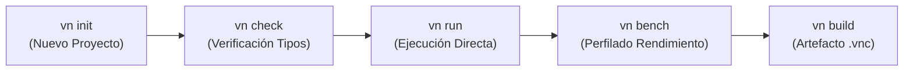

# Guía de Primeros Pasos con Varn

Bienvenido a **Varn**. Esta guía proporciona una visión completa para comenzar a desarrollar aplicaciones con el lenguaje Varn, desde la instalación básica hasta el empaquetado y consumo de bibliotecas.

---

## Tabla de Contenidos

- [¿Qué es Varn?](#qué-es-varn)
- [Ciclo de Vida de Desarrollo](#ciclo-de-vida-de-desarrollo)
- [Instalación Rápida](#instalación-rápida)
- [Tu Primer Programa](#tu-primer-programa)
- [Estructura de un Proyecto Varn](#estructura-de-un-proyecto-varn)
- [Tour de Características Básicas](#tour-de-características-básicas)
  - [Variables y Tipos](#variables-y-tipos)
  - [Funciones y Closures](#funciones-y-closures)
  - [Clases e Interfaces](#clases-e-interfaces)
  - [Pattern Matching (`match`)](#pattern-matching-match)
  - [Operador Pipeline (`|>`)](#operador-pipeline-)
  - [Concurrencia Async/Await](#concurrencia-asyncawait)
- [Importación de Módulos y Paquetes](#importación-de-módulos-y-paquetes)
- [Compilación a Artefactos Portable `.vnc`](#compilación-a-artefactos-portable-vnc)
- [Ejecución de la Suite de Verificación](#ejecución-de-la-suite-de-verificación)
- [Siguientes Pasos](#siguientes-pasos)

---

## ¿Qué es Varn?

Varn es un lenguaje compilado, estáticamente tipado, diseñado para combinar una sintaxis moderna y expresiva (inspirada en TypeScript) con el rendimiento de una máquina virtual basada en registros en 64 bits con NaN-boxing y un runtime asíncrono sobre Tokio.

---

## Ciclo de Vida de Desarrollo

El binario unificado `vn` orquesta todas las fases del ciclo de vida del software:



---

## Instalación Rápida

Consulta la guía detallada en [INSTALL.md](INSTALL.md) para más opciones.

```bash
git clone https://github.com/carlos-burelo/varn.git
cd varn-lang
cargo build --bin vn --release
```

Verifica la instalación:

```bash
./target/release/vn doctor
```

---

## Tu Primer Programa

Crea un archivo llamado `hola.vn`:

```Varn
// hola.vn
function saludar(nombre: str): str {
    return `¡Hola, ${nombre} desde Varn!`
}

print(saludar("Mundo"))
```

Ejecútalo con el comando `vn`:

```bash
vn run hola.vn
```

Salida esperada:
```
¡Hola, Mundo desde Varn!
```

---

## Estructura de un Proyecto Varn

Para inicializar un proyecto estructurado:

```bash
vn init mi-proyecto
cd mi-proyecto
```

Esto generará la siguiente jerarquía de archivos:

```
mi-proyecto/
├── main.vn             ← Punto de entrada principal
├── varn.json          ← Manifiesto del proyecto y dependencias
└── .vn/
    ├── varn.lock      ← Versiones bloqueadas de dependencias
    └── cache/         ← Caché local de bytecode (.bin)
```

---

## Tour de Características Básicas

### Variables y Tipos

```Varn
const pi: float = 3.14159
let contador: int = 0
const activo: bool = true
const nombre: str = "Varn"
```

### Funciones y Closures

```Varn
function sumar(a: int, b: int): int {
    return a + b
}

const duplicar = (n: int): int => n * 2
print(duplicar(21)) // 42
```

### Clases e Interfaces

```Varn
interface Volador {
    volar(): void
}

class Ave implements Volador {
    especie: str
    constructor(e: str) { this.especie = e }
    volar(): void { print(`${this.especie} está volando`) }
}
```

### Pattern Matching (`match`)

```Varn
const estado: int = 200

const mensaje = match (estado) {
    200 => "OK",
    404 => "Not Found",
    500 | 502 => "Server Error",
    _ => "Unknown State"
}
```

### Operador Pipeline (`|>`)

```Varn
function cuadrado(n: int): int = n * n
function sumarUno(n: int): int = n + 1

const resultado = 5 |> cuadrado |> sumarUno
print(resultado) // 26
```

### Concurrencia Async/Await

```Varn
import { sleep } from "std:time"

async function tareaLarga(): str {
    await sleep(100)
    return "Completado"
}

async function main(): void {
    const res = await tareaLarga()
    print(res)
}

await main()
```

---

## Importación de Módulos y Paquetes

### Módulos Nativos de la Stdlib (`std:*`)

```Varn
import { readFile, writeFile } from "std:fs"
import { sha256 } from "std:crypto"
import { now } from "std:time"
```

### Paquetes Externos (`pkg:*`)

Agrega dependencias a tu `varn.json`:

```bash
vn pkg add mathlib github.com/user/mathlib@^1.0.0
```

E impórtalas en tu código:

```Varn
import { calcular } from "pkg:mathlib"
```

---

## Compilación a Artefactos Portable `.vnc`

Puedes compilar tu código a un paquete de bytecode optimizado `.vnc`:

```bash
vn build main.vn -o app.vnc
```

Ejecuta el archivo `.vnc` sin volver a pasar por las fases de parsing o type checking:

```bash
vn run app.vnc
```

---

## Ejecución de la Suite de Verificación

Varn incluye una suite de pruebas integrada con 72 módulos de integración:

```bash
vn run tests/main.vn
```

---

## Siguientes Pasos

- 📖 [**WARP-SPEC.md**](WARP-SPEC.md) — Especificación completa de la sintaxis y semántica.
- 🏛️ [**ARCHITECTURE.md**](ARCHITECTURE.md) — Visión técnica interna de la VM y el compilador.
- 💻 [**CLI_REFERENCE.md**](CLI_REFERENCE.md) — Referencia de comandos CLI e inspección de fases.
