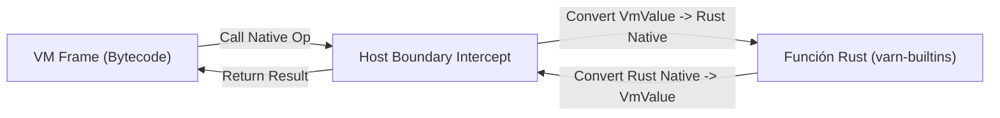

# Especificación del Límite Host / VM (`HOST_BOUNDARY_SPEC.md`)

Este documento especifica la interfaz de frontera (*Host Boundary*) que separa el runtime de **Varn** del código nativo en Rust, definiendo las reglas de conversión de tipos, manejo de errores y seguridad de memoria.

---

## Tabla de Contenidos

- [1. Visión General del Límite Host](#1-visión-general-del-límite-host)
- [2. Conversión de Tipos (`VmValue` ↔ Rust)](#2-conversión-de-tipos-vmvalue--rust)
- [3. Seguridad de Memoria y GC Roots](#3-seguridad-de-memoria-y-gc-roots)
- [4. Manejo de Errores y Excepciones Nativas](#4-manejo-de-errores-y-excepciones-nativas)

---

## 1. Visión General del Límite Host

El Límite Host es el punto de contacto entre la máquina virtual basada en registros de Varn y las funciones nativas implementadas en Rust (`varn-builtins`).



---

## 2. Conversión de Tipos (`VmValue` ↔ Rust)

La conversión de tipos entre el formato `VmValue` (128 bits: `tag: u64`, `payload: u64`) de la VM y las estructuras de datos nativas de Rust se realiza mediante primitivas optimizadas:

| Tipo Varn | Representación `VmValue` | Tipo Rust | Método de Conversión |
|---|---|---|---|
| `int` | `tag: KIND_INT`, payload de 64 bits | `i64` (completo) | `val.to_int()` / `VmValue::from_int(n)` |
| `float` | `tag: KIND_FLOAT`, payload IEEE 754 | `f64` | `val.to_float()` / `VmValue::from_float(f)` |
| `bool` | `tag: KIND_BOOL`, payload `0` o `1` | `bool` | `val.to_bool()` / `VmValue::from_bool(b)` |
| `str` | SSO inline (hasta 5B) o Ptr a Heap String | `&str` / `String` | `ctx.expect_string(val)` / `ctx.alloc_string(s)` |
| `Array` | Ptr a Heap Array | `&[VmValue]` | `ctx.expect_array(val)` / `ctx.alloc_array(v)` |
| `Map` | Ptr a Heap Map | `&ValueMap` | `ctx.expect_map(val)` / `ctx.alloc_map()` |

> **`int` es `i64` nativo completo.** Con la adopción de `VmValue` de dos palabras (128 bits), todo `i64` cabe íntegramente en el payload de 64 bits. No hay máscaras ni truncamiento a 48 bits.
>
> **Aritmética:** dentro del lenguaje, la aritmética de enteros opera en 64 bits con detección de overflow. Reglas normativas en `varn-core/src/numeric.rs` (fuente única).
>
> **Cruce desde el host:** `VmValue::from_int(n)` acepta cualquier `i64` de forma exacta sin precondiciones de rango. Métodos compatibles como `from_int_checked` y `from_int_wrapping` se conservan para conveniencia y coherencia de llamadas.

---

## 3. Seguridad de Memoria y GC Roots

Cuando una función nativa de Rust asigna memoria en el Heap de Varn (por ejemplo, al crear un `String` o un `Array` intermedio), debe proteger esa referencia de ser recolectada prematuramente si el GC menor se activa durante la llamada:

```rust
// Regla: Registrar el valor como raíz temporal (GC Root)
let temp_str = ctx.alloc_string("ejemplo");
ctx.push_root(temp_str); // Protege la referencia
// Operación nativa que puede desencadenar GC...
ctx.pop_root();
```

---

## 4. Manejo de Errores y Excepciones Nativas

Las funciones nativas en Rust no deben causar pánicos (`panic!`). Toda falla I/O o de argumento debe retornarse envuelta en un `VmResult::Err`:

```rust
if path.is_empty() {
    return Err(VmError::runtime_error("Path must not be empty"));
}
```

La VM interceptará este error y elevará una excepción recuperable en el código Varn (`try / catch`).

---

## 5. Sistema de Capacidades y Seguridad de Grano Fino (*Capabilities*)

El acceso a recursos externos del sistema operativo (disco, red, variables de entorno, procesos, FFI) se encuentra estrictamente mediado por el `CapabilitySet` en la interfaz `NativeCtx`:

- **Fast-path Bitmask (`u64`)**: Comprobación bit a bit en 1 ciclo de CPU (`0.3ns`) para operaciones no restringidas (`CAP_FS_READ`, `CAP_FS_WRITE`, `CAP_NET_CLIENT`, `CAP_NET_SERVER`, `CAP_SYS_ENV`, `CAP_SYS_EXEC`, `CAP_SYS_FFI`).
- **Filtros granulares de rutas y hosts**: Validación al momento de abrir el recurso (`open()`, `connect()`).
- **Aislamiento en Sandbox (`--sandbox`)**: Ejecución con cero permisos que bloquea determinísticamente cualquier intento de interacción con el host retornando `SecurityError: Permission denied (...)`.
