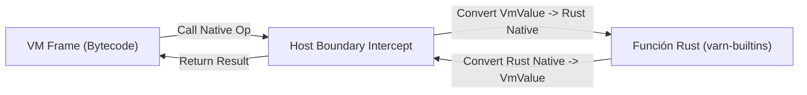

# Especificación del Límite Host / VM (`HOST_BOUNDARY_SPEC.md`)

Este documento especifica la interfaz de frontera (*Host Boundary*) que separa el runtime de **Varn** del código nativo en Rust, definiendo las reglas de conversión de tipos, manejo de errores y seguridad de memoria.

---

## Tabla de Contenidos

- [1. Visión General del Límite Host](#1-visión-general-del-límite-host)
- [2. Conversión de Tipos (`VmValue` ↔ Rust)](#2-conversión-de-tipos-vmvalue--rust)
- [3. Seguridad de Memoria y GC Roots](#3-seguridad-de-memoria-y-gc-roots)
- [4. Manejo de Errores y Excepciones Nativas](#4-manejo-de-errores-y-excepciones-nativas)

---

## 1. Visión General del Límite Host

El Límite Host es el punto de contacto entre la máquina virtual basada en registros de Varn y las funciones nativas implementadas en Rust (`varn-builtins`).



---

## 2. Conversión de Tipos (`VmValue` ↔ Rust)

La conversión de tipos entre el formato NaN-boxed de 64 bits de la VM y las estructuras de datos nativas de Rust se realiza mediante primitivas optimizadas:

| Tipo Varn | Representación `VmValue` | Tipo Rust | Método de Conversión |
|---|---|---|---|
| `int` | QNAN + Tag Int | `i64` | `val.to_int()` / `VmValue::from_int(n)` |
| `float` | Standard IEEE 754 | `f64` | `val.to_float()` / `VmValue::from_float(f)` |
| `bool` | QNAN + Tag Bool | `bool` | `val.to_bool()` / `VmValue::from_bool(b)` |
| `str` | Pointer a Heap String | `&str` / `String` | `ctx.expect_string(val)` / `ctx.alloc_string(s)` |
| `Array` | Pointer a Heap Object | `&[VmValue]` | `ctx.expect_array(val)` / `ctx.alloc_array(v)` |

---

## 3. Seguridad de Memoria y GC Roots

Cuando una función nativa de Rust asigna memoria en el Heap de Varn (por ejemplo, al crear un `String` o un `Array` intermedio), debe proteger esa referencia de ser recolectada prematuramente si el GC menor se activa durante la llamada:

```rust
// Regla: Registrar el valor como raíz temporal (GC Root)
let temp_str = ctx.alloc_string("ejemplo");
ctx.push_root(temp_str); // Protege la referencia
// Operación nativa que puede desencadenar GC...
ctx.pop_root();
```

---

## 4. Manejo de Errores y Excepciones Nativas

Las funciones nativas en Rust no deben causar pánicos (`panic!`). Toda falla I/O o de argumento debe retornarse envuelta en un `VmResult::Err`:

```rust
if path.is_empty() {
    return Err(VmError::runtime_error("Path must not be empty"));
}
```

La VM interceptará este error y elevará una excepción recuperable en el código Varn (`try / catch`).
