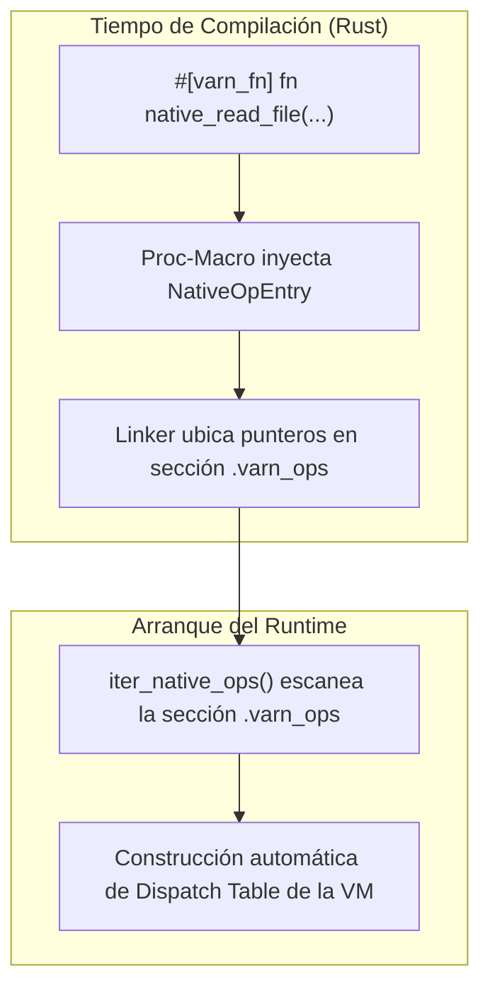

# Arquitectura de la Interfaz Ligada al Linker (LBI) (`varn-builtins`)

Este documento especifica el funcionamiento de la **Linker-Bound Interface (LBI)**, el mecanismo por el cual el runtime de **Varn** descubre y registra funciones y clases nativas en Rust sin tablas de registro centralizadas ni costo en tiempo de arranque.

---

## Tabla de Contenidos

- [1. Visión General de LBI](#1-visión-general-de-lbi)
- [2. Registro por Secciones del Linker](#2-registro-por-secciones-del-linker)
- [3. Proc-Macros de Registro (`#[varn_module]` y `#[varn_fn]`)](#3-proc-macros-de-registro-varn_module-y-varn_fn)
- [4. Proceso de Autodescubrimiento al Arrancar](#4-proceso-de-autodescubrimiento-al-arrancar)
- [5. Sistema de Capacidades de Seguridad (`cap`)](#5-sistema-de-capacidades-de-seguridad-cap)

---

## 1. Visión General de LBI

LBI resuelve el problema de mantener tablas monolíticas de registro de funciones nativas. Permite a los desarrolladores de Rust añadir un nuevo bindings nativo en cualquier archivo de `varn-builtins` simplemente etiquetando la función con un atributo proc-macro. Durante el enlazado del ejecutable, el compilador ubica la referencia de la función en una sección especial del ejecutable.



---

## 2. Registro por Secciones del Linker

Dependiendo del sistema operativo host, LBI inyecta los metadatos de las funciones nativas (`NativeOpEntry`) en las secciones equivalentes del binario ejecutable:

| Sistema Operativo | Formato Ejecutable | Sección del Linker |
|---|---|---|
| **Windows** | PE/COFF | `.varn_ops$B` (Delimitado por `$A` y `$C`) |
| **Linux** | ELF | `varn_ops` |
| **macOS** | Mach-O | `__DATA,varn_ops` |

---

## 3. Proc-Macros de Registro (`#[varn_module]` y `#[varn_fn]`)

`varn-op-macros` expone atributos procedurales para declarar módulos y funciones nativas de forma declarativa:

```rust
use varn_op_macros::{varn_module, varn_fn};
use varn_types::{VmValue, VmResult, CallContext};

#[varn_module("std:fs")]
pub mod native_fs {

    #[varn_fn(name = "readFile", cap = "fs.read")]
    pub fn read_file(ctx: &mut CallContext, path_val: VmValue) -> VmResult<VmValue> {
        let path = ctx.expect_string(path_val)?;
        let content = std::fs::read_to_string(path)?;
        Ok(ctx.alloc_string(content))
    }
}
```

---

## 4. Proceso de Autodescubrimiento al Arrancar

Al inicializar la VM, `varn-builtins::iter_native_ops()` realiza una lectura de memoria sobre la sección del linker:

1. Se obtiene el puntero de inicio y fin de la sección `.varn_ops`.
2. Se itera sobre cada `NativeOpEntry` sin realizar ninguna asignación de memoria.
3. Se registran las funciones nativas en la tabla de dispatch de la VM indexadas por ID de símbolo.

---

## 5. Sistema de Capacidades de Seguridad (`cap`)

Cada función nativa puede requerir una capacidad de seguridad explícita:

```rust
#[varn_fn(name = "writeFile", cap = "fs.write")]
```

Si el programa se ejecuta en un entorno restringido o sandbox que carece de la capacidad `fs.write`, la invocación de la función nativa fallará inmediatamente arrojando una excepción de seguridad sin ejecutar la llamada al sistema operativo.

---

## 6. Módulos Host Especializados (`builtin:net` y Primitivas)

### 6.1 Subsistema de Red Host (`builtin:net`)
Expone la interfaz nativa para sockets TCP no bloqueantes con soporte de cancelación reactiva:
- `tcpListen$(port)`: Enlaza un `TcpListener` y retorna un identificador entero.
- `tcpAccept$(listenerId)`: Bucle asíncrono con fast-path no bloqueante. Al invocar `tcpCloseListener$`, el bucle de sondeo detecta la remoción inmediata y finaliza el hilo de background sin retardos.
- `tcpConnect$(host, port)`: Conexión asíncrona no bloqueante.
- `tcpRead$(connId, maxLen)` / `tcpWrite$(connId, data)`: I/O no bloqueante con fast-path de $0\ \mu\text{s}$ cuando el buffer del kernel está listo.
- `tcpClose$(connId)` / `tcpCloseListener$(listenerId)`: Cierre determinista y liberación de recursos.

### 6.2 Primitivas Nativas (`int.parse`, `float.parse`, `str`)
Implementadas directamente a nivel nativo en Rust dentro de `crates/varn-builtins/src/modules/primitives/`, permitiendo conversión directa de strings a números con validación de NaN/overflow y rendimiento nativo sin requerir bucles manuales de parsing en la stdlib.

