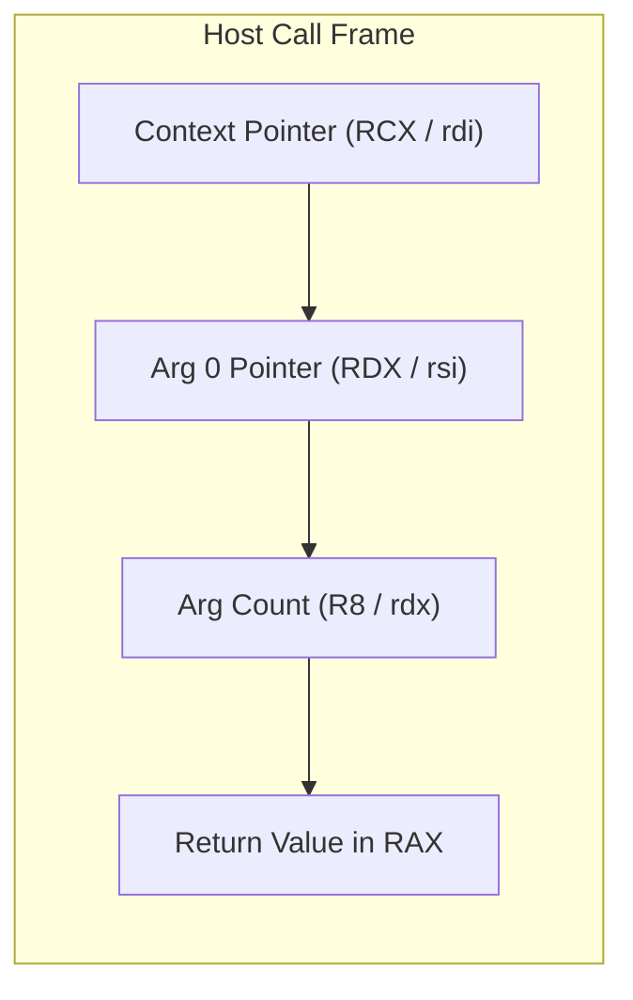

# Especificación de la ABI Nativa (`NATIVE_ABI_SPEC.md`)

Este documento define la **Interfaz Binaria de Aplicación (ABI)** nativa de **Varn**, detallando las convenciones de llamada a nivel de ensamblador, la distribución de registros y la compatibilidad FFI.

---

## Tabla de Contenidos

- [1. Convención de Llamada Nativa](#1-convención-de-llamada-nativa)
- [2. Distribución de Registros en la VM](#2-distribución-de-registros-en-la-vm)
- [3. Representación de Memoria FFI](#3-representación-de-memoria-ffi)
- [4. Interoperabilidad con C/Rust](#4-interoperabilidad-con-crust)

---

## 1. Convención de Llamada Nativa

Para minimizar la sobrecarga al invocar funciones nativas de Rust desde el intérprete o el JIT x86-64, Varn sigue la convención C estándar de 64 bits de la plataforma host (`x86_64-pc-windows-msvc` en Windows o `System V AMD64 ABI` en Linux/macOS).



---

## 2. Distribución de Registros en la VM

Las funciones nativas reciben una vista del array de registros del frame actual:

```rust
pub type NativeFn = fn(ctx: &mut CallContext, args: &[VmValue]) -> VmResult<VmValue>;
```

- `ctx`: Puntero al contexto de ejecución (acceso al heap, internador de cadenas y registrador de raíces del GC).
- `args`: Slice plano contiguo de 64 bits conteniendo los argumentos pasados en codificación NaN-Boxing.

---

## 3. Representación de Memoria FFI

Cualquier struct exportada a la ABI nativa debe mantener un layout binario compatible con C (`#[repr(C)]`):

```rust
#[repr(C)]
pub struct NativeStringHeader {
    pub length: u32,
    pub capacity: u32,
    pub hash: u32,
    pub data: *const u8,
}
```

---

## 4. Interoperabilidad con C/Rust

Las bibliotecas nativas de terceros pueden compilarse como DLL / Dynamic Libraries (`.dll`, `.so`, `.dylib`) e integrarse dinámicamente con Varn exponiendo el símbolo de entrada:

```c
// extern "C" C-ABI Plugin Entry
__declspec(dllexport) uint64_t varn_plugin_init(void* vm_context) {
    // Registrar opcodes nativos dinámicos
    return 0; // Success
}
```
