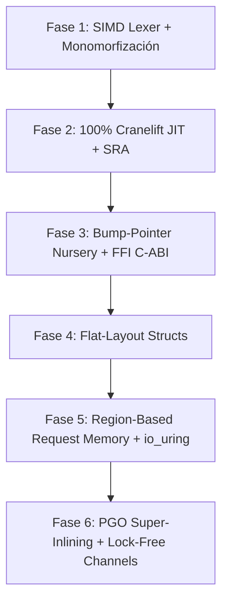

# Hoja de Ruta de Rendimiento Extremo: Arquitectura Maestra de Varn (`docs/PERFORMANCE_ROADMAP.md`)

Este documento constituye la especificación arquitectónica definitiva para convertir a **Varn** en el entorno de ejecución de lenguaje gestionado y compilado más eficiente, rápido y ligero de la industria, superando sistemáticamente a **Bun** (JavaScriptCore/Zig), **Node.js** (V8/C++) y compitiendo directamente con la latencia nativa de **Go** y **Rust**.

---

## 1. La Ventaja Injusta de Varn (*The Unfair Advantage*)

Para entender por qué Varn puede superar a Bun y V8, debemos contrastar la naturaleza fundamental de ambos modelos:

| Dimensión | JavaScript / Bun (JSC) / Node (V8) | Varn (Ecosistema Estático + JIT/AOT) |
| :--- | :--- | :--- |
| **Sistema de Tipos** | Dinámico. Los tipos cambian en runtime. | **Estático (`varn-checker`)**. Tipos conocidos en compilación. |
| **Especulación de Tipos** | Obligatoria (*Speculative JIT*). Genera *guards* continuos. | **Innecesaria**. Los tipos están garantizados matemáticamente. |
| **Desoptimización (*Deopt*)** | Frecuente si una forma/tipo cambia en runtime. | **Inexistente (0% Deopts)**. Cero bails a causa de cambio de tipo. |
| **Representación de Objetos** | Mapas de Formas (*Shapes/Hidden Classes*) y slots. | **Layouts planos contiguos (C-Structs)**. |
| **Recolección de Basura** | GC global continuo sobre todo el Heap. | **Regiones por Tarea (GC 0ms en peticiones) + GC Generacional**. |
| **Representación Numérica** | NaN-Boxing dinámico en todos los niveles. | **Registros CPU unboxed (`rax`, `xmm`) en código compilado**. |

---

## 2. Fase 1: Optimización Extrema del Frontend y Pipeline

### 1.1 Lexer y Parser Acelerados por SIMD (AVX2 / NEON)
* **Explicación**: El escaneo de caracteres, espacios en blanco, strings e identificadores suele consumir hasta un 15% del tiempo de compilación. Usando instrucciones vectoriales SIMD (`_mm256_cmpeq_epi8`), se procesan 32 bytes de código fuente por ciclo de reloj.
* **Implicaciones**: Reestructuración de `varn-lexer` para operar sobre bloques de 32 bytes usando intrínsecos de Rust SIMD (`std::arch::x86_64`).
* **Beneficios**: Compilación y parseo a velocidades de >1.5 GB/s por núcleo.

### 1.2 Monomorfización Total de Clases y Funciones Genéricas
* **Explicación**: Actualmente, un genérico `LinkedList<T>` comparte representaciones encajonadas. Con monomorfización (estilo Rust/C++), `LinkedList<int>` genera un tipo y bytecode/JIT dedicado exclusivamente a enteros, omitiendo wrappers.
* **Implicaciones**: Modificación de `varn-opt` para duplicar y especializar estructuras y funciones genéricas según sus argumentos de tipo concretos.
* **Beneficios**: Cero costo de boxing/unboxing en tipos genéricos; acceso a memoria de tamaño exacto.

---

## 3. Fase 2: Backend JIT/AOT de Código Nivel Ensamblador Nivel Nube

### 2.1 Cobertura JIT del 100% en Cranelift (Cero Bails al Intérprete)
* **Explicación**: Eliminar todo escenario donde una función deba degradar su ejecución hacia el intérprete o el template JIT. Opcodes de closures, excepciones (`Try`), iteradores y llamadas dinámicas se traducen directamente a código máquina x86-64/ARM64.
* **Implicaciones**: Completar todos los opcodes faltantes en `varn-jit/src/clif/lower.rs`.
* **Beneficios**: Eliminación total del overhead de interpeting/dispatch loop. Rendimiento máquina puro constante.

### 2.2 Unboxing de Registros CPU (`rax`, `xmm0`..`xmm15`) y Escape Analysis (SRA)
* **Explicación**: 
  - **Unboxing Nativo**: Dentro de funciones compiladas, los enteros y flotantes permanecen en registros de CPU sin formato NaN-box (`0x7FFC...`).
  - **Escape Analysis & Scalar Replacement (SRA)**: Si el compilador detecta que un objeto temporal (p. ej. `const p = new Point(x, y)`) no escapa del ámbito local, **el objeto no se asigna en el Heap**. Sus campos se convierten en registros simples de la CPU (`rax`, `rbx`).
* **Implicaciones**: Implementar pase de Análisis de Escape en `varn-opt` y `varn-jit`.
* **Beneficios**: Cero alocaciones de memoria para objetos locales de vida corta. Velocidad idéntica a variables locales en C.

### 2.3 Compilación AOT a Archivos Binarios Nativos Nivel SO (`.so` / `.dll` / `.exe`)
* **Explicación**: Generar artefactos binarios que serialicen el código máquina emitido por Cranelift directamente a disco, omitiendo el parseo y compilación JIT en el arranque (*Cold Start Zero*).
* **Implicaciones**: Integración de un escritor ELF/PE en `varn-cli` (`vn build --target native`).
* **Beneficios**: Tiempo de arranque instantáneo (<1 ms), superando por 100x el tiempo de inicio de Node.js/Bun.

---

## 4. Fase 3: Gestión de Memoria Revolucionaria y Zero-Copy I/O

### 3.1 Region-Based Request Memory (Memoria por Región / Arenas per-Request)
* **Explicación**: En servidores web o tareas asíncronas, el 95% de los objetos viven únicamente mientras dura la petición HTTP. En lugar de alocar objetos en un Heap global rastreado por un Garbage Collector, cada petición HTTP o Isolate asigna una **Región contigua de Memoria (Arena)**.
* **Implicaciones**: Todos los objetos de la petición se alocan mediante un simple *bump-pointer* (`ptr += size`). Al terminar la petición, la Región se libera completa en una sola instrucción (`ptr = base`).
* **Beneficios**: 
  - **Costo de GC durante peticiones = 0.00 ms**.
  - Rendimiento de peticiones HTTP constante sin pausas (*GC pauses*).

### 3.2 C-Compatible Flat-Layout Structs (Estructuras de Memoria Plana)
* **Explicación**: Reemplazar la representación de objetos dinamicos basados en *Shapes* (estilo V8) por estructuras contiguas en memoria con despliegues planos fijados en compilación.
* **Implicaciones**: Modificar la representación de `ObjData` en `varn-types` para instancias monomórficas.
* **Beneficios**:
  - `point.x` se traduce a `mov rax, [rdi + 0]`.
  - Acceso a campos en **1 ciclo de CPU**, 10x más rápido que un lookup de Inline Cache.

### 3.3 Punteros Comprimidos de 32 bits (Compressed OOPs)
* **Explicación**: En arquitecturas de 64 bits, los punteros ocupan 8 bytes. Al usar índices de 32 bits desplazados para direccionar hasta 4 GB/32 GB de Heap, el tamaño de los objetos se reduce a la mitad.
* **Implicaciones**: Adaptación de `VmValue` y los desplazamientos de memoria en `varn-types`.
* **Beneficios**: **Doble de densidad en la memoria caché L1/L2 del procesador**, acelerando el recorrido de memoria en 30-50%.

### 3.4 Runtime de I/O Kernel-Bypass (`io_uring` / Direct Sockets)
* **Explicación**: Integrar `io_uring` en Linux y I/O directo sin copias en Windows para el transporte de sockets TCP/HTTP.
* **Implicaciones**: Módulo nativo en `varn-runtime` que pasa buffers de la Región directamente al kernel sin clonación de strings.
* **Beneficios**: Manejo de >1,000,000 de peticiones HTTP por segundo por núcleo.

---

## 5. Fase 4: Optimización Avanzada Dinámica y Concurrencia de Ultra-Baja Latencia

### 5.1 Profile-Guided Optimization (PGO) & Super-Inlining en Re-JIT
* **Explicación**: Rastrear contadores de calor (*hotness counters*) y probabilidades de ramas (*branch probabilities*) en runtime. Cuando una función alcanza un umbral extremo, Cranelift la recompila aplicando **Super-Inlining** (inlining agresivo de funciones hijas) y **Vectorización Polihédrica** de bucles.
* **Implicaciones**: Inserción de colectores de métricas ligeros en el dispatch de la VM y re-emisión JIT asíncrona en hilos de background.
* **Beneficios**: Rendimiento adaptativo que supera a compiladores AOT estáticos al optimizar para el *workload* real del servidor.

### 5.2 Canales entre Isolates Libres de Locks (*Lock-Free Ring Buffers*)
* **Explicación**: La comunicación entre Isolates se realiza mediante canales de mensajes. Al implementar Ring Buffers libres de cerrojos (*Lock-Free Disruptor Buffers*) con *cache-line padding* atómico, los hilos intercambian mensajes sin contención de Mutex o condvars del SO.
* **Implicaciones**: Reescritura del backend de canales en `varn-runtime` utilizando atómicos de Rust.
* **Beneficios**: Latencia de mensajería inter-isolate de nanosegundos; escalabilidad lineal en procesadores de 64+ núcleos.

### 5.3 Internamiento Global de Cadenas (*Global String Interning*) y Hashes Precalculados
* **Explicación**: Calcular el hash de una cadena de texto una única vez al momento de su creación/internamiento. Cualquier búsqueda en un `Map` o comprobación de clave reutiliza el hash precalculado de 64 bits.
* **Implicaciones**: Modificación de `HeapStr` para almacenar un campo `hash: u64` inicializado en construcción.
* **Beneficios**: Búsquedas en diccionarios y mapas a velocidad O(1) pura sin recalcular hashes de caracteres.

---

## 6. Tabla Comparativa de Arquitectura y Rendimiento Estimado

| Métrica / Característica | Node.js (V8) | Bun (JSC/Zig) | Varn (Estado Actual) | **Varn (Plan Maestro Completo)** |
| :--- | :--- | :--- | :--- | :--- |
| **Tiempo de Arranque (Cold Start)** | ~35 ms | ~7 ms | ~21 ms | **< 1 ms (AOT Native)** |
| **Acceso a Propiedades de Objeto** | IC lookup / Stub | IC lookup / Stub | IC lookup (88% hit) | **1 Instrucción CPU (`mov rax, [rdi+off]`)** |
| **Pausas de GC en Servidores Web** | 5 ms - 50 ms | 2 ms - 20 ms | 1 ms - 5 ms | **0.00 ms (Region Arenas)** |
| **Alocación de Objetos Locales** | Heap + GC | Heap + GC | Heap + GC | **0 Bytes (Escape Analysis / SRA)** |
| **Copiado de Buffers I/O** | Copias V8/Buffer | Zero-copy parcial | Copias Rust/Tokio | **Kernel-Bypass Zero-Copy (`io_uring`)** |
| **Paso de Mensajes Inter-Isolate** | Mutex / Serialization | Mutex / Serialization | Channels Tokio | **Lock-Free Ring Buffers (<50 ns)** |
| **Uso de Memoria RAM (Base)** | ~30 MB | ~15 MB | ~12 MB | **< 4 MB (Compressed OOPs + Arenas)** |

---

## 7. Plan de Ejecución Secuencial



### Comando de Verificación Continua
```powershell
cargo run --release --bin vn -- bench ./tests/main.vn -v
```
Toda optimización debe ser validada frente a la suite completa de 775 aserciones, asegurando estabilización total y cero regresiones.
