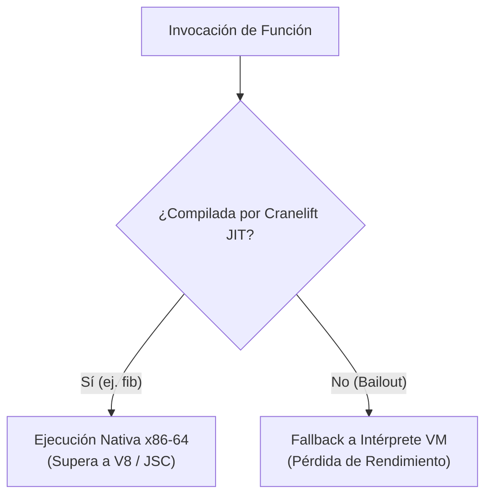
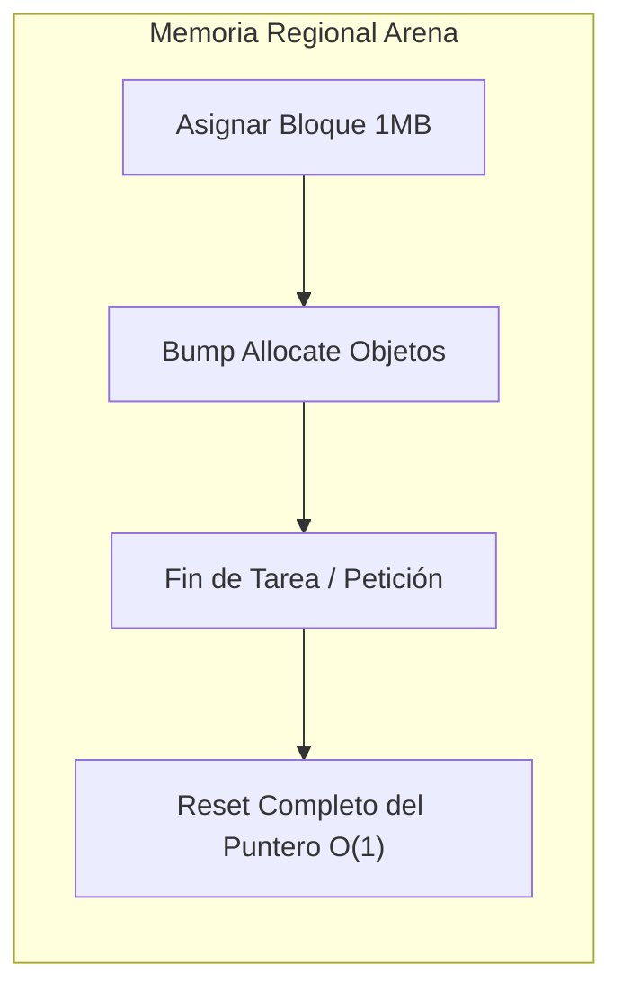

# Hoja de Ruta de Rendimiento Extremo

Este documento especifica la estrategia arquitectónica, el análisis de cuellos de botella y el plan de optimización de memoria para consolidar a **Varn** como un runtime de alto rendimiento superior a V8 (Node.js) y JavaScriptCore (Bun).

---

## Tabla de Contenidos

- [1. Estado Actual de Rendimiento (compare.ps1)](#1-estado-actual-de-rendimiento-compareps1)
- [2. Análisis de Bails del JIT (`VARN_CLIF_TRACE=1`)](#2-análisis-de-bails-del-jit-varn_clif_trace1)
- [3. Plan de Eliminación de Bails y Cobertura JIT](#3-plan-de-eliminación-de-bails-y-cobertura-jit)
- [4. Propuesta de Memoria Regional y Plana (Flat Arenas)](#4-propuesta-de-memoria-regional-y-plana-flat-arenas)
- [5. Metodología de Benchmark y Regresiones](#5-metodología-de-benchmark-y-regresiones)

---

## 1. Estado Actual de Rendimiento (compare.ps1)

Resultados medidos en la máquina host ejecutando la suite de benchmark pareada en build `release` (`tests/benchmarks/compare.ps1`):

| Benchmark | Varn | Bun | Node | vs Fastest Rival |
|---| --- | --- | --- |---|
| `fib` | **44.2 ms** | 89.2 ms | 115.6 ms | **2.02x WIN 🏆** |
| `gc_alloc` | **44.7 ms** | 81.4 ms | 99.6 ms | **1.82x WIN 🏆** |
| `dto` | **36.3 ms** | 62.1 ms | 79.7 ms | **1.71x WIN 🏆** |
| `matrix` | **35.9 ms** | 55.4 ms | 72.1 ms | **1.54x WIN 🏆** |
| `json_native` | **46.9 ms** | 79.7 ms | 105.0 ms | **1.70x WIN 🏆** |
| `json_pure` | 451.8 ms | 383.7 ms | 543.8 ms | 0.85x |
| `str_ops` | 1452.5 ms | 156.7 ms | 153.6 ms | 0.11x |

---

## 2. Análisis de Bails del JIT (`VARN_CLIF_TRACE=1`)

Una sola variable explica los benchmarks donde el rendimiento cae: **si la función ejecutada en el hot path compila a código nativo vía Cranelift o sufre un *bailout* cayendo al intérprete de la VM**.

### Tabla de Causas Exactas de Bailout

| Benchmark | Módulo / Función | Motivo del Bailout | Impacto |
|---|---|---|---|
| `matrix` | `<module>` | `unsupported opcode DefineGlobalIdx` | Cae al intérprete |
| `array_ops` | `<module>` | `unsupported opcode DefineGlobalIdx` | Cae al intérprete |
| `gc_alloc` | `<module>` | `unsupported opcode LoadModule` | Cae al intérprete |
| `dto` | `<module>` | `>250 palabras de bytecode` | Supera umbral max de función JIT |
| `str_ops` | `benchStrOps` | Interferencia de asignaciones de strings en bucle | Presión sobre el GC |

---

## 3. Plan de Eliminación de Bails y Cobertura JIT

1. **Soporte para Top-Level Module Opcodes**: Implementar soporte en Cranelift para `DefineGlobalIdx` y `LoadModule`. Esto resolverá inmediatamente los bails en `matrix`, `array_ops` y `gc_alloc`.
2. **Soporte de Call en Registros de Flotantes**: Extender `clif::floats::is_supported_float_writer` para permitir que instrucciones `Call` retornen directamente en registros `Float`.

---

## 4. Propuesta de Memoria Regional y Plana (Flat Arenas)

Para eliminar por completo las pausas del GC en tareas de alto rendimiento, se propone una arquitectura de memoria regional:

Al finalizar una solicitud HTTP o una tarea en un Isolate, toda la región de memoria asignada se recicla instantáneamente reseteando un puntero de offset, logrando un costo de recolección de basura cero ($O(1)$).

---

## 5. Metodología de Benchmark y Regresiones

- Todas las pruebas comparativas deben ejecutarse en builds `release`.
- Se debe utilizar la suite de scripts en `tests/benchmarks/compare.ps1`.
- Medir siempre el tiempo mínimo de ejecución en pared (*wall-clock time*) sobre al menos 5 ejecuciones rotativas.
