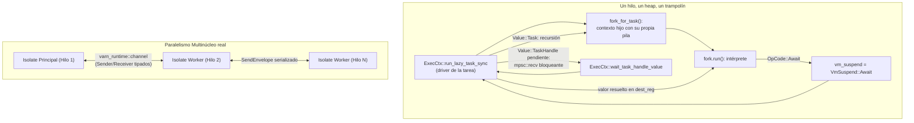
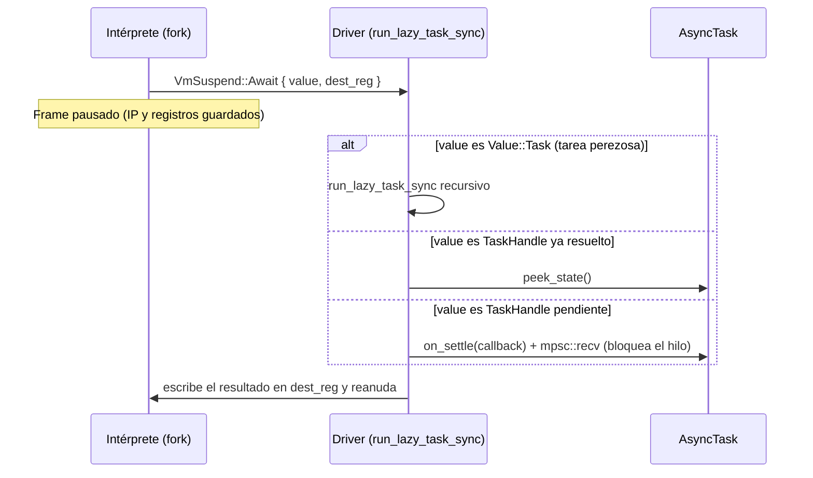
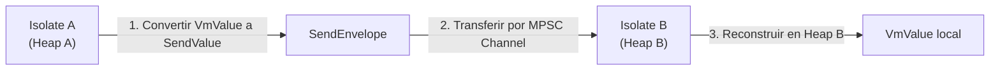

# Arquitectura de Concurrencia: Tareas, Generadores e Isolates

Este documento especifica cómo Varn ejecuta `async`/`await`, generadores e Isolates. El nombre del crate `varn-runtime` es engañoso por historia: hoy ese crate aporta **solo** los canales tipados entre Isolates y la vtable de asignación del heap. La suspensión y reanudación de tareas viven en `varn-vm`.

---

## Tabla de Contenidos

- [1. Modelo Real de Ejecución](#1-modelo-real-de-ejecución)
- [2. Estado y Límites Conocidos](#2-estado-y-límites-conocidos)
- [3. Mecánica de Suspensión y Reanudación (`async`/`await`)](#3-mecánica-de-suspensión-y-reanudación-asyncawait)
- [4. Generadores y Canal de Rendimiento (`yield`)](#4-generadores-y-canal-de-rendimiento-yield)
- [5. Primitivas de Concurrencia](#5-primitivas-de-concurrencia)
  - [`spawn` y `parallel`](#spawn-y-parallel)
  - [`TaskGroup` con Gestión Determinista (`using`)](#taskgroup-con-gestión-determinista-using)
- [6. Concurrencia Multinúcleo mediante Isolates](#6-concurrencia-multinúcleo-mediante-isolates)
  - [Aislamiento de Heap](#aislamiento-de-heap)
  - [Canales Tipados (`SendValue` & `SendEnvelope`)](#canales-tipados-sendvalue--sendenvelope)

---

## 1. Modelo Real de Ejecución

No hay event loop. Las tareas se ejecutan en un **trampolín síncrono** dentro de la VM: el intérprete corre hasta que encuentra un `await`, señala la suspensión al driver, y el driver resuelve el valor esperado antes de reanudar el mismo frame.



El paralelismo real de Varn son los Isolates (§6): hilos del sistema operativo con VM y heap propios. La concurrencia intra-hilo es cooperativa y determinista, no preemptiva.

---

## 2. Estado y Límites Conocidos

Consecuencias directas del modelo, para que nadie las descubra depurando:

- **`await` sobre un handle pendiente bloquea el hilo.** `wait_task_handle_value` registra un `on_settle` y espera en un canal `std::sync::mpsc`. Si quien debe resolverlo es el mismo hilo, no hay quien lo resuelva.
- **I/O no cede el control.** Las operaciones de `runtime:fs` y `runtime:net` son síncronas; `net` lanza hilos del sistema (`std::thread::spawn`) cuando necesita concurrencia.
- **Los timers duermen el hilo.** `suspend_timer` usa `thread::sleep`. Solo intenta `tokio::task::spawn_local` si detecta un runtime Tokio activo, situación que ninguna ruta del CLI produce hoy.
- **No hay `LocalSet` en ejecución.** El scheduler basado en Tokio que este documento describía fue eliminado en el commit `0aef540` por no tener un solo consumidor: era una arquitectura documentada pero nunca instanciada.

Un event loop real es un cambio de diseño pendiente, no una descripción del presente. Cuando llegue, este documento se escribe **después** de que exista.

---

## 3. Mecánica de Suspensión y Reanudación (`async`/`await`)

`OpCode::Await` no llama a nadie: guarda el `IP` del frame, deja
`VmSuspend::Await { value, dest_reg }` en el contexto y retorna al driver. El
driver (`run_lazy_task_sync`) decide cómo obtener el valor:



1. La VM emite `VmSuspend::Await` guardando `IP` y registros locales del frame.
2. El driver resuelve el valor: recursión para tareas perezosas, `peek_state`
   para handles ya resueltos, espera bloqueante para handles pendientes.
3. Un rechazo se reinyecta como excepción de la VM en el frame reanudado; una
   resolución se escribe en `dest_reg`.

El JIT participa por el mismo canal: `jit_helpers/suspend.rs` deja el mismo
`VmSuspend::Await` que el intérprete, así que el contrato de suspensión es
único para ambas rutas de ejecución.

---

## 4. Generadores y Canal de Rendimiento (`yield`)

Las funciones generadoras (`function*`) usan el mismo canal de suspensión que `await`:
- Al ejecutar `yield valor`, la VM deja `VmSuspend::Yield { value, dest_reg }`.
- El generador guarda su `ExecCtx` completo (`NanSyncGenDriver` en `varn-vm/src/generator.rs`), no un frame aislado: la reanudación reentra en ese contexto y escribe el valor enviado por `.next(v)` en `dest_reg`.
- La ejecución se congela entre llamadas a `.next()`; un generador que emita `VmSuspend::Await` o `Task` se trata como generador asíncrono.

---

## 5. Primitivas de Concurrencia

### `spawn` y `parallel`
- `spawn(asyncFn())`: ejecuta la tarea **hasta el final en el trampolín del hilo actual** (`spawn_internal` -> `run_lazy_task_sync`) y devuelve un handle ya resuelto. No es ejecución en segundo plano: el nombre viene del modelo previsto, no del actual.
- `parallel([p1, p2, p3])`: registra un `on_settle` por handle sobre un contador compartido y resuelve el handle agregado cuando el último llega. Los handles provienen de `spawn`, así que las tareas ya vienen ejecutadas; lo que `parallel` aporta hoy es la agregación de resultados y la propagación del primer rechazo, no solapamiento temporal.

### `TaskGroup` con Gestión Determinista (`using`)
`TaskGroup` permite agrupar tareas asíncronas dinámicas garantizando la limpieza de recursos al salir del ámbito mediante la palabra clave `using`:

```Varn
import { TaskGroup } from "std:task"

async function procesarColeccion(): void {
    using group = TaskGroup<int>()
    group.spawn(async () => 10)
    group.spawn(async () => 20)
    
    const resultados = await group.join()
    assert("total", resultados[0] + resultados[1] === 30)
}
```

---

## 6. Concurrencia Multinúcleo mediante Isolates

Para aprovechar arquitecturas multinúcleo sin sufrir los problemas de las condiciones de carrera (*race conditions*), Varn implementa **Isolates**:

### Aislamiento de Heap
Cada Isolate se ejecuta en su propio hilo del sistema operativo, con su propia instancia de la máquina virtual (`varn-vm`) y su propio Heap independiente. Ningún objeto del heap se comparte directamente entre Isolates.

### Canales Tipados (`SendValue` & `SendEnvelope`)
La comunicación inter-Isolate se realiza exclusivamente mediante paso de mensajes a través de canales tipados:



1. **Serialización Ligera**: Los datos se converten a una estructura neutra e independiente del heap (`SendValue`).
2. **Transferencia Segura**: Se envían envueltos en un `SendEnvelope` a través de un canal mpsc no bloqueante.
3. **Deserialización Local**: El Isolate receptor deserializa el mensaje y reconstruye las estructuras de objetos en su propio heap.
