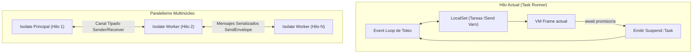
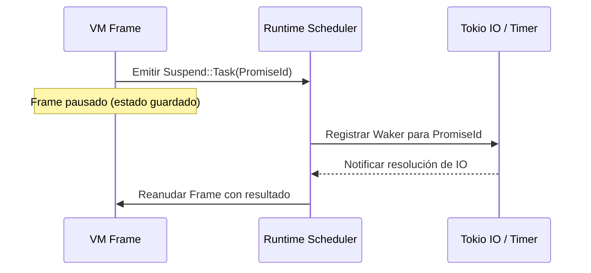
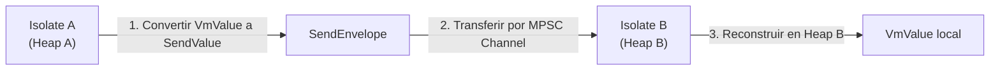

# Arquitectura del Runtime Asíncrono e Isolates (`varn-runtime`)

Este documento especifica la arquitectura del runtime asíncrono y el sistema de paralelismo de **Varn**, incluyendo la integración con Tokio, la mecánica de suspensión de frames (`async`/`await`), los generadores y la comunicación entre hilos mediante **Isolates**.

---

## Tabla de Contenidos

- [1. Visión General del Runtime](#1-visión-general-del-runtime)
- [2. Event Loop de Tokio y `LocalSet`](#2-event-loop-de-tokio-y-localset)
- [3. Mecánica de Suspensión y Reanudación (`async`/`await`)](#3-mecánica-de-suspensión-y-reanudación-asyncawait)
- [4. Generadores y Canal de Rendimiento (`yield`)](#4-generadores-y-canal-de-rendimiento-yield)
- [5. Primitivas de Concurrencia](#5-primitivas-de-concurrencia)
  - [`spawn` y `parallel`](#spawn-y-parallel)
  - [`TaskGroup` con Gestión Determinista (`using`)](#taskgroup-con-gestión-determinista-using)
- [6. Concurrencia Multinúcleo mediante Isolates](#6-concurrencia-multinúcleo-mediante-isolates)
  - [Aislamiento de Heap](#aislamiento-de-heap)
  - [Canales Tipados (`SendValue` & `SendEnvelope`)](#canales-tipados-sendvalue--sendenvelope)

---

## 1. Visión General del Runtime

`varn-runtime` proporciona la capa de ejecución asíncrona no bloqueante de Varn. Combina un event-loop asíncrono para operaciones I/O intensivas con un modelo de **Isolates** para paralelismo real en múltiples núcleos del procesador.



---

## 2. Event Loop de Tokio y `LocalSet`

Puesto que las estructuras de la VM (`VmValue`, `CallFrame`, `HeapObj`) contienen punteros locales y referencias no compatibles con el rasgo `Send` de Rust, las tareas Varn de un mismo contexto se ejecutan en un `tokio::task::LocalSet`.
- Cada hilo del runtime administra su propio `LocalSet`.
- Permite la ejecución de miles de corrutinas en un solo hilo sin incurrir en costos de sincronización por cerrojos (*locks*).

---

## 3. Mecánica de Suspensión y Reanudación (`async`/`await`)

Cuando la VM evalúa una instrucción `await` sobre una promesa no resuelta:



1. La VM emite la señal `Suspend::Task(PromiseId)` guardando la posición del contador de programa (`IP`) y los registros locales.
2. El runtime suspende el frame y retorna el control al bucle de eventos de Tokio.
3. Al completarse la tarea I/O, el `Waker` notifica al scheduler, el cual reactiva el frame de la VM inyectando el valor resuelto en el registro destino.

---

## 4. Generadores y Canal de Rendimiento (`yield`)

Las funciones generadoras (`function*`) utilizan un mecanismo similar a `async`/`await`:
- Al ejecutar `yield valor`, la VM emite `Suspend::Yield(VmValue)`.
- El valor devuelto se envía a un canal sincronizado `GenChannel`.
- La ejecución de la función se congela hasta que el código consumidor invoca `.next()`.

---

## 5. Primitivas de Concurrencia

### `spawn` y `parallel`
- `spawn(asyncFn())`: Lanza una tarea en segundo plano dentro del `LocalSet` actual y retorna un handle awaitable.
- `parallel([p1, p2, p3])`: Ejecuta un array de promesas concurrentemente y suspende el frame hasta que todas se hayan resuelto.

### `TaskGroup` con Gestión Determinista (`using`)
`TaskGroup` permite agrupar tareas asíncronas dinámicas garantizando la limpieza de recursos al salir del ámbito mediante la palabra clave `using`:

```Varn
import { TaskGroup } from "std:task"

async function procesarColeccion(): void {
    using group = TaskGroup<int>()
    group.spawn(async () => 10)
    group.spawn(async () => 20)
    
    const resultados = await group.join()
    assert("total", resultados[0] + resultados[1] === 30)
}
```

---

## 6. Concurrencia Multinúcleo mediante Isolates

Para aprovechar arquitecturas multinúcleo sin sufrir los problemas de las condiciones de carrera (*race conditions*), Varn implementa **Isolates**:

### Aislamiento de Heap
Cada Isolate se ejecuta en su propio hilo del sistema operativo, con su propia instancia de la máquina virtual (`varn-vm`) y su propio Heap independiente. Ningún objeto del heap se comparte directamente entre Isolates.

### Canales Tipados (`SendValue` & `SendEnvelope`)
La comunicación inter-Isolate se realiza exclusivamente mediante paso de mensajes a través de canales tipados:



1. **Serialización Ligera**: Los datos se converten a una estructura neutra e independiente del heap (`SendValue`).
2. **Transferencia Segura**: Se envían envueltos en un `SendEnvelope` a través de un canal mpsc no bloqueante.
3. **Deserialización Local**: El Isolate receptor deserializa el mensaje y reconstruye las estructuras de objetos en su propio heap.
