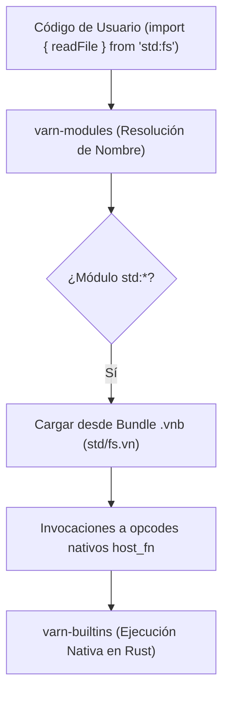
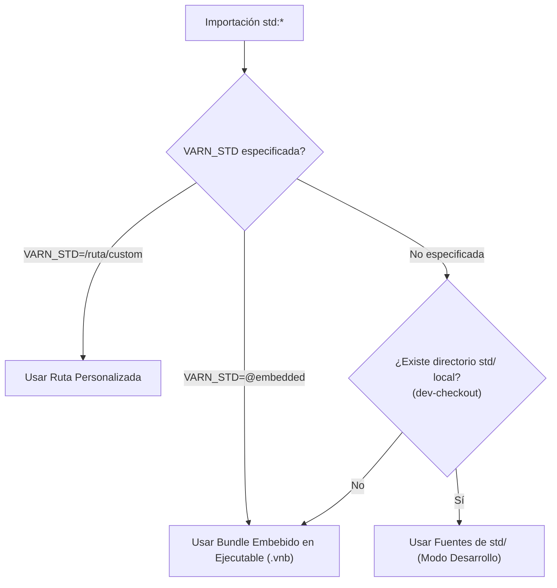

# Arquitectura de la Biblioteca Estándar (`std:*` & `.vnb`)

Este documento especifica la estructura, el sistema de resolución, el mecanismo de empaquetado y la especificación de módulos de la biblioteca estándar de **Varn**.

---

## Tabla de Contenidos

- [1. Visión General de la Stdlib](#1-visión-general-de-la-stdlib)
- [2. Módulos de la Biblioteca Estándar](#2-módulos-de-la-biblioteca-estándar)
- [3. Arquitectura del Bundle `.vnb`](#3-arquitectura-del-bundle-vnb)
- [4. Jerarquía de Resolución y Procedencia](#4-jerarquía-de-resolución-y-procedencia)
- [5. Estado de la Matriz de Validación de Procedencia](#5-estado-de-la-matriz-de-validación-de-procedencia)
- [6. Especificación del Módulo HTTP (`std:http`)](#6-especificación-del-módulo-http-stdhttp)
  - [6.1 Protocolo Estándar Web (`Request`, `Response`, `Headers`)](#61-protocolo-estándar-web-request-response-headers)
  - [6.2 Servidor HTTP Declarativo y Fluido](#62-servidor-http-declarativo-y-fluido)
  - [6.3 Tabla Comparativa de Diseño de API](#63-tabla-comparativa-de-diseño-de-api)
- [7. Integración con Bindings Nativos LBI](#7-integración-con-bindings-nativos-lbi)

---

## 1. Visión General de la Stdlib

La biblioteca estándar de Varn está escrita principalmente en el propio lenguaje Varn (`std/*.vn`) e integrada directamente en el binario ejecutable mediante un bundle empaquetado `.vnb`. Para operaciones del sistema de bajo nivel (I/O, sockets, criptografía), los módulos se comunican con implementaciones nativas en Rust a través de la Interfaz Ligada al Linker (LBI).



---

## 2. Módulos de la Biblioteca Estándar

| Módulo | Descripción | Dependencias Nativas (Rust) |
|---|---|---|
| `std:http` | Cliente (`fetch`) y Servidor HTTP declarativo alineado 100% al estándar Web (`Request`, `Response`, `Headers`). | `varn-builtins::net` |
| `std:fs` | Sistema de archivos (lectura, escritura, streams, permisos). | `varn-builtins::fs` |
| `std:io` | Entrada/Salida estándar (`stdin`, `stdout`, `stderr`). | `varn-builtins::io` |
| `std:task` | Concurrencia, `TaskGroup`, `parallel`, `spawnIsolate`. | `varn-runtime` |
| `std:crypto` | Hashing (SHA256, MD5) y encriptación. | `varn-builtins::crypto` |
| `std:time` | Medición de tiempo, temporizadores y formateo de fechas. | `varn-builtins::time` |
| `std:json` | Serialización y parsing ultrarrápido de JSON. | `varn-builtins::json` |
| `std:reflect` | Introspección de clases, decoradores y metadatos (`MetaKey`). | `varn-builtins::reflect` |
| `std:sys` | Información del entorno de ejecución, OS, CPU y memoria. | `varn-builtins::sys` |
| `std:math` | Operaciones matemáticas y funciones trigonométricas. | `varn-core::numeric` |
| `std:testing` | Framework de pruebas unitarias y aserciones. | `varn-builtins::testing` |
| `std:result` | Tipos algebraicos monádicos `Option<T>` y `Result<T, E>`. | — |
| `std:collections` | Estructuras de datos avanzadas (`Deque`, `PriorityQueue`). | — |
| `std:markdown` | Parser de Markdown CommonMark/GFM a AST, renderizado a HTML y utilidades de extracción. | — |

---

## 3. Arquitectura del Bundle `.vnb`

Para distribuir el lenguaje en un **único ejecutable autónomo sin dependencias de archivos externos**, el script de compilación `crates/varn-cli/build.rs` compila automáticamente las fuentes de `std/` en un bundle binario comprimido `.vnb`:


---

## 4. Jerarquía de Resolución y Procedencia

Al importar un módulo `std:*`, `varn-modules` determina la fuente del código según el siguiente orden de prioridad:



---

## 5. Estado de la Matriz de Validación de Procedencia

**Estado: 100% Verde (1094 / 0 PASSED en todas las combinaciones).**

| Procedencia | Modo de Ejecución | Estado | Aserciones |
|---|---|---|---|
| **Árbol local (`std/`)** | JIT (x86_64 Cranelift) | **PASSED** | 1094 / 0 |
| **Árbol local (`std/`)** | Intérprete (`VARN_NO_JIT=1`) | **PASSED** | 1094 / 0 |
| **Bundle Embebido (`@embedded`)** | JIT (x86_64 Cranelift) | **PASSED** | 1094 / 0 |
| **Bundle Embebido (`@embedded`)** | Intérprete (`VARN_NO_JIT=1`) | **PASSED** | 1094 / 0 |

---

## 6. Especificación del Módulo HTTP (`std:http`)

El módulo `std:http` unifica el protocolo de comunicación cliente/servidor bajo el estándar web moderno (WinterCG / Fetch API / Bun) combinándolo con un router declarativo y fluido.

### 6.1 Protocolo Estándar Web (`Request`, `Response`, `Headers`)

- **`Headers`**:
  - Búsqueda case-insensitive (`.get("content-type")`, `.set(k, v)`, `.has(k)`, `.delete(k)`, `.append(k, v)`).
  - Serialización a objeto plano mediante `.toObject()`.
- **`Request`**:
  - `url: str`, `method: str`, `headers: Headers`, `body: str`, `path: str`, `query: { [k: str]: str }`, `params: { [k: str]: str }`.
  - Métodos asíncronos/síncronos de extracción tipada: `.text(): str`, `.json(): Json`.
  - Soporte de constructor polimórfico `new Request(url, init?: { method, headers, body })` o `new Request(url, method, headers, body)`.
- **`Response`**:
  - `status: int`, `statusText: str`, `ok: bool`, `headers: Headers`, `body: str`.
  - `.text(): str`, `.json(): Json`.
  - Helpers declarativos de respuesta:
    - `json(data, status = 200, headers = {}): Response`
    - `redirect(url, status = 302): Response`
    - `error(status = 500, message = ""): Response`

### 6.2 Servidor HTTP Declarativo y Fluido

```typescript
import { server, json, redirect, error, Request, Response, Headers } from "std:http"

let app = server();

// Rutas declarativas que retornan instancias de Response o usan helpers
app.get("/api/v1/users/:id", (req: Request) => {
    let id = req.params["id"];
    return json({ user_id: id, active: true });
});

app.post("/api/v1/users", async (req: Request) => {
    let data = req.json();
    return json({ created: true, payload: data }, 201);
});

app.get("/old-docs", (req: Request) => redirect("/docs"));

app.listen(8080);
```

### 6.3 Tabla Comparativa de Diseño de API

| Característica | Node.js (`http` / Express) | Bun (`Bun.serve`) | **Varn (`std:http`)** |
| :--- | :--- | :--- | :--- |
| **Protocolo de Petición** | `IncomingMessage` (Streams heredados) | `Request` estándar web | **`Request` estándar web** |
| **Protocolo de Respuesta** | `ServerResponse` mutativo (`res.write()`) | `Response` inmutable | **`Response` estándar web + Helpers (`json`, `redirect`)** |
| **Sintaxis de Servidor** | Callbacks anidados (`(req, res) => ...`) | Objeto `fetch(req): Response` | **Router declarativo (`app.get(...) => Response`) + `serve()`** |
| **Búsqueda de Headers** | Case-sensitive o mapeo manual en minúsculas | `Headers` case-insensitive | **`Headers` case-insensitive nativo** |
| **Interoperabilidad Cliente-Servidor** | Disjunta (`node-fetch` vs `http.Server`) | Unificada | **100% Unificada (mismo `Request`/`Response` en `fetch` y `server`)** |

---

## 7. Integración con Bindings Nativos LBI

Los archivos de la stdlib exponen una API limpia con tipos estáticos mientras delegan el trabajo pesado a funciones nativas mediante anotaciones especiales y opcodes de enlace:

```typescript
// std/http.vn
import { tcpListen$, tcpAccept$, tcpRead$, tcpWrite$, tcpClose$ } from "builtin:net"
```
