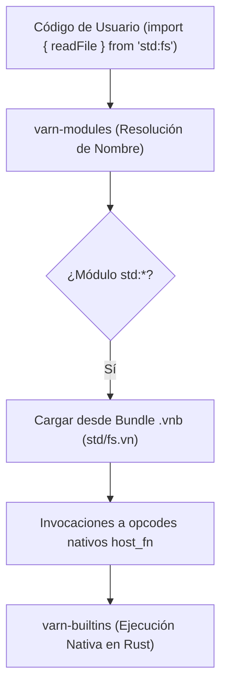
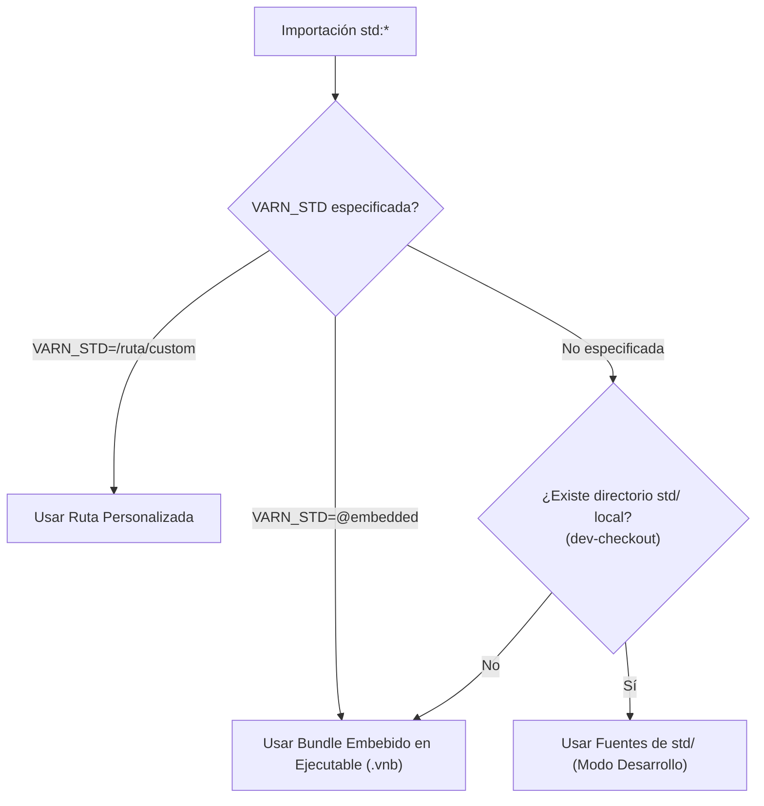

# Arquitectura de la Biblioteca Estándar (`std:*` & `.vnb`)

Este documento especifica la estructura, el sistema de resolución y el mecanismo de empaquetado de la biblioteca estándar de **Varn**.

---

## Tabla de Contenidos

- [1. Visión General de la Stdlib](#1-visión-general-de-la-stdlib)
- [2. Módulos de la Biblioteca Estándar](#2-módulos-de-la-biblioteca-estándar)
- [3. Arquitectura del Bundle `.vnb`](#3-arquitectura-del-bundle-vnb)
- [4. Jerarquía de Resolución y Procedencia](#4-jerarquía-de-resolución-y-procedencia)
- [5. Integración con Bindings Nativos LBI](#5-integración-con-bindings-nativos-lbi)

---

## 1. Visión General de la Stdlib

La biblioteca estándar de Varn está escrita principalmente en el propio lenguaje Varn (`std/*.vn`) e integrada directamente en el binario ejecutable mediante un bundle empaquetado `.vnb`. Para operaciones del sistema de bajo nivel (I/O, sockets, criptografía), los módulos se comunican con implementaciones nativas en Rust a través de la Interfaz Ligada al Linker (LBI).



---

## 2. Módulos de la Biblioteca Estándar

| Módulo | Descripción | Dependencias Nativas (Rust) |
|---|---|---|
| `std:fs` | Sistema de archivos (lectura, escritura, streams, permisos). | `varn-builtins::fs` |
| `std:io` | Entrada/Salida estándar (`stdin`, `stdout`, `stderr`). | `varn-builtins::io` |
| `std:task` | Concurrencia, `TaskGroup`, `parallel`, `spawnIsolate`. | `varn-runtime` |
| `std:crypto` | Hashing (SHA256, MD5) y encriptación. | `varn-builtins::crypto` |
| `std:time` | Medición de tiempo, temporizadores y formateo de fechas. | `varn-builtins::time` |
| `std:json` | Serialización y parsing ultrarrápido de JSON. | `varn-builtins::json` |
| `std:reflect` | Introspección de clases, decoradores y metadatos (`MetaKey`). | `varn-builtins::reflect` |
| `std:sys` | Información del entorno de ejecución, OS, CPU y memoria. | `varn-builtins::sys` |
| `std:math` | Operaciones matemáticas y funciones trigonométricas. | `varn-core::numeric` |
| `std:testing` | Framework de pruebas unitarias y aserciones. | `varn-builtins::testing` |

---

## 3. Arquitectura del Bundle `.vnb`

Para distribuir el lenguaje en un **único ejecutable autónomo sin dependencias de archivos externos**, el script de compilación `crates/varn-cli/build.rs` compila automáticamente las fuentes de `std/` en un bundle binario comprimido `.vnb`:


---

## 4. Jerarquía de Resolución y Procedencia

Al importar un módulo `std:*`, `varn-modules` determina la fuente del código según el siguiente orden de prioridad:



---

## 4.1 Defecto abierto: dos superficies de tipos para la misma stdlib

**Estado: parcialmente arreglado.** Quedan en rojo las dos celdas `@embedded`
de la matriz de validación.

**Por qué estuvo invisible tanto tiempo:** los diagnósticos del checker se
descartaban para todo módulo alcanzado por `import`, así que una discrepancia
sólo podía notarse en el archivo de entrada. Al propagarlos, la señal apareció;
el defecto es anterior.

### Arreglado

1. **`Option` y `Result` estaban declarados dos veces.** `std:result` los tiene
   como enums; `std:types` declaraba `type Option<T> = T?` y
   `type Result<T,E> = | Ok(..) | Err(..)`. Cuál ganaba dependía de qué ruta
   poblaba primero la caché de exports, y eso cambiaba con la procedencia.
   `std:types` ya no los declara; la forma nullable se escribe `T?`.
2. **Exports y bind podían venir de portadores distintos.** El resolutor de
   exports tenía un caso especial para `std:types` (leer el fuente) que el de
   bind no tenía, así que ese módulo acababa con exports del fuente y bind del
   blob — y la expansión de tipos mapeados vive en el bind. Ahora los dos pasan
   por `stdlib_carrier`, una única lista ordenada.

### Abierto

`Partial<T>` y `Readonly<T>` no expanden cuando el módulo que los usa se
alcanza por `import` bajo `VARN_STD=@embedded`. Como archivo de entrada
funcionan en ambas procedencias.

Ya **no** es una discrepancia de portador: ambas mitades salen de
`Carrier::Embedded`. La diferencia que queda es qué función construye el bind:

| Procedencia | Portador | Bind construido por | Clave |
|---|---|---|---|
| árbol `std/` | `Carrier::File` | `cache_get_or_insert_ref` | ruta absoluta |
| `@embedded` | `Carrier::Embedded` | `bind_from_embedded_source` | `"std:types"` |

Las dos parsean y llaman a `bind_and_cache`; la sospecha es que la clave
virtual no sirve como directorio base para resolver lo que el bind necesita.

El destino sigue siendo el mismo: **una** definición de la superficie de tipos.
O el blob se genera desde la misma resolución que usa el fuente —y entonces es
una caché y no una segunda fuente— o desaparece.

---

## 5. Integración con Bindings Nativos LBI

Los archivos de la stdlib exponen una API limpia con tipos estáticos mientras delegan el trabajo pesado a funciones nativas mediante anotaciones especiales:

```Varn
// std/fs.vn
import { @native_read_file } from "builtin:host"

export function readFile(path: str): str {
    if (path.length === 0) {
        throw new Error("Path cannot be empty")
    }
    return @native_read_file(path)
}
```
