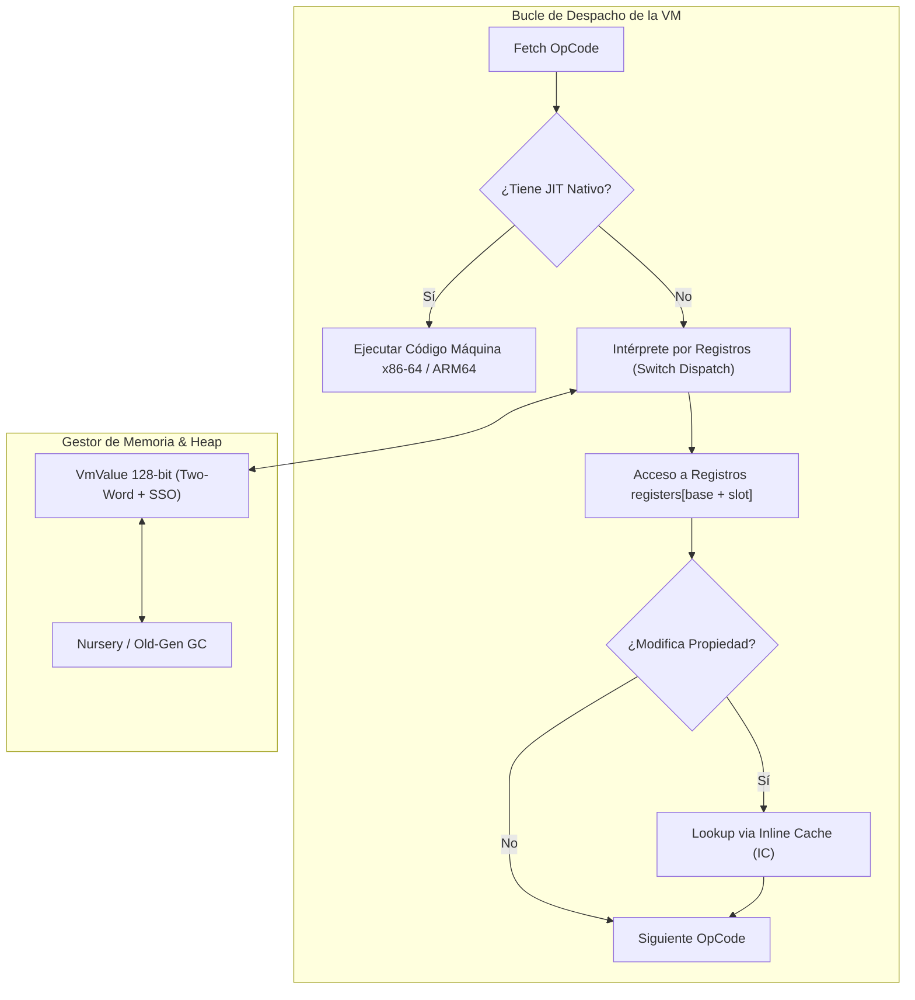
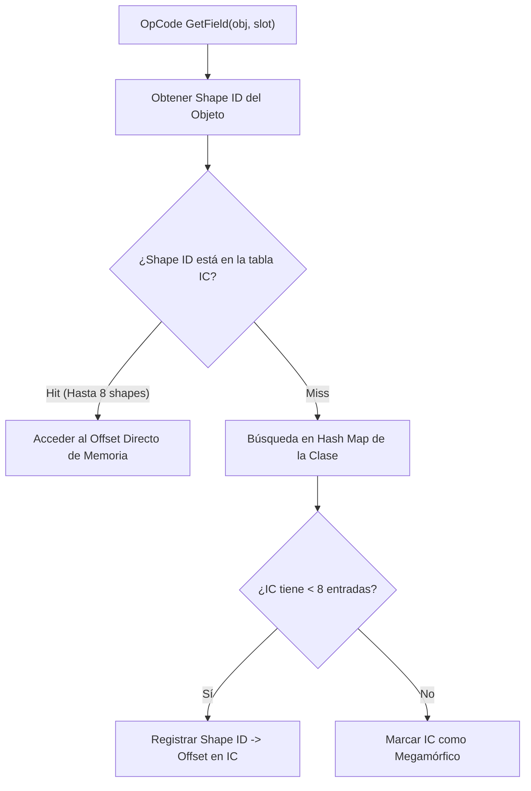

# Arquitectura de la Máquina Virtual y GC (`varn-vm` & `varn-jit`)

Este documento especifica la implementación de la máquina virtual (VM) basada en registros de **Varn**, incluyendo la representación `VmValue` de 128 bits (Two-Word Layout) con Small String Optimization (SSO), el Recolector de Basura (GC) generacional, la estructura de objetos DST, el sistema de Inline Cache (IC) polimórfico, optimizaciones COW para mapas y el backend JIT Cranelift.

---

## Tabla de Contenidos

- [1. Visión General de la VM](#1-visión-general-de-la-vm)
- [2. Representación `VmValue` de 128 bits y SSO](#2-representación-vmvalue-de-128-bits-y-sso)
- [3. Estructura de Memoria y Heap Generacional](#3-estructura-de-memoria-y-heap-generacional)
  - [Nursery & Asignación Bump Pointer](#nursery--asignación-bump-pointer)
  - [Promoción y Old-Gen Mark-and-Sweep](#promoción-y-old-gen-mark-and-sweep)
  - [Barrera de Escritura (*Write Barrier*)](#barrera-de-escritura-write-barrier)
- [4. Estructura de Objetos DST y Optimizaciones de Alocación](#4-estructura-de-objetos-dst-y-optimizaciones-de-alocación)
- [5. Sistema de Inline Cache (IC) Polimórfico](#5-sistema-de-inline-cache-ic-polimórfico)
- [6. CallFrames, Registros y Upvalues](#6-callframes-registros-y-upvalues)
- [7. Resolución de Globals](#7-resolución-de-globals)
- [8. Compilador JIT x86-64 y ARM64 (`varn-jit`)](#8-compilador-jit-x86-64-y-arm64-varn-jit)

---

## 1. Visión General de la VM

`varn-vm` es una máquina virtual de registros de alto rendimiento construida en Rust. A diferencia de las VM basadas en pila (*stack-based*), las instrucciones operan directamente sobre un array plano de registros asignados por frame, logrando un menor número de instrucciones por función y un despacho de opcodes más eficiente.



---

## 2. Representación `VmValue` de 128 bits y SSO

Varn representa sus valores en tiempo de ejecución (`VmValue`) mediante una estructura de dos palabras de 64 bits (`tag: u64`, `payload: u64`, total 16 bytes).

```
Word 0 (Tag, 64-bit):     [Reservado: 48 bits] [SSO Len: 8 bits] [Kind: 8 bits]
Word 1 (Payload, 64-bit): [Valor Nativo i64 / f64 / Puntero Heap / SSO Bytes (0..5)]
```

### Tabla de Kinds y Estructura de Valores

| Tipo | Constante de Kind | Tag Metadata (Bits 8-15) | Estructura de Payload (Word 1) |
|---|---|---|---|
| `null` | `0x00` (`KIND_NULL`) | `0` | Cero |
| `bool` | `0x01` (`KIND_BOOL`) | `0` | `0` para `false`, `1` para `true` |
| `int` | `0x02` (`KIND_INT`) | `0` | Entero con signo nativo de 64 bits (`i64` completo) |
| `float` | `0x03` (`KIND_FLOAT`) | `0` | Flotante IEEE 754 de 64 bits (`f64` estándar) |
| Heap Ref | `0x04` (`KIND_HEAP`) | `0` | Índice de 32 bits a la tabla de objetos del heap |
| SSO String | `0x05` (`KIND_SSO`) | Longitud (0 a 5 bytes) | Hasta 5 bytes UTF-8 inline empaquetados en little-endian |
| Symbol | `0x06` (`KIND_SYMBOL`) | `0` | ID numérico de símbolo |

### Razones del Retiro de NaN-Boxing:
1. **Tipado Estático vs Dinámico**: En motores JS dinámicos, NaN-boxing compacta valores a 64 bits a costa de limitar enteros a 48 bits y pagar máscaras bitwise complejas en cada operación. En Varn, el compilador conoce los tipos estáticamente antes de emitir bytecode; la VM aprovecha directamente registros nativos de 64 bits en x86-64 y AArch64.
2. **`int` es `i64` sin truncamiento**: Las operaciones aritméticas sobre `int` operan en el rango completo de `i64` sin máscaras ni reempaquetados forzados.
3. **Small String Optimization (SSO) de 5 Bytes**: Cadenas cortas de hasta 5 caracteres (claves comunes de JSON, verbos HTTP, identificadores) se guardan directamente en el payload del `VmValue` sin alocar en el heap ni generar presión de recolección de basura.
4. **Comparación Rápida de Tags**: Un `match` sobre el kind se resuelve con un simple `cmp` contra una constante pequeña de 8 bits (0..6), generando tablas de salto directas en ensamblador.

---

## 3. Estructura de Memoria y Heap Generacional

El Heap de Varn utiliza una arquitectura generacional para optimizar la recolección de basura según la hipótesis de mortalidad infantil de objetos:


### Nursery & Asignación Bump Pointer
Los objetos de vida corta nacen en un Nursery de `NURSERY_CAPACITY = 65 536` ranuras mediante un puntero decreciente de asignación lineal (asociación $O(1)$ sin fragmentación). La reserva se hace completa desde el nacimiento y nunca crece: el colector indexa `objects` y `forwarding` en paralelo por índice de nursery, y la asignación inline del JIT depende de que el backing store no se mueva. La recolección menor se dispara al 75 % de ocupación (`FULL_THRESHOLD`), el mismo límite que compara el safepoint de back-edge del JIT.

### Promoción y Old-Gen Mark-and-Sweep
Durante la recolección menor, los objetos sobrevivientes se promueven al Old-Gen. En el Old-Gen opera un recolector Mark-and-Sweep tricolor no bloqueante con *free-list*.

Los buffers de trabajo del colector (worklist y lista de candidatos del old-gen) son propiedad del `Nursery` y se reutilizan entre colecciones. Deben serlo: como locales de `collect` costaban una asignación de 256 KB más una copia del vector de raíces **por colección**, un coste fijo que no dependía de cuántos objetos sobrevivían. Por el mismo motivo el contador de promociones se incrementa en `evacuate`, donde la promoción ocurre, en vez de derivarse al final recorriendo `forwarding` entero.

### Barrera de Escritura (*Write Barrier*)
Cuando un objeto promovido en el Old-Gen almacena una referencia a un objeto joven en el Nursery, la barrera de escritura intercepta la operación y registra la referencia en el *Remembered Set* para evitar que el GC menor elimine el objeto joven.

---

## 4. Estructura de Objetos DST y Optimizaciones de Alocación

Para maximizar la localidad de caché L1/L2 del procesador, los objetos de clase y registros en Varn se almacenan en una **única asignación continua de memoria** (*Dynamically Sized Type* DST):

```
+-------------------------------------------------------------+
| Header Rc (Ref Count & Meta) | Shape ID | Field 0 | Field 1 | ...
+-------------------------------------------------------------+
^                                         ^
Puntero del Heap                          Propiedades en Offsets Fijos
```

Dado que la cabecera y el array de campos forman un bloque contiguo, el objeto **nunca se mueve en memoria**, garantizando la validez de punteros en código C/Rust nativo.

### Optimizaciones Estáticas de Alocación

1. **COW para Mapas Vacíos (`alloc_empty_map_vm`)**:
   Los mapas creados vacíos (`let m: Map<str, str> = {}` o `{ [k: str]: str }`) devuelven una referencia estática compartida inmutable sin ninguna llamada al allocator. La primera operación de mutación (`m[k] = v` o `m.set(k, v)`) clona de forma diferida (Copy-On-Write) a una instancia mutable real. En benchmarks como `bench_http_routing`, esto erradica más de 500 000 alocaciones efímeras por corrida.
2. **Construcción de Records y Tuplas por Slice (`alloc_record_with_shape_slice`)**:
   Construye instancias de `Record` (`#{}`) y `Tuple` (`#[]`) pasando directamente un slice prestado de `VmValue` sin alocar vectores intermedios de paso en el frame.
3. **Canonicidad de Claves de Mapa con Zero-Alloc (`lookup_str_map_key`)**:
   La búsqueda en mapas compara directamente contra la representación SSO o el string del heap sin crear strings intermedios.
4. **Fast Paths en JIT (`jit_array_get_fast`, `jit_array_set_fast`)**:
   Acceso desindexado directo en memoria con bounds checks hoisteadas fuera de los bucles por Cranelift.

### El Allocator Está en el Camino Caliente

Un objeto DST es *una* asignación, pero sigue siendo una asignación del allocator global por cada objeto que el programa construye. Eso pone al allocator dentro del bucle caliente de cualquier programa con objetos, y el de Windows (`HeapAlloc`) no está a la altura: medido con 2 millones de objetos que mueren jóvenes —el colector no llega a copiar nada—, alocar costaba ~90 ns por objeto frente a los ~24 ns de Bun.

El binario `vn` instala **mimalloc** como `#[global_allocator]`. Baja el coste a ~60 ns por objeto, no cambia el tamaño del ejecutable (17,78 MB frente a 17,88 MB) y no penaliza el arranque (42 ms frente a 46 ms, programa vacío). Sobre los benchmarks reales, medido A/B con caché purgada y mediana de tres: `gc_alloc` −42 %, `dto` −43 %, `collection_pipeline` −39 %, `json_api_payloads` −41 %.

---

## 5. Sistema de Inline Cache (IC) Polimórfico

Las operaciones de lectura/escritura de propiedades (`GetField` / `SetField`) utilizan un Inline Cache polimórfico de hasta 8 entradas por cada sitio de llamada:



---

## 6. CallFrames, Registros y Upvalues

- **CallFrames**: Cada llamada a función asigna un `CallFrame` que apunta a una ventana contigua del array global de registros `registers[base + slot]`. La resolución de variables locales es una lectura $O(1)$ por offset indexado.
- **Upvalues**: Las funciones anidadas que capturan variables de un ámbito superior utilizan `Upvalues`. Mientras el frame padre está activo, el upvalue es **Abierto** (*Open*) y apunta al registro en la pila. Al finalizar el frame padre, el upvalue se **Cierra** (*Closed*) copiando el valor al heap.

### Excepciones: Un Solo Camino

Todo error que llega a la máquina —lo lance el usuario con `throw` o lo produzca el runtime— pasa por `exceptions::dispatch_to_handler`, que busca primero en la pila `try_handlers` y después en la `exception_table` del proto, desenrollando frames hasta el fondo de la invocación actual.

Que el camino sea uno solo es de corrección, no de estilo. La búsqueda vivía únicamente dentro del brazo del opcode `Throw`, así que cualquier operación que devolviera `Err` —una división por cero, una nativa que falla, `JSON.parse` de una entrada inválida— salía del bucle de ejecución **sin consultar nunca la tabla**. El resultado: `try/catch` capturaba lo que lanzaba el código Varn y nada más. Un servidor no podía manejar entrada no confiable, porque un cuerpo malformado terminaba el proceso en lugar de la petición.

Dos detalles que el camino tiene que respetar:

* **Sincronizar el `ip`.** El bucle lleva `ip` en una variable local y sólo lo escribe al frame en puntos concretos. La `exception_table` se indexa por el ip de la instrucción que falló, así que el camino de error lo sincroniza antes de buscar; sin eso encuentra el rango equivocado, o ninguno.
* **Respetar el fondo (`depth`).** Por debajo del fondo de la invocación hay frames de un llamador de Rust o de un llamador JIT nativo, que no puede reanudarse desde el intérprete: ahí el error se propaga como `Err` en vez de desmontarlos (`h.frame_depth > depth`).

Un error nativo no traía valor lanzado, así que se materializa como instancia de `Error` con su mensaje y `e.message` funciona igual que con uno lanzado a mano.

#### Excepciones en la Frontera JIT / Intérprete y Diferencias entre `run` y `bench`

En `vn run`, el código se ejecuta una sola vez; la mayoría de funciones de control o helpers auxiliares permanecen por debajo del umbral de invocaciones del tiered JIT y corren en el intérprete. En cambio, `vn bench` calienta la VM y ejecuta múltiples repeticiones completas (10 runs por defecto), provocando que funciones callee secundarias superen los umbrales de tiering y se compilen con Cranelift.

Esto exige una paridad estricta en el desenrollado de excepciones entre marcos JIT e intérprete:
1. **Invariante `h.frame_depth > depth` en `run_compiled_frame`**:
   Cuando una función compilada por JIT atrapa una excepción (`longjmp` con código 1), no debe desenrollar handlers pertenecientes a marcos llamadores (`h.frame_depth <= depth`). Si el handler pertenece a un llamador, el marco JIT actual se declara fallido (`JitFrameOutcome::Failed`) y preserva el handler en `ctx.jit_panic_exception_handler` para que el marco llamador sea quien efectúe el desenrollado.
2. **Desenlace de Frames Callee en `jit_call` y `jit_call_method`**:
   Cuando un marco JIT invoca a un callee que falla (`run_until_inner(caller_depth)` devuelve `Err`), los frames intermedios por encima de `caller_depth` deben desapilarse explícitamente (`while ctx.frames.len() > caller_depth { ctx.frames.pop(); }`) antes de llamar a `jit_propagate_error`, asegurando que la pila de frames coincida exactamente con la profundidad del llamador que capturará el error.

---

## 7. Resolución de Globals

El emisor produce accesos a globals **por nombre**: `LoadGlobal` / `StoreGlobal` / `DefineGlobal` llevan el índice del nombre en el pool de constantes. Ninguno de los tres llega a ejecutarse.

`varn_vm::globals::resolve_in_proto` los reescribe a `LoadGlobalIdx` / `StoreGlobalIdx` / `DefineGlobalIdx`, que llevan el índice del slot: una lectura o escritura indexada, inline, en intérprete y en JIT. El pase es recursivo sobre los protos anidados del pool e idempotente.

Dos puntos de entrada lo cubren todo:

| Punto | Cubre |
|---|---|
| `ExecCtx::eval_module_proto` | Todo módulo, en todo VM — `precompiled`, `FileLoader`, bundle de la std, hilo principal o worker de isolate |
| `Vm::resolve_globals` | El proto de entrada, el único que no pasa por el anterior. Lo llama el pipeline en setup, **no** `Vm::run` (el harness de bench cronometra `run`) |

Los índices pertenecen a **un** `GlobalStore`, y cada `Vm` tiene el suyo — un isolate define `isIsolate` antes de cargar nada, así que el mismo nombre cae en índices distintos según el VM. Por eso un proto compartido (la caché thread-local de la std, el mapa `precompiled`) nunca se resuelve in-place: ambos sitios pasan por `Rc::make_mut`, que clona exactamente cuando el proto está compartido.

**Esta invariante es carga estructural, no una optimización.** `clif` baja únicamente las formas `*Idx`; las formas por nombre no tienen lowering. Si el pase deja de cubrir un camino, esas funciones caen al intérprete en silencio. Las vistas de `vn debug` que compilan sin ejecutar (`-p tiers`, `-p bails`, `-p roots`, `-p clif`) resuelven una copia primero (`varn_debug::resolved_copy`) para no reportar bails que en producción no ocurren.

---

## 8. Compilador JIT x86-64 (`varn-jit`)

`varn-jit` utiliza la infraestructura de Cranelift para traducir funciones a código ejecutable x86-64 nativo:
- **Compilación Eager**: Se compila en el momento en que se instancia el closure.
- **Fallbacks Transparentes**: Si una instrucción del bytecode no está implementada en el backend JIT (un *bailout*), el control retorna suavemente al intérprete de la VM sin perder el estado de ejecución.
