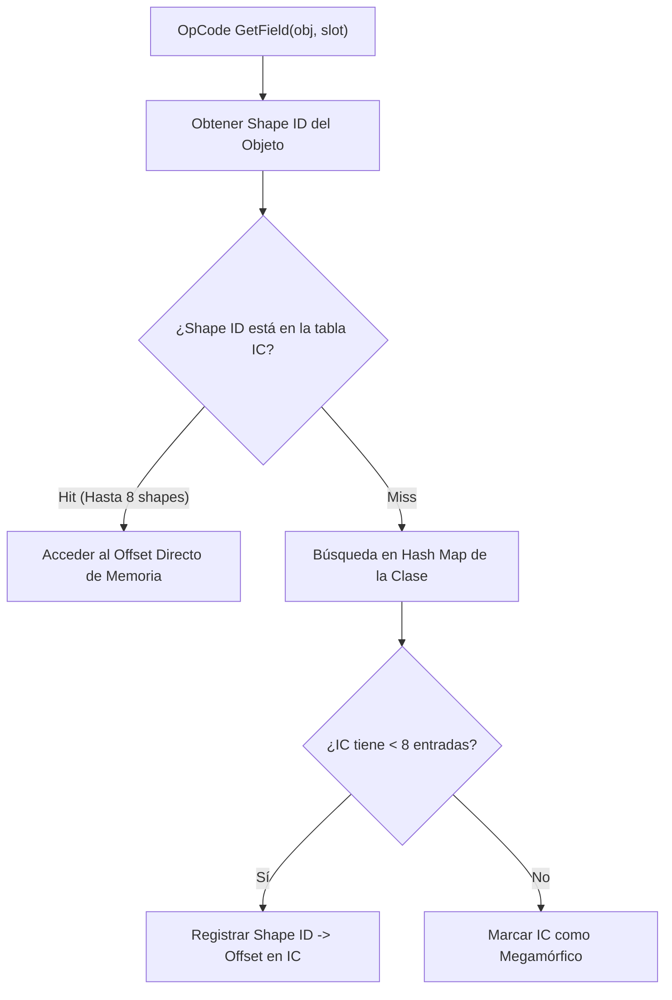

# Arquitectura de la Máquina Virtual y GC (`varn-vm` & `varn-jit`)

Este documento especifica la implementación de la máquina virtual (VM) basada en registros de **Varn**, incluyendo la codificación NaN-Boxing en 64 bits, el Recolector de Basura (GC) generacional, la estructura de objetos en una sola asignación, el sistema de Inline Cache (IC) polimórfico y el backend JIT x86-64.

---

## Tabla de Contenidos

- [1. Visión General de la VM](#1-visión-general-de-la-vm)
- [2. Codificación NaN-Boxing en 64 bits](#2-codificación-nan-boxing-en-64-bits)
- [3. Estructura de Memoria y Heap Generacional](#3-estructura-de-memoria-y-heap-generacional)
  - [Nursery & Asignación Bump Pointer](#nursery--asignación-bump-pointer)
  - [Promoción y Old-Gen Mark-and-Sweep](#promoción-y-old-gen-mark-and-sweep)
  - [Barrera de Escritura (*Write Barrier*)](#barrera-de-escritura-write-barrier)
- [4. Estructura de Objetos DST en Una Asignación](#4-estructura-de-objetos-dst-en-una-asignación)
- [5. Sistema de Inline Cache (IC) Polimórfico](#5-sistema-de-inline-cache-ic-polimórfico)
- [6. CallFrames, Registros y Upvalues](#6-callframes-registros-y-upvalues)
- [7. Resolución de Globals](#7-resolución-de-globals)
- [8. Compilador JIT x86-64 (`varn-jit`)](#8-compilador-jit-x86-64-varn-jit)

---

## 1. Visión General de la VM

`varn-vm` es una máquina virtual de registros de alto rendimiento construida en Rust. A diferencia de las VM basadas en pila (*stack-based*), las instrucciones operan directamente sobre un array plano de registros asignados por frame, logrando un menor número de instrucciones por función y un despacho de opcodes más eficiente.


---

## 2. Codificación NaN-Boxing en 64 bits

Varn representa **todos los valores dinámicos** (`VmValue`) en una palabra de 64 bits de extensión escalar, eliminando la necesidad de asignaciones en el heap para números enteros, flotantes, booleans o nulos.

```
Double Precision Float:  [S EEEEEEEEEEE MMMMMMMMMMMMMMMMMMMMMMMMMMMMMMMMMMMMMMMMMMMMMMMMMM]
QNAN Marker:            [1 11111111111 11..........................................]
Value Encoding:         [1 11111111111 11] [TAG 4-bit] [Payload 48-bit                 ]
```

### Tabla de Máscaras y Tags Bitwise

| Tipo | QNAN Prefix | Tag Bits (4-bit) | Payload (48-bit) |
|---|---|---|---|
| `float` | `0x0000000000000000` (Valores IEEE 754 no QNAN) | N/A | Flotante IEEE 754 completo |
| `null` | `0x7FF8000000000000` | `0x01` | Cero |
| `false` | `0x7FF8000000000000` | `0x02` | Cero |
| `true` | `0x7FF8000000000000` | `0x03` | Cero |
| `int` | `0x7FF8000000000000` | `0x04` | Entero complemento a dos de 48 bits |
| `pointer` | `0x7FF8000000000000` | `0x05` | Índice de 32 bits a la Heap Table |

---

## 3. Estructura de Memoria y Heap Generacional

El Heap de Varn utiliza una arquitectura generacional para optimizar la recolección de basura según la hipótesis de mortalidad infantil de objetos:


### Nursery & Asignación Bump Pointer
Los objetos de vida corta nacen en un Nursery de `NURSERY_CAPACITY = 65 536` ranuras mediante un puntero decreciente de asignación lineal (asociación $O(1)$ sin fragmentación). La reserva se hace completa desde el nacimiento y nunca crece: el colector indexa `objects` y `forwarding` en paralelo por índice de nursery, y la asignación inline del JIT depende de que el backing store no se mueva. La recolección menor se dispara al 75 % de ocupación (`FULL_THRESHOLD`), el mismo límite que compara el safepoint de back-edge del JIT.

### Promoción y Old-Gen Mark-and-Sweep
Durante la recolección menor, los objetos sobrevivientes se promueven al Old-Gen. En el Old-Gen opera un recolector Mark-and-Sweep tricolor no bloqueante con *free-list*.

Los buffers de trabajo del colector (worklist y lista de candidatos del old-gen) son propiedad del `Nursery` y se reutilizan entre colecciones. Deben serlo: como locales de `collect` costaban una asignación de 256 KB más una copia del vector de raíces **por colección**, un coste fijo que no dependía de cuántos objetos sobrevivían. Por el mismo motivo el contador de promociones se incrementa en `evacuate`, donde la promoción ocurre, en vez de derivarse al final recorriendo `forwarding` entero.

### Barrera de Escritura (*Write Barrier*)
Cuando un objeto promovido en el Old-Gen almacena una referencia a un objeto joven en el Nursery, la barrera de escritura intercepta la operación y registra la referencia en el *Remembered Set* para evitar que el GC menor elimine el objeto joven.

---

## 4. Estructura de Objetos DST en Una Asignación

Para maximizar la localidad de caché L1/L2 del procesador, los objetos de clase y registros en Varn se almacenan en una **única asignación continua de memoria** (*Dynamically Sized Type* DST):

```
+-------------------------------------------------------------+
| Header Rc (Ref Count & Meta) | Shape ID | Field 0 | Field 1 | ...
+-------------------------------------------------------------+
^                                         ^
Puntero del Heap                          Propiedades en Offsets Fijos
```

Dado que la cabecera y el array de campos forman un bloque contiguo, el objeto **nunca se mueve en memoria**, garantizando la validez de punteros en código C/Rust nativo.

---

## 5. Sistema de Inline Cache (IC) Polimórfico

Las operaciones de lectura/escritura de propiedades (`GetField` / `SetField`) utilizan un Inline Cache polimórfico de hasta 8 entradas por cada sitio de llamada:



---

## 6. CallFrames, Registros y Upvalues

- **CallFrames**: Cada llamada a función asigna un `CallFrame` que apunta a una ventana contigua del array global de registros `registers[base + slot]`. La resolución de variables locales es una lectura $O(1)$ por offset indexado.
- **Upvalues**: Las funciones anidadas que capturan variables de un ámbito superior utilizan `Upvalues`. Mientras el frame padre está activo, el upvalue es **Abierto** (*Open*) y apunta al registro en la pila. Al finalizar el frame padre, el upvalue se **Cierra** (*Closed*) copiando el valor al heap.

---

## 7. Resolución de Globals

El emisor produce accesos a globals **por nombre**: `LoadGlobal` / `StoreGlobal` / `DefineGlobal` llevan el índice del nombre en el pool de constantes. Ninguno de los tres llega a ejecutarse.

`varn_vm::globals::resolve_in_proto` los reescribe a `LoadGlobalIdx` / `StoreGlobalIdx` / `DefineGlobalIdx`, que llevan el índice del slot: una lectura o escritura indexada, inline, en intérprete y en JIT. El pase es recursivo sobre los protos anidados del pool e idempotente.

Dos puntos de entrada lo cubren todo:

| Punto | Cubre |
|---|---|
| `ExecCtx::eval_module_proto` | Todo módulo, en todo VM — `precompiled`, `FileLoader`, bundle de la std, hilo principal o worker de isolate |
| `Vm::resolve_globals` | El proto de entrada, el único que no pasa por el anterior. Lo llama el pipeline en setup, **no** `Vm::run` (el harness de bench cronometra `run`) |

Los índices pertenecen a **un** `GlobalStore`, y cada `Vm` tiene el suyo — un isolate define `isIsolate` antes de cargar nada, así que el mismo nombre cae en índices distintos según el VM. Por eso un proto compartido (la caché thread-local de la std, el mapa `precompiled`) nunca se resuelve in-place: ambos sitios pasan por `Rc::make_mut`, que clona exactamente cuando el proto está compartido.

**Esta invariante es carga estructural, no una optimización.** `clif` baja únicamente las formas `*Idx`; las formas por nombre no tienen lowering. Si el pase deja de cubrir un camino, esas funciones caen al intérprete en silencio. Las vistas de `vn debug` que compilan sin ejecutar (`-p tiers`, `-p bails`, `-p roots`, `-p clif`) resuelven una copia primero (`varn_debug::resolved_copy`) para no reportar bails que en producción no ocurren.

---

## 8. Compilador JIT x86-64 (`varn-jit`)

`varn-jit` utiliza la infraestructura de Cranelift para traducir funciones a código ejecutable x86-64 nativo:
- **Compilación Eager**: Se compila en el momento en que se instancia el closure.
- **Fallbacks Transparentes**: Si una instrucción del bytecode no está implementada en el backend JIT (un *bailout*), el control retorna suavemente al intérprete de la VM sin perder el estado de ejecución.
