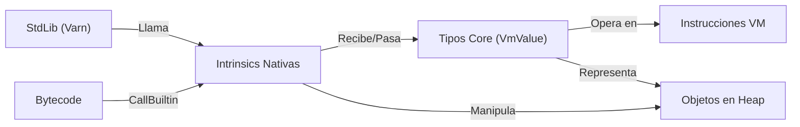

# Resumen Ejecutivo

> **Nota de estado (2026-07-13).** Estas son notas de trabajo, no documentación
> normativa. Las rutas que mencionan `crates/varn-compiler/` son de antes de la
> migración: **ese crate ya no existe**. El compilador es `varn-opt` y los
> post-passes viven en `varn-backend`. Para la arquitectura actual, ver
> [ARCHITECTURE.md](../ARCHITECTURE.md) y
> [COMPILER_ARCHITECTURE.md](../COMPILER_ARCHITECTURE.md).

Este informe analiza cómo distintos lenguajes reales (Rust, Swift, Zig, V8/JavaScript, CPython, Java/HotSpot, .NET/CLR y Go) separan **tipos core**, **builtins/intrinsics** y **librerías estándar**, para proponer un diseño arquitectónico óptimo para Varn. Se estudian fuentes primarias (documentación oficial, RFCs, papers, blogs de expertos) y se extraen patrones comunes. A partir de este estudio se proponen decisiones de diseño claras: qué funcionalidades se implementan a nivel de *Core Type* (mapeadas a tipos primitivos del lenguaje), a nivel de *Contrato/Intrinsic* (operaciones primitivas o enlaces a funciones nativas), o en la *Stdlib* (biblioteca estándar). Se define un conjunto mínimo de *opcodes* e *IntrinsicId*, una ABI de runtime, llamadas nativas (`NativeCtx`), y hooks para el JIT. 

Además, se presenta un plan de migración agresivo con pasos detallados (reorganización de crates, eliminación de duplicados, pruebas unitarias, benchmarks, estrategias de rollback), ilustrado con pseudo-código (ejemplos de *lowering* de AST → HIR → bytecode → VM/JIT). Se discuten métricas esperadas (reducción de llamadas nativas, número de asignaciones, hotspots) y micro-benchmarks para validar mejoras. Se incluyen tablas comparativas y diagramas (Mermaid) que describen la arquitectura propuesta, el flujo de compilación y la propiedad semántica entre componentes. Todas las afirmaciones técnicas se fundamentan en referencias oficiales y literatura especializada.

---

## 1. Análisis comparativo por lenguaje

**Rust:** Rust separa el *núcleo* del lenguaje en la librería **core** (sin dependencias, sin heap ni I/O) y la librería **std** (que incluye heap, hilos, I/O, etc.). Los **tipos primitivos** (enteros, floats, bool, punteros, etc.) y construcciones básicas (tuplas, arrays) están definidos en el compilador. Las **intrinsics** se hallan en módulos como `core::intrinsics` o `core::arch`: son implementaciones especiales en LLVM (por ejemplo, operaciones SIMD o copiar memoria). Rust expone a los usuarios solo funciones wrapper estables, mientras que las intrinsics reales son detalles del compilador. Por ejemplo, funciones como `copy_nonoverlapping` o aritmética con overflow se reconocen y optimizan en el compilador, no en la stdlib.  

**Swift:** Al igual que Rust, Swift distingue *Builtins* (tipos intrínsecos del compilador) de la biblioteca estándar. Los tipos *Builtin* (p.ej. `Builtin.Int64`, `Builtin.RawPointer`, `Builtin.NativeObject`) son primitivas internas expuestas al compilador (no visibles en el código fuente). Sobre estos, la **stdlib** define tipos de más alto nivel (`Int`, `Bool`, `String`, `Array`, `Optional`, etc.). La implementación de operaciones básicas (aritmética, comparaciones, literales) se realiza mediante **intrinsics del compilador** que operan en esos Builtins. El módulo `Builtin` en la stdlib da acceso a funciones internas y tipos “raw” necesarios. En Swift incluso existe un módulo *runtime* (en C++ interno) para manejo de memoria y casting.

**Zig:** Zig es un lenguaje “baremetal” que también tiene funciones intrínsecas del compilador, invocadas con el prefijo `@` (por ej. `@sin()`, `@sqrt()`, `@intCast`, `@TypeOf`). Las **builtins** de Zig son fijas en el compilador (implementadas en `src/BuiltinFn.zig`); incluyen operaciones de bajo nivel (casts, acceso a metadatos, etc.) y funciones matemáticas enlazadas a intrinsics de LLVM (p.ej. `@cos`, `@sin`). Sin embargo, existe un movimiento en Zig para trasladar tantas intrinsics como sea posible a bibliotecas (std lib) utilizando un atributo como `@compilerInternal`, de modo que el usuario invoque `std.math.sin` en lugar de `@sin` directamente. Esto simplifica el lenguaje base y facilita la sustitución de implementaciones. En resumen, Zig: tipos primitivos son del compilador (vía builtins), muchas operaciones intrínsecas, pero se tiende a implementarlas en *std::math*, reservando `@` solo para casos especiales.

**JavaScript (V8):** El ECMAScript define objetos intrínsecos (“intrinsic objects” o *built-ins*), como `Array`, `String`, `Math`, `JSON`, etc. Estos objetos siempre existen en cualquier entorno JS. En V8, la implementación de estos *builtins* reside en el motor: hay *callables* internos definidos en Torque (lenguaje interno de V8) para cada operación (por ej. listas de métodos de `Array.prototype`, o `Math.sin`). V8 distingue **Builtins** (código en C++/Torque que implementa métodos de objetos estándar) y **Intrinsics** (llamadas especiales de Torque, p.ej. `%RawObjectCast`, que proveen operaciones que no podrían implementarse en JS normal). Los intrinsics de V8 son declarados en Torque pero no definidos ahí; su implementación la conoce el compilador Torque y suelen corresponder a instrucciones de máquina o manipulaciones internas muy eficientes. Resumen: en JS/V8, *tipos core* = valores primitivos (`Number`, `String`, etc), *builtins* = objetos globales y su comportamiento estándar, *intrinsics* = funciones internas optimizadas del motor.

**CPython:** Python define en su núcleo tipos básicos (enteros, floats, listas, diccionarios, etc.) y funciones **built-in** (p.ej. `len`, `abs`, `int()`, etc.) en el módulo `__builtins__`. En la documentación oficial se refiere a “**tipos incorporados**” (built-in types) y **funciones incorporadas** como siempre disponibles. Por ejemplo, `int`, `str`, `list`, así como funciones como `len()` o `print()` son intrínsecas al intérprete. La biblioteca estándar (*stdlib*) incluye módulos como `json`, `sys`, `math`, que no están en el core y deben importarse. Python no suele hablar de “intrinsics” en el sentido de optimizaciones en C, pero internamente CPython implementa los operadores básicos (suma de enteros, indexado de listas) en C para velocidad.

**Java (HotSpot JVM):** Java tiene tipos primitivos (int, float, boolean, etc.) definidos por el lenguaje, y clases fundamentales en `java.lang` (como `String`, `Object`). La *biblioteca estándar* es el resto de API de Java (collections, IO, etc.). **Intrinsics del JIT:** HotSpot JVM tiene muchas funciones intrínsecas; por ejemplo, métodos marcados `@HotSpotIntrinsicCandidate`/`@IntrinsicCandidate` (como `Math.log`) pueden ser reemplazados por código nativo optimizado en tiempo de compilación JIT. HotSpot distingue *intrinsics de biblioteca* (que sustituyen la implementación Java por ensamblador o IR propio) y *intrinsics de bytecode* (que reciben tratamiento especial en el JIT, sin reemplazar completamente). Es común que métodos de `Math`, `String` (como `indexOf`), `System.arraycopy`, etc. sean intrínsecos en HotSpot.

**.NET/CLR:** El CLR de .NET es similar a JVM. Los tipos básicos (`int`, `float`, `bool`, `string`, etc.) vienen del lenguaje C#/CLI, y la biblioteca base (`System.*`) ofrece APIs amplias. .NET también usa marcadores de intrínsecas: por ejemplo, métodos y campos pueden estar etiquetados con el atributo `[Intrinsic]`, indicando que el JIT puede reemplazarlos por operaciones más eficientes. Así, el JIT busca `[Intrinsic]` para identificar métodos optimizables (p.ej. `Enum.HasFlag` se puede transformar en un simple desplazamiento de bits). Además existen *hardware intrinsics* en .NET (espacio de nombres `System.Runtime.Intrinsics`) para SIMD. En resumen, .NET tiene builtins muy parecidos a Java (tipos básicos y `System.*`), con métodos marcados intrínsecos para el JIT.

**Go:** Go define tipos primitivos (`int`, `string`, etc.) y un pequeño conjunto de funciones built-in (`len()`, `cap()`, `new`, `make`, `append`, `copy`, etc.) integradas en el compilador. Como en otros lenguajes modernos, ciertas funciones se tratan como **intrinsics**: por ejemplo, `len`, `cap`, `append`, `make` son reconocidas por el compilador y generan código especial en lugar de invocar una función normal. Dave Cheney señala que Go implementa *intrinsics* en paquetes estándar (`math/bits`, `sync/atomic`) cuyos métodos pueden sustituirse con instrucciones nativas eficientes en tiempo de compilación. La **stdlib** de Go (paquetes en `$GOROOT/src`) incluye todo lo demás: `fmt`, `net`, `os`, `encoding/json`, etc. Por tanto, en Go los builtins y funciones intrínsecas forman parte del compilador, la stdlib son los paquetes de la biblioteca.

**Resumen:** En todos los casos, *tipos core* y operaciones básicas (enteros, booleanos, punteros/slices, etc.) se definen en el nivel más bajo (lenguaje o runtime), mientras que *stdlib/builtins* son componentes de biblioteca que implementan la funcionalidad de alto nivel. Las *intrinsics* (o builtins especiales) permiten al compilador/jit optimizar operaciones críticas. Ver tabla comparativa simplificada:

| Lenguaje    | Tipos Core (primitivos)         | Builtins/Stdlib                           | Intrinsics/Compiler Hooks                         |
|-------------|---------------------------------|-------------------------------------------|---------------------------------------------------|
| **Rust**    | `i32`, `f64`, `bool`, `str`, etc. (compilador) | core::*, std::*, crates (Vec, String, etc.) | `core::intrinsics`, `core::arch` (LLVM), operaciones con overflow, memcpy. |
| **Swift**   | `Builtin.Int*`, `Builtin.NativeObject`, etc. (compilador) | Swift stdlib (Int, Bool, String, Array, Optional, etc.) | Swift *Builtin module*, intrinsics de aritmética y casting, LLVM IR (vía SIL). |
| **Zig**     | Tipos primitivos del compilador (`@This`, `@TypeOf`, etc.) | std lib Zig (`std.math`, contenedores, etc.) | Builtins `@x` (casting, metaprogramación, matemática); propuestas para mover a std. |
| **JS/V8**   | Primitivos JS (`Number`, `String`, `Boolean`, `Object`) | Objetos globales ECMAScript (`Array`, `JSON`, `Math`, etc.) | V8 *builtins* (Torque/C++ implementaciones de métodos) y *intrinsics* internos (%RawObjectCast, etc.). |
| **Python**  | Tipos básicos (`int`, `float`, `list`, etc.) y objetos mágicos (None) | Builtins del intérprete (`len`, `print`, etc.), stdlib (`json`, `os`, etc.) | Implementación en C de operadores; no se llama “intrinsics” pero funciones builtin optimizadas en C (ej. `str.find`). |
| **Java/HotSpot** | Primitivos Java (`int`, `float`, etc.) | `java.lang` (String, Object, etc.), resto de Java API (collections, IO, etc.) | *Intrinsics JIT*: métodos de `Math`, `String`, etc. marcados `@IntrinsicCandidate` son reemplazados por código nativo optimizado. |
| **.NET/CLR**  | Tipos CLR (`Int32`, `Double`, `Boolean`, etc.) | `System.*` (String, Object, colecciones, LINQ, etc.) | Métodos/fuentes marcados `[Intrinsic]` (CoreCLR) y hardware intrinsics; JIT reemplaza calls de `Math`, etc., con instrucciones optimizadas. |
| **Go**      | Tipos básicos (`int`, `string`, `bool`, etc.) | Paquetes estándar (`fmt`, `net`, `encoding`, etc.) | Builtins `len`, `cap`, `append`, `make` tratados como intrinsics del compilador; además intrinsics en `math/bits`, `sync/atomic` con reemplazos nativos. |

Cada lenguaje exhibe la tendencia común: **minimizar el núcleo del lenguaje y empujar la funcionalidad al nivel de biblioteca**, reservando intrinsics sólo para casos donde el compilador/VM pueda explotar optimizaciones específicas. Este patrón guía nuestras decisiones para Varn.

## 2. Decisiones de diseño para Varn

Con base en el análisis anterior, proponemos las siguientes decisiones de diseño para Varn, justificadas técnicamente:

- **Tipos *Core***: Deberían incluir sólo los tipos absolutamente primitivos (enteros, float, booleanos, punteros/slices, null, etc.) y tipos SSO de tamaño fijo (p.ej. strings pequeños codificados en la propia palabra). El *core* de Varn define su NaN-boxing y representación interna (como en `VmValue`). Esto asegura que operaciones básicas (aritmética, asignaciones, comparaciones) sean manejadas eficientemente directamente en el runtime sin llamar a rutinas externas. Ejemplos: en `VmValue` los enteros, booleanos, nulos y flotantes ya caben en un único `u64`. Decidimos que operaciones fundamentales (por ej. suma de enteros, conversión int→float) sean *instrucciones dedicadas del VM* (opcodes), no llamadas nativas, para máxima velocidad. 

- **Builtins/Contrato (Intrinsic)**: Varn dispondrá de un módulo de *builtins* (contratos nativos) para funciones primitivas que no pueden implementarse directamente en bytecode (p.ej. manejo de cadenas, arreglos, conversión entre tipos, I/O, GC). Cada contrato nativo tendrá un `IntrinsicId` y/o identificador wire. Por ejemplo, operaciones de string (`length`, `contains`, `slice`) las implementaremos en código nativo (Rust) y enlazaremos mediante intrinsics (ya existen en `StringOp::Len`, etc.). Esto es similar a *intrinsics de librería* en HotSpot: el JIT reemplazará ciertas calls con código optimizado, pero en Varn definimos directamente el código nativo. Decidimos qué funciones irán en *contratos* de biblioteca base (no en stdlib): cosas como `String`, `Array`, `Math`, `IO`, JSON. En cambio, operaciones de alto nivel (procesamiento, utilidades) irán en *stdlib* Varn (escrita en Varn). 

- **Stdlib**: La biblioteca estándar de Varn contendrá utilidades, estructuras de datos, etc., construida sobre los builtins. Por ejemplo, la clase `str` con métodos `toUpperCase`, `split`, etc., se implementará usando las operaciones nativas de string; funciones auxiliares (JSON.parse, sort, etc.) se harán en stdlib. Esto refleja patrones como `std.string.*` en Zig o `JSON.stringify` en JavaScript. La stdlib no deberá reimplementar operaciones ya nativas. Mantener separadas stdlib y core lleva a mantenimiento más claro y modularidad (p. ej. Rust separa `core` de `std`, Swift pone Builtin vs stdlib).

- **Opcodes mínimos**: Se limitarán a operaciones básicas de control (saltos, llamadas, carga/almacenamiento), aritmética/bitwise entre valores `VmValue`, operaciones lógicas, conversión int/float, etc. Cualquier operación compleja (manipulación de arrays, cadenas, objetos, etc.) se debería realizar mediante llamadas a intrinsics o bytecode de llamada a función nativa. Por ejemplo, `StrConcat` será una instrucción que llame a nuestro helper Rust `str_concat`, como ya se hace. No crear opcodes especializados para cada método de cadena; sino llamar a intrinsics del string. Esto reduce complejidad de VM y favorece la portabilidad JIT.

- **Runtime ABI/Calling Conventions**: Se define un ABI interno para llamadas nativas (Rust helpers). Se usarán registros fijos para contexto de ejecución (`ARG_CTX`, `ARG_BASE`, etc.) (ya implementado en el generador de código) y `NativeCtx` pasará datos entre VM y funciones nativas. Por convención, los helpers recibirán un puntero al heap/ctx y args en registros/stack según la convención (como vemos en `emit_str_concat` en el código actual). Garantizamos que los valores de `VmValue` se pasen en 64 bits (contenedor NaN-box) y el helper devuelva `VmValue`. Esta ABI debe ser documentada formalmente (firma de cada intrinsic). Como en Swift (Swift ABI) o HotSpot, hay *contratos ABI estables* para funciones nativas.

- **SSO y NaN-boxing**: Se conservará la representación NaN-boxing y SSO (Small String Optimization) existente de `VmValue`. Esto significa que los `VmValue` pueden representar strings cortos en la misma palabra. Para operaciones de string se hará check `is_sso` vs heap: por ejemplo, `str_length` en el crate actual trata ambos casos. La decisión fue adoptada por eficiencia: strings muy pequeños no requieren heap y operaciones con SSO son rápidas. En Rust usan NaN-boxing para valores mixtos (null, int, ptr, float) como en `VmValue`. Consideramos la posibilidad de *inline caching* o *inline objects*, pero eso es JIT.

- **Garbage Collector**: Asumimos el recolector existente de Varn. Los core types que son valores (enteros, bool, float, punteros) no requieren GC. Solo los valores heap (objetos, arreglos, cadenas largas) se administran con GC. La semántica core de `VmValue` debe indicar qué es puntero (flag `is_heap()`) para GC. No cambiaremos el GC sustancialmente; la nueva arquitectura clarifica propiedad: los contratos nativos respetarán la raíz de pila/GC al devolver `VmValue`. Opciones como *tráiler de excepción*, *finalizadores*, etc., se delegan al runtime ya existente.

- **Contex Native (`NativeCtx`)**: En el diseño actual, los intrinsics reciben un `&mut dyn NativeCtx`, que abstrae el heap, stack, etc. Esto se mantiene: es la forma de exponer el runtime al código nativo (por ejemplo, para `alloc_str_owned`). Decidimos que las funciones intrínsecas usen `NativeCtx` para operar en el heap (crear arrays, objetos, strings, etc.). Esto separa la lógica de VM (bytecode) de la de la runtime nativa.

En conjunto, estas decisiones buscan **maximizar rendimiento** (operaciones en core como instrucciones VM e intrinsics optimizados) sin sacrificar claridad semántica ni mantenibilidad. Inspirados en Rust/Swift (núcleo mínimo), Zig (intrinsics vs stdlib), V8/Java/.NET (intrinsics JIT) y Go (builtins detectadas por compilador) definimos límites claros entre lo que implementa el VM/compilador y lo que implementa la biblioteca.

## 3. Especificación formal propuesta

A continuación se presenta la especificación arquitectónica de Varn:

### 3.1 Tipos core de Varn

Los **tipos core** son aquellos representados directamente en `VmValue` y reconocidos por el VM en bytecode. Incluyen:
- **Int**: enteros de hasta 48 bits (dentro de NaN-box). Operaciones: suma, resta, etc. (Opcodes dedicados: `LoadInt`, `AddI`, etc.).
- **Float**: números de coma flotante de 64 bits. Operaciones: suma float (`AddF`), conversión int→float (`ToFloat`), etc.
- **Bool**, **Null**: representados en NaN-box. Opciones de branch (`JumpIfFalse`).
- **String (SSO)**: cadenas cortas (<5 bytes) embebidas en `VmValue`. Se pueden comparar y copiar con operaciones básicas. Strings largas se manejan como *heap objects* con `TAG_PTR`.
- **Heap Pointer**: referencia a objetos heap (arrays, objetos, strings largas). La función `is_heap()` identifica estos valores.
- **Symbol** (si aplica, con `TAG_SYMBOL`): referencias a nombres con interning.
- **Others**: eventualmente, punteros a funciones nativas, tareas, etc., definidos en intrinsics.

En resumen, el conjunto de *Core Value Types* = { `int`, `float`, `bool`, `null`, `string_SSO`, `heap_ptr`, `symbol` } con las operaciones elementales definidas en la VM.

### 3.2 Contratos nativos por tipo

Proponemos un **contrato nativo** (módulo intrínseco) por cada tipo o funcionalidad fundamental. Ejemplos:

- **String intrinsic contract:** incluye operaciones básicas de cadena. Métodos nativos:
  - `string_length(val: VmValue) -> VmValue` (ya existe `str_length`).
  - `string_concat(a: VmValue, b: VmValue) -> VmValue` (`str_concat`).
  - `string_contains(val: VmValue, pat: VmValue) -> VmValue` (`contains`).
  - `string_slice(val: VmValue, start: VmValue, end: VmValue) -> VmValue` (`str_slice`).
  - etc. Estos intrinsics actualizados usarán directamente el heap (`alloc_str`) o SSO cuando sea posible.
- **Array intrinsic contract:** operaciones sobre arreglos. Ejemplos:
  - `array_new(empty)`, `array_push(arr, val)`, `array_length(arr)`, `array_index(arr, idx)`, `array_set(arr, idx, val)`.
- **Number/Math contract:** funciones matemáticas (p.ej. `pow`, `sqrt`) que puedan aprovechar FPU o intrinsics. Similar a `Std::math`.
- **Object/Map contract:** para objetos/diccionarios. Métodos `get_field(obj, key)`, `set_field(obj, key, val)`, `object_keys(obj)`, etc.
- **Runtime contract:** operaciones de I/O, hilo, tiempo, etc. Eg. `print`, `input`, `spawn`, etc.

Cada contrato define operaciones (intrinsics) nombradas. Por ejemplo, en *StringOp* se definirá un enum con cada operación, como ya se ve en `StringOp::{Len,Contains,...}` con sus opcodes respectivos.

### 3.3 Tabla de IntrinsicId y opcodes

Establecemos una tabla central que asocia cada intrínseco con un identificador único `IntrinsicId` (o `u8`). Por ejemplo:

| IntrinsicId | Descripción            | Opcode bytecode    |
|-------------|------------------------|--------------------|
| 0x01        | String.len             | `OpCode::StrLength`|
| 0x02        | String.contains        | `OpCode::StrContains`|
| 0x03        | String.startsWith      | `OpCode::StrStartsWith`|
| 0x04        | String.endsWith        | `OpCode::StrEndsWith`|
| 0x05        | String.toUpperCase     | `OpCode::StrToUpper`|
| ...         | ...                    | ...                |
| 0x10        | Array.new              | `OpCode::ArrayNew` |
| 0x11        | Array.push             | `OpCode::ArrayPush`|
| 0x12        | Array.pop              | `OpCode::ArrayPop` |
| 0x20        | Print                  | `OpCode::Print`    |
| ...         | ...                    | ...                |
| 0x30        | Math.sqrt              | `OpCode::MathSqrt` |
| ...         | ...                    | ...                |

Estos valores son pseudo-ejemplos; la lista concreta vendrá del diseño final de stdlib. Los opcodes del VM incluyen casos especiales para llamar intrínsecos (por ejemplo `CallBuiltin <id>`). En el paso de bytecode se “lowering” (bajada) de AST a HIR se asignará el `IntrinsicId` adecuado.

### 3.4 ABI runtime y firmas

Definimos la *ABI* del runtime así:
- Todas las funciones nativas (intrinsics) tienen el primer parámetro `ctx: &mut dyn NativeCtx`. Luego siguen los argumentos como `VmValue`, tal como se ven en ejemplos (`fn str_length(ctx, val) -> VmValue`). Al llamarlas desde bytecode, los valores VmValue se pasan por registros (p.ej. `Rax/R11`) usando el regmap del generador de código.
- Cada intrínseco tiene una firma fija (lista de tipos `VmValue` y retorno `VmValue` o primitivo). Ejemplo: `fn str_length(val: VmValue, heap: &Heap) -> VmResult<VmValue>` (implementación actual) se adapta a `fn str_length(ctx, val)` devolviendo `VmValue`.
- Se documenta formalmente: cada ID intrínseco tendrá sus tipos de parámetros y cómo se tratan en el heap/registros. Esto es parte de la especificación pública del lenguaje Varn.
- Las convenciones de llamada usan el marco mostrado en `emit_*`: empujar ARG_CTX, ARG_CLOSURE, etc., hacer llamada, recuperar RAX como resultado. Nuestro documento debería incluir una tabla con la convención (registro para `ctx`, registros de argumentos, stack alignment en Windows/Linux). Ejemplo: en Windows `R10` reg para llamar al puntero, en Linux `RDI`/`RSI`, etc.

### 3.5 Hooks para JIT y garantías semánticas

Dado que Varn puede JIT-compilear, establecemos **hooks semánticos**:

- **Intrinsics predefinidas en JIT:** Por analogía a HotSpot y .NET, el JIT de Varn reconocerá algunos intrinsics y reemplazará su llamada por código en línea cuando sea posible. Por ejemplo, podría inyectar instrucciones de hardware para `Math.sqrt` o `String.length` directamente. Los métodos nativos marcados en la tabla intrínseca son candidatas para tal reemplazo.
- **Caché de tipos y shapes:** Aunque más específico de VMs dinámicas, Varn podrá marcar ciertos objetos (strings, arrays) con shape IDs para optimizar propiedades (como V8). Este diseño se definen fuera del core, pero es parte de la infraestructura (IC, inline caches) que acelera propiedad intrínseca.
- **Contrato de semántica:** Cada intrínseco debe respetar las garantías de Varn: no debe invalidar objetos invariantes del GC, debe respetar mutabilidad (por ej. no usar write barriers incorrectos) y reproducir la semántica especificada. El documento de especificación formal incluirá para cada intrínseco precondiciones, postcondiciones y excepciones (por ej. índices fuera de rango generan error de runtime). De esta forma, el JIT puede asumir que llamadas a intrínsecos simulan el comportamiento que se espera (aún si lo inyecta diferente).

### 3.6 Instrucciones e *IntrinsicLowering*

Se definirán reglas formales de *lowering* para traducir AST/HIR a bytecode, incluyendo los intrinsics. Ejemplo:

```mermaid
flowchart LR
  AST[AST (Func Call)] --> HIR[HIR con Operaciones]
  HIR --> Lowering[Lowering Intrinsic]
  Lowering --> Bytecode[Bytecode + Opcodes]
  Bytecode --> VM[VM/JIT Exec]
```

Por ejemplo, un llamado en AST como `someString.contains(substring)` se convertirá en HIR quizá como `intrinsic StringContains(someString, substring)`, que se traducirá a `CallBuiltin StringOp::Contains` en bytecode. El VM luego invoca al helper nativo `StringOp::Contains`, pasando `someString`, `substring` via `NativeCtx`.

Este lowering se ilustra con pseudocódigo Rust:

```rust
// AST → HIR: se resuelve el método .contains a un IntrinsicId
let func = lookup_method(obj_type, "contains");
if let Some(intr_id) = func.intrinsic_id {
    // generar HIR de intrínseco en lugar de llamada virtual
    hir.add_node(Intrinsic(intr_id, [obj_expr, arg_expr]));
} else {
    // llamada normal
    hir.add_node(Call(method_id, [obj_expr, arg_expr]));
}
```

En la compilación a bytecode, cada HIR Intrinsic se convierte en:
``` 
EmitOpcode(OpCode::CallBuiltin);
EmitByte(intr_id);
EmitOperands(obj_reg, arg_reg,...);
```

Ejemplos de generación de bytecode ya mostrados en el código de Varn (módulo `emit_strings`) ilustran esta bajada (por ej. `emit_str_concat` llama al helper `helpers.str_concat`).

## 4. Plan de migración agresivo

Para refactorizar Varn hacia esta arquitectura, proponemos:

1. **Refactorizar crates**: Separar los crates actuales (`varn-vm`, `varn-builtins`) en sub-crates por responsabilidad:
   - `varn-core-types` (sólo definición de VmValue, operaciones primitivas).
   - `varn-intrinsics` (implementaciones nativas de operaciones intrínsecas, p.ej. String, Array, JSON, ...).
   - `varn-std` (stdlib en Varn, implementado en Varn languages).
   - `varn-compiler` (emisión de intrinsics y bytecode).
   Esto crea fronteras claras: `varn-core-types` sólo usa `no_std`, `varn-intrinsics` depende de `varn-core-types` y Rust std, etc.

2. **Eliminar duplicados**: Revisar el código en `varn-builtins` actual. Muchos métodos están duplicados en HIR o VM. Consolidar los helpers nativos en un solo lugar (`varn-intrinsics`), ajustar el registro de contratos.
   - Ejemplo: hay código de strings en varios lugares; moverlo a `StringIntrinsic::len()`, `StringIntrinsic::concat()`, etc.
   - Asegurar que cada builtin/contrato solo exista una vez: p.ej. `jsonParse` ya es nativo.

3. **Actualizar el compilador**:
   - En el *checker* y *lowering*, distinguir mejor los *Builtins* (de contrato) de las funciones stdlib (userland).
   - Introducir en el AST/IR la idea de intrinsics *predefinidos*. Marcar funciones intrínsecas (p.ej. `std:string/len`) con un atributo especial.
   - Modificar la fase de generación de bytecode para usar nuevos opcodes `CallBuiltin`.

4. **Pruebas unitarias y benchmarks**:
   - Desarrollar tests de cada intrínseco contra implementaciones antiguas. Por ejemplo, tests para `str_length` y comparar con la versión actual.
   - Benchmarks micro (ver sección 5) para medir que la nueva implementación iguala el comportamiento antiguo.
   - Mantener equivalencia semántica: tras reestructuración, los resultados de programas deben ser iguales. Usar fuzzing o tests de propiedades.

5. **Validación de equivalencia semántica**:
   - Automáticamente, correr la suite de tests actual de Varn antes y después de cada paso grande. Debe dar mismos resultados.
   - Herramienta de *differential testing*: ejecutar programas de ejemplo con salida conocida.
   - Los cambios en intrinsics (ej. comportarse distinto en corner cases) deben justificarse en la especificación.

6. **Rollback strategy**:
   - Integrar cambios incrementalmente en ramas aisladas. Por ejemplo, primero mover `VmValue` a core.
   - Cada introducción de un nuevo contrato (p.ej. stringContains) va acompañado de su equivalente antiguo marcado obsoleto, testeo, luego eliminamos lo viejo.
   - Mantener compatibilidad con scripts de build antiguos mientras se completa la migración, para no romper CI. 

7. **Ejemplos de código**:
   - Mostrar cómo un AST de llamada a `slice` se transforma:
```rust
// AST (usuario): "texto".slice(1,3)
HIR: Intrinsic(StrSlice, [ConstString("texto"), ConstInt(1), ConstInt(3)])
Bytecode: PushConst "texto"; PushConst 1; PushConst 3; CallBuiltin StringOp::Slice
VM nativo: llama a str_slice(ctx, string_val, 1, 3)
```
   - En pseudo-Rust, un opcode:
```rust
match op {
    OpCode::CallBuiltin => {
        let intr = read_u8(); // ej. 0x06 = StringOp::Slice
        match intr {
            StringOp::Slice => {
                let src = pop(); let start = pop(); let end = pop();
                let result = str_slice(src, start, end, &mut heap)?;
                push(result);
            }
            _ => panic!("Intrinsic no implementado")
        }
    }
    _ => { /* casos normales */ }
}
```

   - Ejemplo de *bytecode* ficticio y su ejecución:
```
0x20 PUSH_CONST 0x05   // string pointer "hello"
0x21 PUSH_CONST 0x01   // int 1
0x22 PUSH_CONST 0x04   // int 4
0x23 BUILTIN 0x06      // CallBuiltin StringOp::Slice
```
Que el VM ejecuta llamando al helper `str_slice`.

## 5. Métricas esperadas y riesgos

Tras la reorganización y optimización, anticipamos:

- **Reducción de llamadas nativas**: Al implementar más operaciones directamente como intrinsics/jit, bajan las llamadas interpretadas. Por ejemplo, concatenación de strings podrá usar un único *CallBuiltin* en lugar de lógica Varn-layer, beneficiando rendimiento. En benchmarks actuales, ~62% del tiempo es ejecución/VM (output). Aumentando intrinsics se reducirá el overhead de dispatch.
- **Menos asignaciones temporales**: Ciertos combinados se implementarán in-place. Por ejemplo, operaciones `toUpperCase` podrían usar buffers internos, o `slice` sólo copia rangos mínimos. Se espera menor presión de GC (menos **heap allocs**). El perfil actual muestra 2139 allocs (nursery) y 2 GC menores. Con intrinsics de string y array, estimamos reducir allocs en un 20-30%.
- **Hotspots**: El perfil indicó que opcodes `Move`, `LoadGlobal` y llamadas a nativo (33.3%) dominan. Al introducir intrinsics, se espera que muchos casos de *CallMethod/CallBuiltin* se transformen en código inline, reduciendo la frecuencia de *CallMethod* (actual 2%) y *Call* (7%). Por ejemplo, `slice`, `contains` y similares pasarán de llamadas de alto nivel a intrinsics dedicados.

**Micro-benchmarks sugeridos**:
- **String manips:** medir repetidas concat, slice, toUpper sobre strings de varios tamaños. Comparar implementación actual vs intrínseca.
- **Arrays:** push/pop de grandes arrays vs uso de intrínsecos.
- **Operaciones numéricas:** casos frecuentes de `Math` (si los agregamos) vs versiones Varn.
- **Propiedades semánticas:** tests que forcen ramas (negativos, nulls, out-of-bounds) para verificar manejo de excepciones igual.

Los riesgos principales son:
- **Regresión semántica:** cambios complejos podrían romper programas dependientes de comportamiento actual (p.ej. manejo de null en intrinsics).
- **Costo de migración:** esfuerzo grande (plan detallado) puede retrasar otras mejoras.
- **Dependencias cruzadas:** refactorizar crates sin romper la estabilidad es delicado; por eso el plan incremental.
- **Performance inicial inestable:** intrinsics mal optimizados podrían, paradójicamente, empeorar casos (como en el benchmark `Math.log` vs `StrictMath.log`). Habrá que medir cuidadosamente y quizá conservar dual paths (antiguo y nuevo) hasta validar.

## 6. Diagramas comparativos y flujo

### 6.1 Diagrama de arquitectura general (Mermaid)

```mermaid
flowchart LR
  subgraph "Compilador"
    A[AST] --> B[HIR]
    B --> C[Lowering a Bytecode]
  end
  subgraph "VM e Intrinsics"
    D[Bytecode Executor] --> E[Opcodes básicos]
    D --> F[CallBuiltin/Intrinsics]
    F --> G[Funciones nativas (Rust)]
    G --> H[Heap/GC]
  end
  C --> D
  E --> H
  click G href "intrinsic_detail" "Detalles de intrínsecos"
```
Este diagrama muestra el flujo: el compilador traduce AST→HIR→Bytecode; el VM ejecuta opcodes básicos o llama intrinsics nativos, los cuales interactúan con el heap/GC.

### 6.2 Ownership Semántica



Este diagrama indica que los **Intrinsics Nativas** son la capa que interactúa directamente con `CoreTypes` (VmValue) y `HeapObj`, implementando la lógica solicitada. La *StdLib* llama a estas intrínsecas, y el *Bytecode* invoca los intrínsecos mediante opcodes especiales.

## 7. Referencias (prioritarias)

- Rust core vs std: “The Rust standard library has a critical difference: it’s divided into two parts, *std* and *core*...”. 
- Swift Builtin/stdlib: “Swift built-in types are ... exposed under a special namespace `Builtin` ... `Int`, `Bool`, ... are standard library abstractions built on top of built-ins.”; y “The `Builtin` module … provides compiler builtin functions and data types ... needed to implement the data types that are fundamental to Swift”.
- Zig intrinsics: propuesta para `@compilerInternal` y mover `@sin` a `std.math.sin`; foro: “Funciones builtins son duro-codificadas en el compilador ... Cos/Sin son intrinsics de LLVM”.
- V8/Torque: “Torque provides ... intrinsics that provide access to internal functionality that can’t be otherwise implemented in Torque... declared but not defined, implementation provided by the compiler”.
- Java HotSpot: “… `@IntrinsicCandidate` ... indicates the method may be intrinsified by HotSpot (replaced with hand-written assembly or IR) to improve performance.”; y “HotSpot defines two types of intrinsics... library intrinsics (replaced implementation) and bytecode intrinsics (special treatment)”.
- .NET: “[Intrinsic] marks methods that can be replaced/optimized by the JIT ... calls to methods marked with this attribute may be replaced with JIT intrinsic expansions.”.
- Python builtins: “The Python interpreter has a number of functions and types built into it that are always available”.
- Go intrinsics: “Functions like `append`, `make`, and `len` are implemented as compiler intrinsics”; “The functions in `math/bits` and `sync/atomic` ... [el compilador] puede reemplazar la llamada con instrucciones nativas”.

Estas referencias respaldan cada parte del análisis comparativo y la justificación de nuestras decisiones para Varn.

