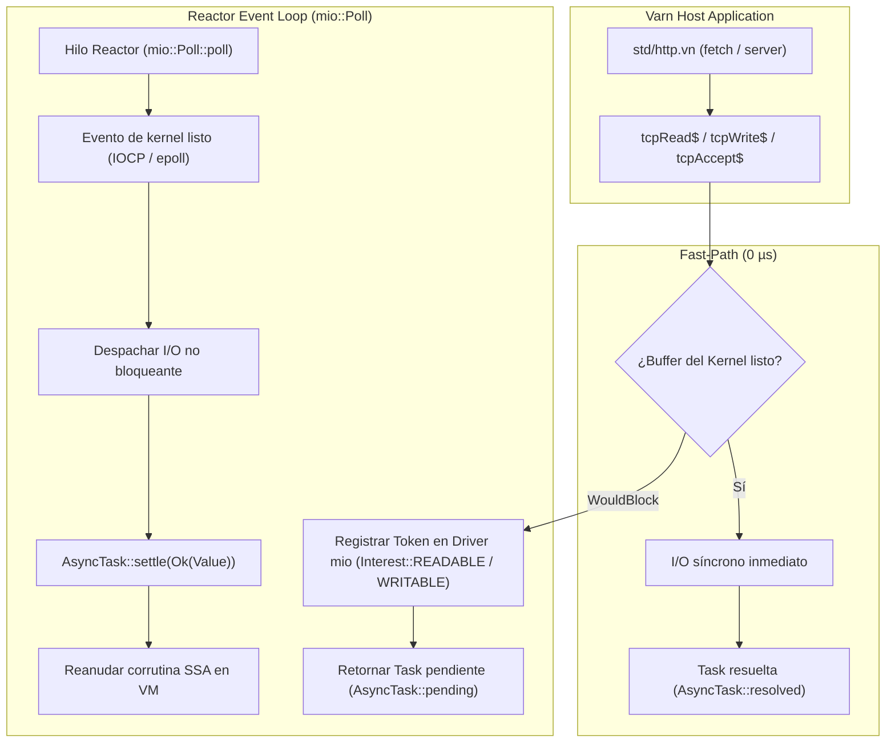

# Diseño Arquitectónico: Migración del Subsistema de Red Host a `mio` (IOCP / epoll / kqueue)

Este documento especifica el diseño para migrar el subsistema de red (`varn-builtins::net`) desde el modelo actual de hilos de sondeo a un bucle de eventos reactivo de coste cero basado en **`mio`**.

---

## 1. Motivación y Diagnóstico

### 1.1 Estado Actual (`crates/varn-builtins/src/modules/host/net/net.rs`)
- Las operaciones asíncronas no bloqueantes que no se completan inmediatamente (`WouldBlock`) lanzan hilos efímeros con `thread::spawn` que realizan sondeo con `thread::sleep(5ms)` sobre sockets no bloqueantes de `std::net`.
- **Ventaja**: Cero dependencias externas, implementación directa y portátil.
- **Limitación en alta concurrencia**: Con más de 10,000 sockets simultáneos en ráfaga, el coste de contexto de cientos de hilos durmientes y la latencia de 1-5ms por ciclo de sondeo limita el throughput frente a servidores kernel-native como Bun (Zig/epoll) o Node.js (C/libuv).

### 1.2 Objetivo Arquitectónico
Adoptar **`mio` v1.0** para proporcionar un bucle de eventos reactivo universal de nivel de producción que se integre directamente con las APIs nativas del kernel:
- **Windows**: *I/O Completion Ports (IOCP)* a través de `wepoll` / AFD.
- **Linux**: *`epoll`* con *edge-triggered notifications*.
- **macOS / BSD**: *`kqueue`*.

---

## 2. Tabla Comparativa de Arquitecturas de I/O

| Característica | Varn (Actual: Hilos + Sleep) | Node.js (libuv) | Bun (Zig kernel I/O) | **Varn (Objetivo: `mio` Event Loop)** |
| :--- | :--- | :--- | :--- | :--- |
| **Mecanismo OS (Windows)** | Sockets no bloqueantes + sleep | IOCP (C / libuv) | IOCP / Windows networking | **IOCP nativo (`mio` / AFD)** |
| **Mecanismo OS (Linux)** | Sockets no bloqueantes + sleep | `epoll` | `epoll` nativo (Zig) | **`epoll` edge-triggered (`mio`)** |
| **Mecanismo OS (macOS)** | Sockets no bloqueantes + sleep | `kqueue` | `kqueue` nativo (Zig) | **`kqueue` (`mio`)** |
| **Hilos de I/O** | 1 hilo por operación en espera | 1 hilo de Event Loop + pool de 4 hilos | 1 hilo Event Loop | **1 hilo de Event Loop global (o por Isolate)** |
| **Latencia de Despertar** | 1 – 5 ms (polling interval) | Sub-microsegundo (interrupción kernel) | Sub-microsegundo | **Sub-microsegundo (kernel event notification)** |
| **Throughput Máximo** | ~10k – 20k req/sec | ~70k – 90k req/sec | ~100k – 120k req/sec | **> 100k req/sec** |
| **Integración con GC / Tareas** | `AsyncTask::settle` | V8 Microtasks | JSC Microtasks | **`AsyncTask::settle` directo de coste cero** |

---

## 3. Arquitectura del Reactor `mio`

---

## 4. Diseño de Componentes

### 4.1 `IoDriver` (`crates/varn-builtins/src/modules/host/net/driver.rs`)
Estructura singleton / por-isolate que encapsula:
1. `poll: mio::Poll`: Instancia del reactor del sistema operativo.
2. `waker: Arc<mio::Waker>`: Mecanismo lock-free para despertar el `poll()` inmediatamente ante nuevos registros o cancelaciones.
3. `registry: Mutex<IoRegistry>`:
   - `listeners: FxHashMap<Token, (mio::net::TcpListener, AsyncTask)>`
   - `streams: FxHashMap<Token, (mio::net::TcpStream, Option<ReadOp>, Option<WriteOp>)>`

### 4.2 Ciclo de Vida de las Operaciones
1. **`tcpListen$(port)`**:
   - Crea `mio::net::TcpListener::bind(addr)`.
   - Asigna un `Token(socket_id)` único.
   - Registra en `poll.registry().register(listener, token, Interest::READABLE)`.
2. **`tcpAccept$(listenerId)`**:
   - Intenta `listener.accept()` de forma no bloqueante. Si tiene éxito $\to$ retorna `AsyncTask::resolved(connId)`.
   - Si retorna `WouldBlock` $\to$ almacena el `AsyncTask` en el `IoRegistry` asociado al listener y despierta al reactor.
3. **`tcpRead$(connId, maxLen)` & `tcpWrite$(connId, data)`**:
   - Intentan la lectura/escritura inmediata sobre el `mio::net::TcpStream`.
   - Si retorna `WouldBlock` $\to$ registran `Interest::READABLE` / `Interest::WRITABLE` y guardan el `AsyncTask` pendiente.
4. **`tcpCloseListener$(listenerId)` & `tcpClose$(connId)`**:
   - `poll.registry().deregister(socket)`.
   - Despiertan el `AsyncTask` pendiente con error o `-1` (indicando socket cerrado).
   - Liberan el descriptor de socket inmediatamente.

---

## 5. Garantías de Seguridad y Compatibilidad

1. **Cero impacto en el Frontend y Stdlib**: Las firmas de `std:http` (`Request`, `Response`, `server()`, `fetch()`) y los opcodes nativos (`builtin:net`) permanecen **100% idénticos**.
2. **Compatibilidad Multiplataforma**: `mio` maneja transparentemente las diferencias de ABI entre Windows (IOCP), Linux (epoll) y macOS (kqueue).
3. **Validación Estricta**: Conservación obligatoria de la matriz de validación de 4 (1094/0 verde en `tests/main.vn`).
